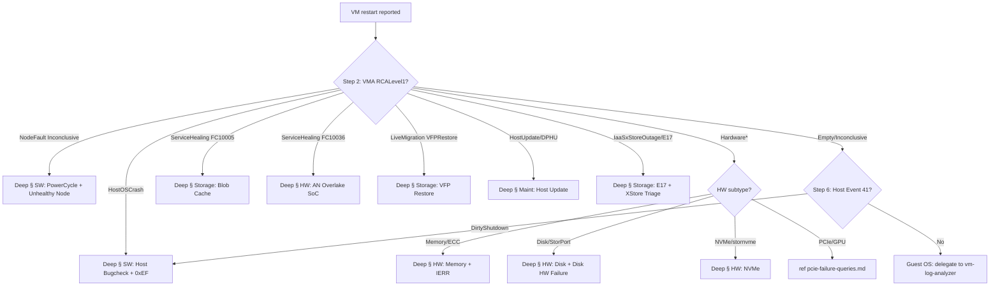

# Playbook A — Unexpected VM Restarts (Core)

> **Purpose**: One-page decision tree for "VM 重启 / 不可用 / 突然消失" RCA. Use this first, drop into [`playbook-A-restarts-deep.md`](playbook-A-restarts-deep.md) only when the core flow narrows to a specific fault mode.
>
> **Source**: Distilled from `/SME Topics/Unexpected Restarts/How-Tos/Kusto-Queries_Restarts` (hub) + ASI EEE RDOS workflows. KQL bodies for the standard 90 queries live in the existing reference files (`azurecm-queries.md`, `vmainsight-queries.md`, `hardware-queries.md`, etc.) — this playbook is the **router**.

---

## Step 0 — Inputs you need

| Variable | Source |
|---|---|
| `{SubscriptionId}` | DFM / customer email / resource ID |
| `{VMName}` / `{ResourceGroupName}` | DFM / resource ID |
| `{StartTime}` / `{EndTime}` (UTC) | Customer report — subtract 1-2h from start, add 1-2h to end |
| `{NodeId}` | derived in Step 1 below |
| `{ContainerId}` / `{Cluster}` / `{TenantName}` | derived in Step 1 below |

If only resource ID given, split it:
```kusto
let MyResourceID = "/subscriptions/.../virtualMachines/...";
let SubID = tostring(split(MyResourceID, "/")[2]);
let ResourceGrp = tostring(split(MyResourceID, "/")[4]);
let VMName = tostring(split(MyResourceID, "/")[-1]);
```

---

## Step 1 — Place the VM on a node + container in time

Get `NodeId`, `ContainerId`, `Cluster`, `TenantName` for the impact window. See [`azurecm-queries.md`](../catalogs/azurecm-queries.md) → **LogContainerSnapshot — VM host placement history**.

```kusto
let sid = "{SubscriptionId}";
let vmname = "{VMName}";
cluster("AzureCM").database("AzureCM").LogContainerSnapshot
| where subscriptionId == sid and roleInstanceName has vmname
| where PreciseTimeStamp between (datetime({StartTime})-2h .. datetime({EndTime})+2h)
| summarize min(PreciseTimeStamp), max(PreciseTimeStamp) by roleInstanceName, creationTime, virtualMachineUniqueId, Tenant, containerId, nodeId, tenantName, containerType, updateDomain, availabilitySetName, subscriptionId
| project VMName=roleInstanceName, VMId=virtualMachineUniqueId, Cluster=Tenant, NodeId=nodeId, ContainerId=containerId,
    ContainerCreationTime=todatetime(creationTime), StartTimeStamp=min_PreciseTimeStamp, EndTimeStamp=max_PreciseTimeStamp, tenantName, containerType, updateDomain, availabilitySetName
| order by ContainerCreationTime asc
```

**If `ContainerCreationTime` shifts inside the impact window** → VM moved hosts (Service Healing or LM happened). Note both old and new `NodeId`/`ContainerId`.

---

## Step 2 — Classify with VMA RCA (RCAEngine verdict)

The **single most important** step. See [`vmainsight-queries.md`](../catalogs/vmainsight-queries.md) → **VMA — Platform RCA classification**.

```kusto
cluster("Vmainsight").database("vmadb").VMA
| where Subscription == "{SubscriptionId}" and RoleInstanceName has "{VMName}"
| where PreciseTimeStamp between (datetime({StartTime})-1h .. datetime({EndTime})+2h)
| where RCAEngineCategory !contains "Customer"
| distinct StartTime, EndTime, Cluster, NodeId, ContainerId, RoleInstanceName,
    RCAEngineCategory, RCALevel1, RCALevel2, RCALevel3, RCA_CSS,
    DCM_RCA, DcmNodeState_OFRFaultCode, DcmNodeState_OFRReason,
    Detail, Watson_dumpUidLink, Watson_BugLink, Watson_DumpType,
    E17_ClusterFailureReportUrl
| order by StartTime asc
```

### Routing by `RCALevel1`

| `RCALevel1` | Likely root | Go to (in [`playbook-A-restarts-deep.md`](playbook-A-restarts-deep.md)) |
|---|---|---|
| `HostOSCrash` (eg `UnhealthyNode_OS Bugcheck 0x...`) | Host BSOD | **§ SW: Host Node Bugcheck** + **§ SW: 0xEF critical break** |
| `NodeFault` → `UnhealthyNode_Inconclusive_Powercycled` / `_OrganicRecovery` / `_RdAgentUpdate_*` | Fabric power-cycled hung node | **§ SW: PowerCycle Unhealthy Node** + **§ SW: Unhealthy Node Investigation** |
| `NodeFault` → `Likely OS Failure` / `Certain OS Failure` / `Unhealthy Node` | OS-layer issue, dump may exist | **§ SW: Unhealthy Node Investigation** (escalate path) |
| `Hardware*` (Disk, Memory, CPU, IERR, Network, PCIe) | HW fault | **§ HW** family (Hardware Failure / NVMe / Disk / Memory / IERR) |
| `ServiceHealing*` with `FaultCode 10005` + `0x80078000` | Blob cache + bad disk → container fault | **§ Storage: Blob Cache (FC 10005)** |
| `ServiceHealing*` with `FaultCode 10036` | NVA AN Boost SoC OOM | **§ HW: AN Overlake SoC (FC 10036)** |
| `LiveMigration*` → `VFPRestoreFailure` | VFP state restore failed during LM | **§ Storage: VFP Restore Failure (NMAgent 356)** |
| `HostUpdate*` / `DataPathHostPluginUpdate` / `NmAgent` change | Maintenance / DPHU | **§ Maint: Host Update chain** + **§ Storage: DataPath HostPlugin Update** |
| `IaaSxStoreOutage` / `Event17` | XStore back-end disk fault | **§ Storage: E17 + XStore Triage** |
| `ContainerFault` (generic) | Container fault — drill into `RCALevel2` | Pivot via Step 4 |
| Empty / `Inconclusive` | No platform fault recorded | Step 5 (Guest OS check) |

### Resolve Failure Signature → KB article ID

If you have an `RCALevel1.RCALevel2` pair and want the official customer-RCA article ID:

```kusto
cluster("Vmainsight").database("Air").GetArticleIdByFailureSignature("<RCALevel1.RCALevel2>")
// example:
//   GetArticleIdByFailureSignature("HostOSCrash.UnhealthyNode_OS Bugcheck 0x0000000a")
//   GetArticleIdByFailureSignature("NodeFault.UnhealthyNode_Inconclusive_Powercycled")
```

### 30-day recurrence (for Strike / repeated impact)

```kusto
cluster("Vmainsight").database("vmadb").VMALENS
| where Subscription == "{SubscriptionId}" and RoleInstanceName has "{VMName}"
| where PreciseTimeStamp > ago(30d)
| project StartTime, EndTime, Cluster, NodeId, RoleInstanceName, RCALevel1, RCALevel2
| order by StartTime desc
```

---

## Step 3 — Confirm Service Healing / Live Migration / Node state change

See [`azurecm-queries.md`](../catalogs/azurecm-queries.md) → **Service Healing** and **Live Migration** sections.

```kusto
// 3a. Service Healing trigger
cluster("AzureCM").database("AzureCM").ServiceHealingTriggerEtwTable
| where TenantName == "{TenantName}" and RoleInstanceName contains "{VMName}"
| where PreciseTimeStamp between (datetime({StartTime})..datetime({EndTime}))
| project PreciseTimeStamp, TriggerType, FaultCode, FaultReason, RoleInstanceName

// 3b. LM session
cluster("azurecm").database("AzureCM").LiveMigrationSessionCompleteLog
| where PreciseTimeStamp between (datetime({StartTime}) .. datetime({EndTime}))
| where sourceContainerId == "{ContainerId}"
| extend elapsedSec = totimespan(elapsedTime) / 1s
| project StartTime=PreciseTimeStamp-totimespan(elapsedTime), EndTime=PreciseTimeStamp, status, elapsedSec, reason, message, sourceNodeId, destinationNodeId

// 3c. Node state changes / reboots
cluster("AzureCM").database("AzureCM").TMMgmtNodeStateChangedEtwTable
| where BladeID == "{NodeId}"
| where PreciseTimeStamp between (datetime({StartTime})..datetime({EndTime}))
| project PreciseTimeStamp, BladeID, OldState, NewState

// 3d. Node snapshot — Unallocatable / OFR / disk config change
cluster("Azcsupfollower").database("AzureCM").LogNodeSnapshot
| where nodeId =~ "{NodeId}" and PreciseTimeStamp between (datetime({StartTime})..datetime({EndTime}))
| project PreciseTimeStamp, nodeState, nodeAvailabilityState, containerCount, diskConfiguration, faultInfo, rootUpdateAllocationType
```

**Flags to look for in `faultInfo`** (drives next deep-TSG selection):
- `OrangeType: Unallocatable_ResetNodeHealth` → § SW: Host Node Marked Unallocatable
- `FaultCode: 10005`, `0x80078000` → § Storage: Blob Cache
- `FaultCode: 10036`, `Manually injected fault - high memory usage` → § HW: AN Overlake SoC

---

## Step 4 — Container health & faultInfo timeline

See [`azurecm-queries.md`](../catalogs/azurecm-queries.md) → **LogContainerHealthSnapshot**.

```kusto
cluster("Azcsupfollower.kusto.windows.net").database("AzureCM").LogContainerHealthSnapshot
| where PreciseTimeStamp between (datetime({StartTime}) .. datetime({EndTime}))
| where roleInstanceName contains "{VMName}"
| project PreciseTimeStamp, Tenant, roleInstanceName, tenantName, containerId, nodeId,
    containerState, actualOperationalState, containerLifecycleState, containerOsState, faultInfo,
    vmExpectedHealthState, containerIsolationState, AvailabilityZone, Region
| order by PreciseTimeStamp asc
```

Pivot by:
- `containerOsState == "ContainerOsStateUnresponsive"` — guest OS hung (Step 5)
- `containerOsState == "GuestOsStateProvisioningRecovery"` — provisioning recovery
- `faultInfo` non-empty — parse to extract FaultCode

---

## Step 5 — Same-window platform operations (rule out planned action)

See [`azurecm-queries.md`](../catalogs/azurecm-queries.md) → **KronoxVmOperationEvent** + Customer-initiated ops.

```kusto
// 5a. Fabric / platform operations on the container
cluster("Azcsupfollower").database("AzureCM").KronoxVmOperationEvent
| where ContainerId == "{ContainerId}" or RoleInstanceName has "{VMName}"
| where PreciseTimeStamp between (datetime({StartTime})..datetime({EndTime}))
| project PreciseTimeStamp, OperationName, OperationType, RoleInstanceName, NodeId, Status, Reason

// 5b. Fault handling recovery events
cluster("Azcsupfollower").database("AzureCM").FaultHandlingRecoveryEventEtwTable
| where Tenant == "{TenantName}" and RoleInstanceName has "{VMName}"
| where PreciseTimeStamp between (datetime({StartTime})..datetime({EndTime}))
| project PreciseTimeStamp, FaultHandlerName, RecoveryEvent, NodeId, RoleInstanceName, Message

// 5c. Customer-triggered reboot/redeploy via ARM (resource lookup)
cluster("armprod").database("ARMProd").HttpIncomingRequests
| where targetResourceId =~ "{ResourceId}"
| where TIMESTAMP between (datetime({StartTime}) .. datetime({EndTime}))
| where operationName has_any ("restart", "redeploy", "deallocate", "stop", "start")
| project TIMESTAMP, operationName, httpStatusCode, callerIpAddress, userAgent, identity
```

If neither platform nor customer op exists → it's an **unexpected restart**; the RCALevel1 from Step 2 owns the path.

---

## Step 6 — Guest OS reboot check (when Step 2-5 show "no platform action")

This is the "control-plane OK but VM rebooted" scenario. See [`vmainsight-queries.md`](../catalogs/vmainsight-queries.md) → **Vmadiag** section.

```kusto
// 6a. VM state transitions from guest
cluster("vmainsight").database("Vmadiag").Atlas_VmStateTransitionEvent
| where VirtualMachineUniqueId == "{VMId}"
| where PreciseTimeStamp between (datetime({StartTime})..datetime({EndTime}))
| project PreciseTimeStamp, OldState, NewState, Reason, NodeId

// 6b. Dirty shutdown on host (Windows Event 41 on host node)
let timeSpan = 7d;
cluster("AzureCM").database("AzureCM").TMMgmtNodeEventsEtwTable
| where NodeId == "{NodeId}" and PreciseTimeStamp >= ago(timeSpan) and Message contains "Node reboot event: EventType: "
| parse Message with "Node reboot event: EventType: " eventType "," * "EventTimeStamp: " eventTimeStamp:datetime "," *
| where eventType in ("DirtyShutdown", "BugCheck", "PXEEvent")
| project PreciseTimeStamp, eventTimeStamp, RoleInstance, Tenant, NodeId, eventType, Message
```

If `eventType == "DirtyShutdown"` on the **host** → host crashed → § SW: Host Node Bugcheck.
If guest VM logs show Event 41 / 1074 / 1076 but host is fine → guest-side OS issue → delegate to `vm-log-analyzer` skill (Linux/Windows guest restart).

---

## Step 7 — Host updates / planned maintenance in window

See [`vmainsight-queries.md`](../catalogs/vmainsight-queries.md) → **Air section**.

```kusto
// VMPHU: customer-impacting Host Plugin Updates by subscription
cluster("vmainsight").database("Air").GetVMPhuEventsBySubId("{SubscriptionId}", datetime({StartTime}), datetime({EndTime}))
| project Cluster, RoleInstanceName, ContainerId, NodeId=ResourceId, ImpactBeginTimeStamp, ImpactEndTimeStamp, ImpactDurationTimeSpan

// AirMaintenanceEvents
cluster("vmainsight.kusto.windows.net").database("Air").AirMaintenanceEvents
| where NodeId == "{NodeId}"
| where EventTime between (datetime({StartTime})..datetime({EndTime}))
| extend Diagnostics = tostring(Diagnostics)
| project EventTime, NodeId, EventCategoryLevel2, EventCategoryLevel3, Component, OutageType, Diagnostics
```

Hit on either → § Maint: Host Update chain (in deep playbook).

---

## Step 8 — Hawkeye RCA (final platform verdict, sometimes lags 4-24h)

See [`operations-queries.md`](../catalogs/operations-queries.md) → **Hawkeye**.

```kusto
cluster("hawkeyedataexplorer.westus2.kusto.windows.net").database("HawkeyeLogs").GetLatestHawkeyeRCAEvents
| where NodeId == "{NodeId}"
| where RCATimestamp between (datetime({StartTime})..datetime({EndTime})+24h)
| project FaultTime, NodeId, RCALevel1, RCALevel2
```

If Hawkeye still says `Inconclusive` after 24h → likely truly Inconclusive → § SW: PowerCycle Unhealthy Node (Inconclusive path).

---

## Decision Tree (visual)



---

## Cross-references

| When you need | Reference |
|---|---|
| Raw KQL for a specific cluster/table | `azurecm-queries.md`, `vmainsight-queries.md`, `azcore-queries.md`, `hardware-queries.md`, `crp-queries.md`, `operations-queries.md`, `storage-account-queries.md`, `disks-queries.md`, `vm-properties-queries.md` |
| PCIe/GPU specifics | `pcie-failure-queries.md` + `PCIefatal_error.md` |
| ASAP/NVMe-on-Boost specifics | `asap-storage-queries.md` |
| Full deep-TSG KQL for restart fault modes | [`playbook-A-restarts-deep.md`](playbook-A-restarts-deep.md) |
| ASI EEE / Geneva / vmdash links | Build from this skill's dashboard catalog [`../dashboards/`](../dashboards/) (ASI/EEE/vmdash templates) or open the page manually |
| Customer RCA email template | draft the customer RCA manually (keep internal identifiers out) |
| KQL language / variable convention | `../_meta/kql-language.md`, `../_meta/conventions.md` |

---

## Standard variables (paste at top of every notebook)

```kusto
//{SubscriptionId}, {VMName}, {ResourceGroupName}, {NodeId}, {ContainerId}, {VMId}, {TenantName}, {Cluster}
//{StartTime} format 2026-06-01 14:30:00Z (subtract 1-2h from reported start)
//{EndTime}   format 2026-06-01 17:30:00Z (add 1-2h to reported end)
//{StorageAccountName}
//If you have {ResourceId} only:
//  let SubID = tostring(split("{ResourceId}", "/")[2]);
//  let ResourceGrp = tostring(split("{ResourceId}", "/")[4]);
//  let VMName = tostring(split("{ResourceId}", "/")[-1]);
```
