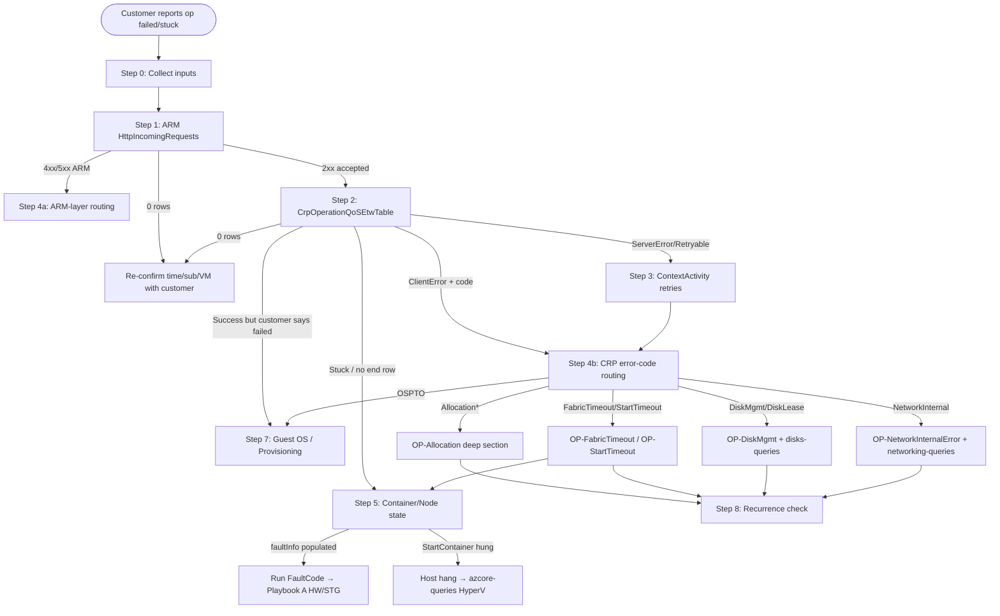

# Playbook B — Cant Start-Stop / Allocation (core router)

> **Scope**: customer reports a VM **Create / Start / Stop / Deallocate / Restart / Redeploy / Delete / Resize / Update** operation **failed** or is **stuck**. Use this when CRP/ARM returned a non-success result, OR the operation has been running well past the expected completion window. For "VM is running but slow / loses connectivity / disk latency" → use Playbook C. For "VM rebooted unexpectedly" → use Playbook A.

This is the router. Deep TSG-style drill-downs (per error code / per operation kind) live in `playbook-B-cant-start-stop-deep.md`. Both files mirror the official AzureIaaSVM wiki **Cant-Start-Stop-Home** decision tree.

---

## Step 0 — Required inputs (collect before any KQL)

| Variable | Where to get it |
|---|---|
| `SubscriptionId` | Customer / DFM |
| `ResourceGroupName` | Customer / DFM |
| `VMName` (or `VMScaleSetName` + `instanceId`) | Customer / DFM |
| `OperationType` | Customer wording → Create / Start / Stop / Deallocate / Restart / Redeploy / Delete / Resize / Update |
| `StartTime`, `EndTime` (UTC) | Customer-stated window — pad ±30 min |
| `CorrelationId` / `OperationId` | Portal → Activity Log; or customer-provided |
| `ErrorMessage` / `ErrorCode` | Customer screenshot / Activity Log → key driver for Step 4 |
| `CurrentVMState` | Resource Explorer (ASC) — Starting / Running / Updating / Failed / Deallocated |

Standard variables for KQL substitution: `<SubscriptionId>` `<VMName>` `<ResourceGroup>` `<Start>` `<End>` `<OperationId>` `<CorrelationId>`.

---

## Step 1 — Confirm what was actually requested (ARM ingress)

Before assuming the customer's wording is accurate, look at what ARM saw. Source of truth for "who called what API when".

```kusto
// cluster('armprod').database('ARMProd').HttpIncomingRequests
HttpIncomingRequests
| where PreciseTimeStamp between (datetime(<Start>) .. datetime(<End>))
| where subscriptionId =~ "<SubscriptionId>"
| where targetUri has "<VMName>" or correlationId == "<CorrelationId>"
| project PreciseTimeStamp, operationName, httpMethod, httpStatusCode,
          userAgent, clientIpAddress, callerIdentities, correlationId,
          targetResourceProvider, durationMs, errorCode, errorMessage
| order by PreciseTimeStamp asc
```

→ See `crp-queries.md` § `ARM API Tracing`.

**Routing on Step 1:**
- **0 rows** → the customer did not actually call ARM in this window. Re-confirm time/subscription/VM with customer.
- **4xx / 5xx with `targetResourceProvider == "Microsoft.Compute"`** → request was rejected by ARM before reaching CRP. **Go to Step 4 → ARM-layer rejects** (skip Steps 2–3).
- **200/201/202 → Microsoft.Compute** → ARM accepted; CRP took over. **Continue to Step 2.**

---

## Step 2 — Find the CRP operation row (operation result + error code)

```kusto
// cluster('Cirrus').database('Cirrus').CrpOperationQoSEtwTable
CrpOperationQoSEtwTable
| where TIMESTAMP between (datetime(<Start>) .. datetime(<End>))
| where SubscriptionId =~ "<SubscriptionId>"
| where ResourceId has "<VMName>" or correlationId == "<CorrelationId>" or OperationId == "<OperationId>"
| project TIMESTAMP, OperationName, ResultType, ErrorCode, ErrorMessage,
          DurationMs, OperationId, correlationId, ResourceId
| order by TIMESTAMP asc
```

→ See `crp-queries.md` § `CRP Operation Lifecycle`.

**Routing on Step 2:**
- **0 rows** → CRP never received the operation. Confirm Step 1 status (likely ARM-rejected).
- **ResultType = `Success`** but customer says it failed → the failure is downstream (provisioning agent / extension / guest OS) — **Go to Step 7 (Guest OS / Provisioning)**.
- **ResultType = `ClientError`** with a code in the error-code table → **Go to Step 4 → CRP error-code routing**.
- **ResultType = `ServerError`** or `RetryableError` → check `ContextActivity` for retries → **Step 3**.
- **Op still in flight** (no terminal row, or `OperationName` shows `BeginXxx` without `EndXxx`) → "stuck" operation — **Go to Step 5 (Container/Node state)**.

> Parallel-run query: `_shared-vm-identification.md` Q7 (`KronoxVmOperationEvent`) to confirm whether the operation was **customer-initiated** or **platform-initiated** (e.g., Madari / scheduled-event redeploy).

---

## Step 3 — CRP internal trace (retries, sub-operations)

When Step 2 returns a retryable / wrapper error or you need to follow the workflow chain:

```kusto
// cluster('azcrp').database('crp_allprod').ContextActivity
ContextActivity
| where TIMESTAMP between (datetime(<Start>) .. datetime(<End>))
| where activityId == "<CorrelationId>" or parentActivityId == "<CorrelationId>"
| project TIMESTAMP, activityId, parentActivityId, operationName,
          eventLevel, message
| order by TIMESTAMP asc
```

→ See `crp-queries.md` § `ContextActivity — CRP internal workflow trace`.

This reveals: nested CRP operations, retries that succeeded (silent recovery), or where the workflow gave up.

---

## Step 4 — Route by error layer (CRP error code OR ARM error code)

This is the **decision pivot**. See `crp-queries.md` § `CRP Error-Code Routing Reference` for the full table.

### 4a — ARM-layer rejects (from Step 1)

| ARM error | Section in deep playbook | Customer-actionable? |
|---|---|---|
| `403 AuthorizationFailed` | § OP-RBAC | Yes (assign role) |
| `409 ScopeLocked` | § OP-Lock | Yes (remove lock) |
| `403 RequestDisallowedByPolicy` | § OP-Policy | Yes (amend policy) |
| `429 TooManyRequests` | § OP-Throttle | Yes (back-off) |
| `5xx InternalServerError` | § OP-ARM-Pod | No (collab ARM) |

### 4b — CRP-layer error codes (from Step 2)

| ErrorCode | Section in deep playbook | Operation kinds typically affected |
|---|---|---|
| `AllocationFailed`, `ZonalAllocationFailed`, `OverconstrainedAllocationRequest`, `NoSubscriptionMatchedQuota` | § OP-Allocation | Create, Start (Deallocated→Running), Resize-up, Redeploy |
| `OutOfTimeBudgetException`, `FabricInternalOperationError` | § OP-FabricTimeout | All (CRP→AzSM/Job call hung) |
| `VMStartTimedOut` | § OP-StartTimeout | Start, Restart, Redeploy |
| `OSProvisioningTimedOut` | § OP-OSPTO | Create (mostly) |
| `NetworkingInternalOperationError` | § OP-NetworkInternalError | All (NIC attach/detach) |
| `InternalDiskManagementError` | § OP-DiskMgmt | Delete (cleanup) and Create (disk attach) |
| `AcquireDiskLeaseFailed` | § OP-DiskLease | Start (unmanaged page-blob) |
| `BadRequest` / `OperationNotAllowed` | § OP-BadRequest | All |
| `RetryableError` (eventually failed) | § OP-Retry | All |
| Other / unknown | § OP-Unknown | All |

→ Also use the **operation-kind quick index** in the deep playbook (§ OP-Delete, § OP-Resize, § OP-Redeploy, § OP-Hibernate) when the failure mode is operation-specific rather than error-code specific.

---

## Step 5 — Container / Node state (for "stuck" operations or VMStartTimedOut)

```kusto
// cluster('Azcsupfollower').database('AzureCM').LogContainerHealthSnapshot
LogContainerHealthSnapshot
| where PreciseTimeStamp between (datetime(<Start>) .. datetime(<End>))
| where containerId has "<VMName>" or Tenant has "<VMName>"
| project PreciseTimeStamp, Tenant, Role, containerId, containerState,
          containerLifecycleState, faultInfo, nodeId
| order by PreciseTimeStamp asc
```

→ See `azurecm-queries.md` § `LogContainerHealthSnapshot`.

```kusto
// cluster('Azcsupfollower').database('AzureCM').NodeServiceOperationEtwTable
NodeServiceOperationEtwTable
| where PreciseTimeStamp between (datetime(<Start>) .. datetime(<End>))
| where nodeId == "<NodeId-from-LogContainerHealthSnapshot>"
| where ContainerId has "<VMName>"
| project PreciseTimeStamp, OperationName, ResultType, DurationMs, ErrorMessage
| order by PreciseTimeStamp asc
```

→ See `azurecm-queries.md` § `NodeServiceOperationEtwTable`.

**Routing on Step 5:**
- `faultInfo` populated → run the FaultCode through `_shared-vm-identification.md` Q2 mapping → if HW/STG → Playbook A (HW/STG sections).
- Long `NodeServiceOperationEtwTable.DurationMs` for `StartContainer` / `StopContainer` → host-side hang → check `TMMgmtNodeEventsEtwTable` for DirtyShutdown / PXE.
- `containerState` flapping → check Playbook A § ServiceHealing.

---

## Step 6 — Resource-side check (Disk / NIC / underlying resource)

Run in parallel with Step 4/5 when the operation touches a disk or NIC.

```kusto
// cluster('Disks').database('Disks').DiskRPResourceLifecycleEvent
DiskRPResourceLifecycleEvent
| where PreciseTimeStamp between (datetime(<Start>) .. datetime(<End>))
| where subscriptionId =~ "<SubscriptionId>"
| where resourceName has "<DiskName>" or resourceName has "<VMName>"
| project PreciseTimeStamp, operationName, resultType, errorCode,
          errorMessage, resourceUri
| order by PreciseTimeStamp asc
```

→ See `disks-queries.md` § `DiskRPResourceLifecycleEvent`.

For NIC issues during create/start: see `networking-queries.md` § Hybridnetworking.

---

## Step 7 — Guest OS / Provisioning (when CRP succeeded but operation appears failed)

If Step 2 returned `Success` but the VM is unreachable / not provisioned:
- **OSProvisioningTimedOut** (CRP-side proxy for guest stuck) → § OP-OSPTO in deep playbook.
- Send the customer to `vm-log-analyzer` skill for `waagent.log` / `cloud-init.log` (Linux) or CBS / unattend.xml / setupact.log (Windows).
- For "VM is Running but I can't RDP/SSH" → that's a different workflow — point to **Cant-RDP-SSH** (wiki id 495096) — out of scope for this playbook.

---

## Step 8 — Recurrence / pattern check

If this is the second+ occurrence on the same VM/SKU/region, check:
1. **CRP recurrence** — re-run Step 2 with the full last-30-day window, `| summarize count() by OperationName, ErrorCode, ResultType`.
2. **Allocator recurrence** (for Allocation* errors) — run `CRPAllocationDetailsEtwTable` summary by Cluster/Region/Sku to confirm capacity pattern.
3. **Container recurrence** — `LogContainerHealthSnapshot` by `nodeId` over 30 days — same node repeatedly? → Playbook A § HW.

---

## Decision tree



---

## Cross-references

| When this step says... | Open |
|---|---|
| "→ See `crp-queries.md` §" | [crp-queries.md](../catalogs/crp-queries.md) |
| "→ See `azurecm-queries.md` §" | [azurecm-queries.md](../catalogs/azurecm-queries.md) |
| "→ See `disks-queries.md` §" | [disks-queries.md](../catalogs/disks-queries.md) |
| "→ See `networking-queries.md` §" | [networking-queries.md](../catalogs/networking-queries.md) |
| "→ See `_shared-vm-identification.md`" | [_shared-vm-identification.md](../_meta/_shared-vm-identification.md) |
| "→ Playbook A" | [playbook-A-restarts-core.md](playbook-A-restarts-core.md) / [playbook-A-restarts-deep.md](playbook-A-restarts-deep.md) |
| Per-error-code TSG bodies | [playbook-B-cant-start-stop-deep.md](./playbook-B-cant-start-stop-deep.md) |
