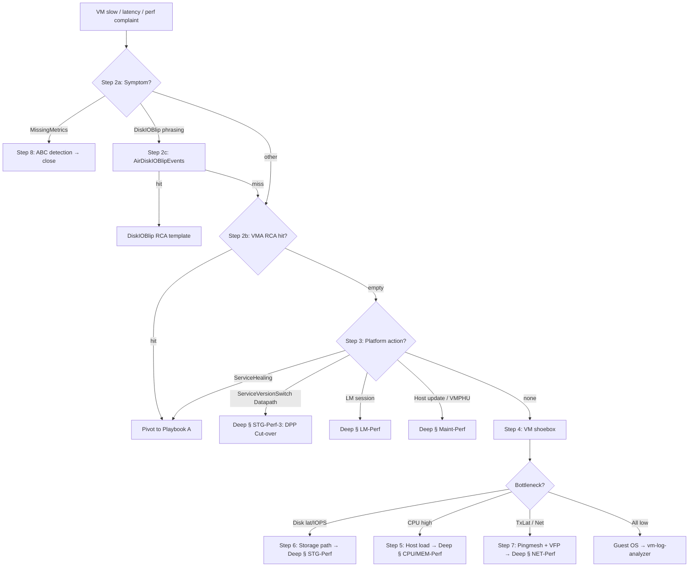

# Playbook C — Performance / ASAP / Throttling (Core)

> **Purpose**: One-page decision tree for "VM 慢 / 卡 / 延迟高 / 磁盘 IO 抖动 / 间歇性变慢" cases. Use this first, drop into [`playbook-C-performance-deep.md`](playbook-C-performance-deep.md) only when the core flow narrows to a specific perf mode.
>
> **Source**: Distilled from `/SME Topics/Performance/*` TSGs on csswiki AzureIaaSVM (Disk Metrics, Disk Collocation, Datapath Update Impact, Host Node Investigation, OsVhddiskEventTable, Blob Cache, Noisy Neighbor, LM-induced perf) + ASI EEE/Geneva panels. KQL bodies live in the existing reference files — this playbook is the **router**.
>
> **Scope**: This playbook is for **slowdowns** while the VM is still running. If the VM **rebooted / went unavailable**, use [`playbook-A-restarts-core.md`](playbook-A-restarts-core.md) instead.

---

## Step 0 — Inputs you need

| Variable | Source |
|---|---|
| `{SubscriptionId}` | DFM / customer email / resource ID |
| `{VMName}` / `{ResourceGroupName}` | DFM / resource ID |
| `{StartTime}` / `{EndTime}` (UTC) | Customer report — subtract 1-2h from start, add 1-2h to end |
| `{NodeId}` | derived in Step 1 |
| `{ContainerId}` / `{Cluster}` / `{TenantName}` | derived in Step 1 |
| `{Symptom}` | one of: `DiskLatency`, `DiskIOPS/BW`, `CPU`, `CPU-Guest`, `Memory`, `Hang`, `GPU`, `Network`, `IntermittentBlip`, `PostMaintBlip`, `MissingMetrics`, `ASAP`, `Throttling`, `Tool-PerfDiag`, `Misc` |

Universal VM-identification queries (split resource ID, find Node/Container): see [`_shared-vm-identification.md`](../_meta/_shared-vm-identification.md) — these are the same Step 0/1 used by Playbook A.

---

## Step 1 — Place the VM on a node + container (same as Playbook A Step 1)

Reuse [`azurecm-queries.md`](../catalogs/azurecm-queries.md) → **LogContainerSnapshot — VM host placement history**. Get `NodeId`, `ContainerId`, `Cluster`, `TenantName` for the impact window.

**If `ContainerCreationTime` shifts inside the window** → VM moved hosts mid-impact (LM or SH). Note both old and new IDs; perf signal may belong to *one* of them, not both.

---

## Step 2 — Classify the symptom (the single most important step for perf)

Unlike restart RCA where VMA gives the verdict in one query, perf has no single oracle — you must classify by **customer wording + first-look graphs** before picking a KQL path.

### 2a. Customer wording → symptom bucket

| Customer phrase (EN / 中文) | Symptom bucket | First-look check |
|---|---|---|
| "Disk slow / IOPS dropped / latency spike / 磁盘慢 / IOPS 突降 / 延迟高" | `DiskLatency` / `DiskIOPS/BW` | Step 4 (VM shoebox) + Step 6 (storage path) |
| "VM CPU 100% / steal time / 卡顿 / 应用慢但磁盘正常" | `CPU` | Step 5 (host load) + § Noisy Neighbor in deep |
| "Ping/network slow / TCP retransmit / 网络抖动" | `Network` | Step 7 (pingmesh + VFP) |
| "Random N-second blip / 周期性短暂卡顿" | `IntermittentBlip` | Step 3 (DPP/LM/maint correlation) + § DPP/LM in deep |
| "Got slow after maintenance / 维护后变慢" | `PostMaintBlip` | Step 3 (host update window) + § Maint in deep |
| "Portal shows no disk metrics / 看不到磁盘 metric" | `MissingMetrics` | Step 8 (ABC detection) — short path, often closes the case |
| "Guest hang / NVMe controller reset / stornvme reset / I/O timeout" + VM is `*_v6`/`*_v7` AMD or Boost-for-Storage | `ASAP` | § ASAP in deep — platform tables usually clean, ASAP probe required |
| "Hit per-VM IOPS limit / disk throttle / VM Cached IOPS Consumed Percentage 100% / burst not delivered / Storage account 429 / Azure Files metadata slow" | `Throttling` | § Throttling in deep (THR-Perf-1 / -3 / -4) |
| "VM hung / 无响应 / frozen / RDP+SSH+Serial Console 全部不通 but portal shows Running" | `Hang` | § HANG-Perf-1 — run core Step 2/3/6 first, then in-guest dump |
| "High CPU inside guest / VM CPU 100% but platform clean" | `CPU-Guest` | CPU-Perf-2 — Performance Diagnostics + `vm-log-analyzer` |
| "Two same-SKU VMs report different CPU GHz / vCPU vs core count confusion" | `CPU` | CPU-Perf-3 / CPU-Perf-4 — SKU spec lookup |
| "Available Memory low / 2 GB missing / Hardware Reserved / Trusted Launch 50MB less" | `Memory` | MEM-Perf-1..6 — `bcdedit` Hyper-V check + Perf Diag Memory Trace |
| "GPU not detected / nvidia-smi empty / CUDA error / RDP zoom slow on NV-series" | `GPU` | § GPU-Perf-1..6 — driver + extension + RDP GPO checks |
| "Performance Diagnostics extension fails / 403 / KeyBasedAuthenticationNotPermitted" | `Tool-PerfDiag` | TOOL-Perf-1 / -2 / -3 — MI role + extension upgrade |
| "AzCLI slow in Docker / portal vs guest metric mismatch / SKU limits question" | `Misc` | MISC-Perf-1 / -2 / -3 |
| "Linux NVMe timeout / OOM Killer / 进程被 kill" | `Memory` / `ASAP` (NVMe) | § OS-Perf-Linux + delegate `vm-log-analyzer` |
| "VM perf 不可解释 / 偶发 / 无规律" | `IntermittentBlip` (default) | Step 3 → Step 4 → Step 6 |

### 2b. First-look platform health (the "is platform OK?" gate)

Pull VMA RCA for the window — even though VMA is restart-oriented, a hit here means perf impact has a platform root and you should pivot to Playbook A. See [`vmainsight-queries.md`](../catalogs/vmainsight-queries.md) → **VMA — Platform RCA classification**.

```kusto
cluster("Vmainsight").database("vmadb").VMA
| where Subscription == "{SubscriptionId}" and RoleInstanceName has "{VMName}"
| where PreciseTimeStamp between (datetime({StartTime})-1h .. datetime({EndTime})+1h)
| where RCAEngineCategory !contains "Customer"
| project StartTime, EndTime, RCALevel1, RCALevel2, RCALevel3, Detail
```

**Verdicts:**
- **Non-empty RCALevel1** → there was a platform impact event (SH/LM/HostUpdate/Hardware) → run [`playbook-A-restarts-core.md`](playbook-A-restarts-core.md) Step 3 and treat this as a downtime-adjacent case.
- **Empty / Inconclusive** → no recorded platform fault → continue with perf flow below.

### 2c. Air disk IO blip (rule out CloudNet brownout)

```kusto
cluster("vmainsight").database("Air").AirDiskIOBlipEvents
| where VirtualMachineUniqueId == "{VMId}" or NodeId == "{NodeId}"
| where PreciseTimeStamp between (datetime({StartTime})-30m .. datetime({EndTime})+30m)
```

Any hit → **DiskIOBlip** (CloudNet brownout). Stop here, draft the "DiskIOBlip" RCA manually (keep internal identifiers out). Otherwise continue.

---

## Step 3 — Time-correlation: any platform/storage action in the window?

Perf blips are most often **transient platform actions** the customer wasn't told about. Check the four most-common culprits in parallel.

### 3a. Storage Datapath (DPP) cut-over on this node

See [`azurecm-queries.md`](../catalogs/azurecm-queries.md) → **ServiceVersionSwitch — Storage Datapath (DPP) updates on a node**.

```kusto
cluster("azcsupfollower").database("AzureCM").ServiceVersionSwitch
| where NodeId == "{NodeId}" and PreciseTimeStamp between (datetime({StartTime})-30m .. datetime({EndTime})+30m)
| where NewVersion contains 'Datapath'
| project PreciseTimeStamp, ServiceName, CurrentVersion, NewVersion
```

Hit → ~9 s disk freeze cut-over → § STG-Perf-3: Datapath Update Impact in deep playbook. Cross-check the AzPE side via [`operations-queries.md`](../catalogs/operations-queries.md) → **AzPEWorkflowEvent — Storage Datapath (DPP) update impact monitor** (`DiskImpact: "Freeze"`, `EstimatedImpactDurationInSeconds: 9`).

### 3b. Live Migration session covering the window

See [`azurecm-queries.md`](../catalogs/azurecm-queries.md) → **Live Migration** section.

```kusto
cluster("azurecm").database("AzureCM").LiveMigrationSessionCompleteLog
| where PreciseTimeStamp between (datetime({StartTime})-30m .. datetime({EndTime})+30m)
| where sourceContainerId == "{ContainerId}"
| extend elapsedSec = totimespan(elapsedTime) / 1s
| project StartTime=PreciseTimeStamp-totimespan(elapsedTime), EndTime=PreciseTimeStamp, status, elapsedSec, reason
```

Hit (especially `elapsedSec > 5`) → § LM-Perf in deep playbook.

### 3c. Service Healing trigger

```kusto
cluster("AzureCM").database("AzureCM").ServiceHealingTriggerEtwTable
| where TenantName == "{TenantName}" and RoleInstanceName contains "{VMName}"
| where PreciseTimeStamp between (datetime({StartTime})-30m .. datetime({EndTime})+30m)
```

Hit → not a perf-only case; pivot to [`playbook-A-restarts-core.md`](playbook-A-restarts-core.md) Step 3a.

### 3d. Host update / maintenance event

See [`vmainsight-queries.md`](../catalogs/vmainsight-queries.md) → **Air section**.

```kusto
cluster("vmainsight").database("Air").GetVMPhuEventsBySubId("{SubscriptionId}", datetime({StartTime})-1h, datetime({EndTime})+1h)
| where RoleInstanceName has "{VMName}"
```

Hit → § Maint-Perf in deep playbook. Customer can preempt via IMDS Scheduled Events.

---

## Step 4 — VM-side counters (shoebox)

If Step 3 was clean, look at the VM itself. See [`azcore-queries.md`](../catalogs/azcore-queries.md) → **VmCounterFiveMinuteRoleInstanceCentralBondTable** and **OsBlobCacheInternalCounterTable**.

### 4a. 5-minute VM counter rollup (CPU / disk / network)

```kusto
cluster("azcore.centralus.kusto.windows.net").database("Fa").VmCounterFiveMinuteRoleInstanceCentralBondTable
| where RoleInstance has "{VMName}" and Tenant == "{TenantName}"
| where PreciseTimeStamp between (datetime({StartTime})-30m .. datetime({EndTime})+30m)
| project PreciseTimeStamp, CurAvgCpuUtilization, CurAvgDiskQLen, CurAvgDiskRdLatInms, CurAvgDiskWrLatInms,
    CurAvgTxLatInms, CurAvgNetReadBps, CurAvgNetWriteBps, CurAvgDiskReadBps, CurAvgDiskWriteBps
```

**Reading:**
- `CurAvgDiskRdLatInms` / `CurAvgDiskWrLatInms` spike → continue Step 6 (storage path).
- `CurAvgCpuUtilization` high + low disk latency → CPU bound → Step 5.
- `CurAvgTxLatInms` spike → host networking → Step 7.
- All counters low but customer says slow → guest OS issue → delegate to [`vm-log-analyzer`](../../../vm-log-analyzer/SKILL.md).

### 4b. Blob cache write-congestion (premium-on-ABC hosts)

See [`azcore-queries.md`](../catalogs/azcore-queries.md) → **OsBlobCacheInternalCounterTable**. Rising `BSPausedWrites` is the canonical signature for ABC throttling the VM's writes.

### 4c. Local-disk burst events (host-side cache disk)

See [`azcore-queries.md`](../catalogs/azcore-queries.md) → **OsVhddiskEventTable — VhdDiskPrt Event 2/3/16 binary data parse**. Event 16 = burst overrun; Event 2/3 = sustained-IO disk slow / dropped.

---

## Step 5 — Host-side load / noisy neighbor

If Step 4 shows the VM is CPU-bound or disk-queue-bound but the disk path looks healthy, check the **host node load**.

```kusto
// Aggregate per-VM CPU on the same host node, same window
cluster("azcore.centralus.kusto.windows.net").database("Fa").VmCounterFiveMinuteRoleInstanceCentralBondTable
| where Tenant == "{TenantName}" and NodeId == "{NodeId}"
| where PreciseTimeStamp between (datetime({StartTime})-30m .. datetime({EndTime})+30m)
| summarize TotalCpu=sum(CurAvgCpuUtilization), VMs=dcount(RoleInstance) by bin(PreciseTimeStamp, 5m)
| order by PreciseTimeStamp asc
```

`TotalCpu` approaching 95-100% with many co-tenants → noisy-neighbor candidate. Continue to § CPU/MEM-Perf in deep playbook.

---

## Step 6 — Storage path drill-down (disk latency / IOPS)

When Step 4 confirms disk latency, walk the storage stack from VM → ABC → XStore tenant → XArgus account.

| Layer | Reference | Table / Query |
|---|---|---|
| VM shoebox (above) | [`azcore-queries.md`](../catalogs/azcore-queries.md) | `VmCounterFiveMinuteRoleInstanceCentralBondTable` |
| Blob cache (host) | [`azcore-queries.md`](../catalogs/azcore-queries.md) | `OsBlobCacheInternalCounterTable` (BSPausedWrites) |
| Local cache disk events | [`azcore-queries.md`](../catalogs/azcore-queries.md) | `OsVhddiskEventTable` Event 2/3/16 + `WindowsEventTable` Event 504 srbstatus=5, Event 505 latency histogram |
| Host disk health/latency 5m | [`azcore-queries.md`](../catalogs/azcore-queries.md) | `DiskHealthRawStateEtwTable`, `StorVscEventsTable` |
| Tenant-level XStore client (host) | [`azcore-queries.md`](../catalogs/azcore-queries.md) | `XStoreClient*` (cross-link) |
| Storage account perf (XArgus) | [`storage-account-queries.md`](../catalogs/storage-account-queries.md) | `AccountPerfPercentiles5M`, `TenantPerfPercentiles5M` |
| XStore disk blackout / triage | [`storage-account-queries.md`](../catalogs/storage-account-queries.md) | `XHealth_DiskBlackoutXStoreTriage`, `XHealth_DiskFailureXStoreTriage` |
| Disk-colocation verification (premium MD) | [`crp-queries.md`](../catalogs/crp-queries.md) | `VMApiQosEvent` colocationSkipDetails parse |

**Rule of thumb:** start at the layer the customer's data is from. If they sent guest-OS perfmon — VM shoebox + storage account perf. If they sent a portal screenshot of disk metrics — confirm ABC first (Step 8), then XArgus.

---

## Step 7 — Network path drill-down

If Step 4 shows `CurAvgTxLatInms` elevated or the customer reports network slowness:

### 7a. Host pingmesh (RTT ≥ 10 ms threshold)

See [`networking-queries.md`](../catalogs/networking-queries.md) → **AzPingMeshServerStatus — Host pingmesh latency anomalies (>10 ms RTT)**.

```kusto
let dateTime_StartTime = datetime({StartTime});
let dateTime_EndTime   = datetime({EndTime});
cluster("Azuredcm").database("AzureDCMDb").ResourceSnapshotV1
| where ResourceId == "{NodeId}"
| project-rename lower_hostname = HostName
| join (
    cluster("netperf").database("NetPerfKustoDB").AzPingMeshServerStatus
    | where timestamp between (dateTime_StartTime..dateTime_EndTime)
    | where avgRTTInMicroseconds >= 10000
  ) on $left.IPAddress == $right.serverIP
| project timestamp, serverName, serverIP, avgPayloadRTTInMicroseconds, avgRTTInMicroseconds, avgSyncRTTInMicroseconds
| take 5
```

Hit → § NET-Perf in deep playbook. Cross-confirm via the **NetVMA "Pingmesh" button** in the EEE Host Node page (build the link from [`../dashboards/`](../dashboards/) or open the EEE Host Node page manually).

### 7b. VFP / VM data path

Cross-link to [`vmainsight-queries.md`](../catalogs/vmainsight-queries.md) → **Vmadiag → vfp_restore_fails / EventData_SDN_DataPath**. Usually relevant after LM (§ LM-Perf in deep).

---

## Step 8 — "No metrics visible" short path (MissingMetrics symptom)

Customer asks "why don't I see disk utilization for my standard-storage VM?" — usually closes in one query.

See [`azurecm-queries.md`](../catalogs/azurecm-queries.md) → **LogNodeSnapshot — ABC (Azure Blob Cache) host configuration detection**.

```kusto
cluster('Azcsupfollower').database('AzureCM').LogNodeSnapshot
| where nodeId == "{NodeId}" and PreciseTimeStamp > ago(2h)
| distinct diskConfiguration
```

| Output | Verdict |
|---|---|
| `AllDisksAbc` | ABC enabled → metrics should appear; if not, escalate (rare). |
| `AllDisksInStripe` | Pure standard host → ABC disabled → **expected behavior**; standard-storage VMs do NOT expose disk-utilization counters here. Close with TSG link [Disk Metrics_Perf](https://supportability.visualstudio.com/AzureIaaSVM/_wiki/wikis/AzureIaaSVM/Disk-Metrics_Perf). |

---

## Step 9 — Recurrence check (Strike / repeated perf)

```kusto
cluster("Vmainsight").database("vmadb").VMALENS
| where Subscription == "{SubscriptionId}" and RoleInstanceName has "{VMName}"
| where PreciseTimeStamp > ago(30d)
| project StartTime, EndTime, NodeId, RCALevel1, RCALevel2
| order by StartTime desc

cluster("vmainsight").database("Air").AirDiskIOBlipEvents
| where VirtualMachineUniqueId == "{VMId}"
| where PreciseTimeStamp > ago(30d)
```

Recurrent DiskIOBlip / repeated DPP cut-overs / repeated LM → flag in customer-facing RCA. The VM may benefit from VMPHU disablement (perf-sensitive workload) or moving to a different SKU family.

---

## Decision Tree (visual)



---

## Cross-references

| When you need | Reference |
|---|---|
| Raw KQL for a specific cluster/table | `azurecm-queries.md`, `azcore-queries.md`, `vmainsight-queries.md`, `crp-queries.md`, `operations-queries.md`, `storage-account-queries.md`, `networking-queries.md` |
| Perf-specific deep TSG playbook | [`playbook-C-performance-deep.md`](playbook-C-performance-deep.md) |
| Restart RCA flow | [`playbook-A-restarts-core.md`](playbook-A-restarts-core.md) |
| ASAP / NVMe-on-Boost perf | [`playbook-C-performance-deep.md`](playbook-C-performance-deep.md) § ASAP → routes into `asap-storage-queries.md` |
| Throttling (VM disk cap / storage 429 / Azure Files) | [`playbook-C-performance-deep.md`](playbook-C-performance-deep.md) § Throttling → routes into `azcore-queries.md` (Geneva Shoebox) + `storage-account-queries.md` |
| GPU N-series (NC / ND / NV / NG) issues | [`playbook-C-performance-deep.md`](playbook-C-performance-deep.md) § GPU-Perf-1..6 |
| In-guest high CPU / memory / hung VM | [`playbook-C-performance-deep.md`](playbook-C-performance-deep.md) § CPU-Perf-2 / § MEM-Perf-2..6 / § HANG-Perf-1 + delegate [`vm-log-analyzer`](../../../vm-log-analyzer/SKILL.md) |
| Performance Diagnostics extension (Perf Insights) | [`playbook-C-performance-deep.md`](playbook-C-performance-deep.md) § TOOL-Perf-1..3 |
| Linux NVMe troubleshooting / OOM Killer | [`playbook-C-performance-deep.md`](playbook-C-performance-deep.md) § OS-Perf-Linux + `asap-storage-queries.md` for platform-side NVMe checks + [`vm-log-analyzer`](../../../vm-log-analyzer/SKILL.md) |
| EEE / Geneva / vmdash links | Build from this skill's dashboard catalog [`../dashboards/`](../dashboards/) (ASI/EEE/vmdash templates) or open the page manually |
| Customer perf RCA template | draft the customer perf RCA manually (keep internal identifiers out) |
| KQL language / variable convention | `kql-language.md`, `conventions.md` |

---

## Standard variables (paste at top of every notebook)

```kusto
//{SubscriptionId}, {VMName}, {ResourceGroupName}, {NodeId}, {ContainerId}, {VMId}, {TenantName}, {Cluster}
//{StartTime} format 2026-06-01 14:30:00Z (subtract 30m-1h from reported start)
//{EndTime}   format 2026-06-01 17:30:00Z (add 30m-1h to reported end)
//{Symptom}  one of: DiskLatency / DiskIOPS-BW / CPU / Network / IntermittentBlip / PostMaintBlip / MissingMetrics / ASAP / Throttling
```
