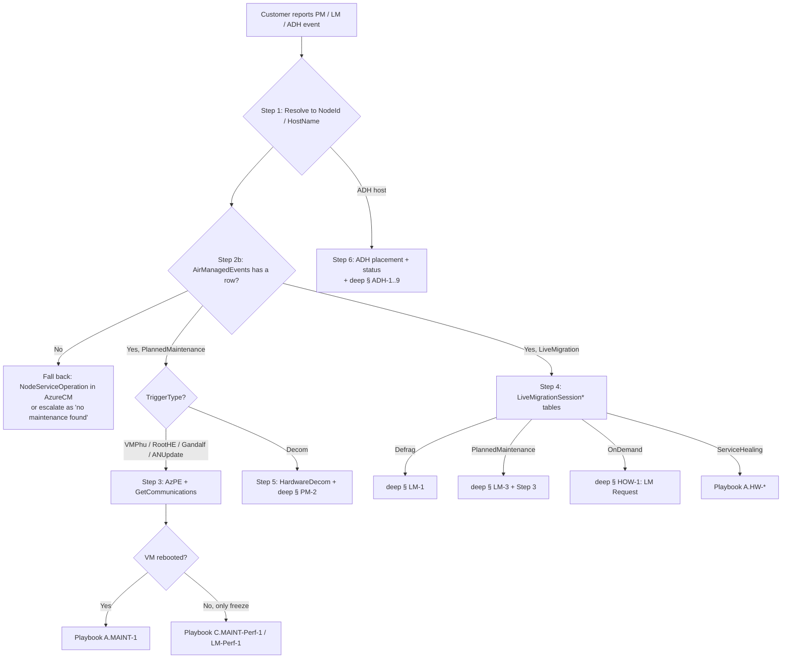

# Playbook D — Planned Maintenance + Live Migration + Dedicated Host (Core)

> **Purpose**: One-page decision tree for cases involving **Planned Maintenance (PM)**, **Live Migration (LM)**, or **Azure Dedicated Host (ADH)**. Use this first; drop into [`playbook-D-maintenance-deep.md`](playbook-D-maintenance-deep.md) for per-TSG bodies.
>
> **Source**: Distilled from `/SME Topics/Planned Maintenance/*` (15 TSGs + 12 How-Tos + 3 Workflows) and `/SME Topics/Dedicated Host/*` (9 TSGs + 8 How-Tos) on csswiki AzureIaaSVM. KQL bodies live in `azurecm-queries.md` (LM tables, NodeServiceOperation), `operations-queries.md` (AzPE, GetCommunicationsForSupport), `vmainsight-queries.md` (Air* tables), `hardware-queries.md` (Decom). This file is the **router**.
>
> **Scope**:
>
> - **Planned Maintenance** — Azure-initiated host updates (VMPHU / RDOS / NMAgent / Gandalf / RootHE / accelnet / DPP), Self-Service Maintenance windows, Critical Change Only Advisories (CCOA), Hardware Decommissioning.
> - **Live Migration** — Defrag / PM-triggered / on-demand customer-requested LM, VFPRestoreFailure post-LM, M-Series LM specifics.
> - **Azure Dedicated Host (ADH)** — host-group lifecycle, autoManage extension, ADH unavailable, forced maintenance date, platform-update-caused ADH reboot, provisioning state failures.
>
> **Boundary**:
>
> - VM actually **rebooted** during the maintenance window → start with [`playbook-A-restarts-core.md`](playbook-A-restarts-core.md), come back here only for the **maintenance correlation** sub-step.
> - VM only **slowed down** during maintenance → [`playbook-C-performance-core.md`](playbook-C-performance-core.md) (§ LM-Perf-1 / § MAINT-Perf-1 / § STG-Perf-3 DPP).
> - VM **cant start/stop** due to a maintenance lock (e.g., `OperationDisallowed`) → [`playbook-B-cant-start-stop-deep.md`](playbook-B-cant-start-stop-deep.md) § OP-Lock.

---

## Step 0 — Inputs you need

| Variable | Source |
|---|---|
| `{SubscriptionId}` | DFM / customer email / resource ID |
| `{VMName}` / `{ResourceGroupName}` | DFM / resource ID |
| `{StartTime}` / `{EndTime}` (UTC) | Customer report — extend ±2h around the reported window |
| `{NodeId}` | derived in Step 1 |
| `{ContainerId}` / `{Cluster}` / `{TenantName}` | derived in Step 1 |
| `{HostGroupName}` / `{HostName}` (ADH only) | DFM / resource ID — `/hostGroups/{HG}/hosts/{H}` |
| `{LMSessionId}` (if known) | from AzureCM LM tables (Step 4) |
| `{MaintenanceBucket}` | one of: `PM-Notification`, `PM-Workflow`, `LM-Defrag`, `LM-PM-Triggered`, `LM-OnDemand`, `LM-PostRestore`, `Self-Service-Maint`, `SGX-Enclave`, `Hardware-Decom`, `Databricks-RCA`, `ADH-Unavailable`, `ADH-AutoManage`, `ADH-ForcedDate`, `ADH-Lifecycle`, `Scheduled-Events`, `VMPHU-Disable-Request` |

Universal VM-identification queries (split resource ID, find Node/Container): see [`_shared-vm-identification.md`](../_meta/_shared-vm-identification.md).

---

## Step 1 — Place the VM on a node + container (or resolve ADH host)

### 1a. Regular VM / VMSS

Reuse [`azurecm-queries.md`](../catalogs/azurecm-queries.md) → **LogContainerSnapshot — VM host placement history**. Capture `NodeId`, `ContainerId`, `Cluster`, `TenantName`, and **all** `ContainerCreationTime` boundaries in the window — multiple boundaries inside the impact window prove an LM or SH actually happened.

### 1b. Azure Dedicated Host (ADH)

`HostName` is supplied by the customer or extracted from the resource ID (`…/hostGroups/{HG}/hosts/{H}`). Resolve to physical `NodeId`:

```kusto
cluster("azcrp.kusto.windows.net").database("crp_allprod").VMApiQosEvent
| where TIMESTAMP between (datetime({StartTime})-7d .. datetime({EndTime})+1d)
| where resourceUri has "/hostGroups/{HostGroupName}/hosts/{HostName}"
| project TIMESTAMP, resourceUri, nodeId = tostring(parse_json(extendedProperties).NodeId), operationName, status
| distinct nodeId
```

(If `extendedProperties.NodeId` is absent, use the ADH dashboard — build the link from [`../dashboards/`](../dashboards/) and the ASI **Azure Dedicated Host** page set, or open ASI manually.)

---

## Step 2 — Classify the maintenance bucket

Unlike restart RCA where VMA gives the verdict in one query, PM/LM/ADH has many distinct triggers — classify by **customer wording** before picking a KQL path.

### 2a. Customer wording → bucket

| Customer phrase (EN / 中文) | Bucket | First-look check |
|---|---|---|
| "We received a maintenance notification on {date} / 收到维护通知" | `PM-Notification` | Step 3 (GetCommunicationsForSupport) |
| "VM rebooted during a planned maintenance window / 计划维护时段重启" | `PM-Workflow` (+ Playbook A) | Step 3 (AzPEWorkflowEvent + Air) + Playbook A.MAINT-1 |
| "VM live-migrated unexpectedly / 突然被 LM 了 / 没收到通知就 LM" | `LM-Defrag` or `LM-PM-Triggered` | Step 4 (LiveMigrationSessionCompleteLog `TriggerType`) |
| "We requested an on-demand LM / 申请了主动 LM / Live Migration Request" | `LM-OnDemand` | Step 4 + How-To: LM Request |
| "Post-LM the VM lost network / VFPRestoreFailure / NMAgent Event 356" | `LM-PostRestore` (+ Playbook A) | Step 4 + Playbook A.STG-3 |
| "We enrolled the VM in Self-Service Maintenance / 自助维护" | `Self-Service-Maint` | Step 3 (Self-Service status table) |
| "Confidential Compute / SGX enclave broke after maintenance / SGX 飞地不工作" | `SGX-Enclave` | Step 3 + deep § PM-9 |
| "Customer says hardware is being decommissioned / 硬件下线" | `Hardware-Decom` | Step 5 (`HardwareDecomCases`) + deep § PM-2 |
| "Databricks cluster lost VM / Databricks worker repeatedly recycled" | `Databricks-RCA` | deep § PM-1 (DataBricks RCA) |
| "Disable VMPHU on this VM / 关掉 VMPHU / disable platform host updates" | `VMPHU-Disable-Request` | deep § HOW-3 (VMPHU disablement) |
| "ADH host shows Unavailable / Provisioning Failed / autoManage error" | `ADH-Unavailable` / `ADH-Lifecycle` | Step 6 (ADH placement + status) |
| "Cannot delete ADH host group / `OperationNotAllowed` on ADH delete" | `ADH-Lifecycle` | deep § ADH-6 |
| "AutoManage configuration profile failed / autoManage forbidden / 403" | `ADH-AutoManage` | deep § ADH-1..4 |
| "ADH next forced maintenance date changed to an older date" | `ADH-ForcedDate` | deep § ADH-7 |
| "Where do I poll Scheduled Events / IMDS Scheduled Events not firing" | `Scheduled-Events` | Step 3 (AzPE + IMDS) + deep § PM-11 |

### 2b. First-look platform health (the "is platform actually doing maintenance?" gate)

```kusto
cluster("Vmainsight").database("Air").AirManagedEvents
| where Subscription == "{SubscriptionId}" and (RoleInstanceName has "{VMName}" or NodeId == "{NodeId}")
| where PreciseTimeStamp between (datetime({StartTime})-2h .. datetime({EndTime})+2h)
| project PreciseTimeStamp, EventCategory, EventReason, TriggerType, NodeId, RoleInstanceName, ContainerId, Subscription
| order by PreciseTimeStamp asc
```

- `EventCategory == "PlannedMaintenance"` → confirmed PM event. Capture `TriggerType` (`VMPhu`, `RootHE`, `Gandalf`, `ANUpdate`, `Decom`) — this routes deep.
- `EventCategory == "LiveMigration"` → confirmed LM. Capture `TriggerType` (`Defrag`, `PlannedMaintenance`, `OnDemand`, `ServiceHealing`).
- Empty → either NOT a maintenance event (re-route to Playbook A/B/D), or event predates Air retention (60 days for AirManagedEvents) → fall back to AzureCM `NodeServiceOperationEtwTable` in Step 3.

See [`vmainsight-queries.md`](../catalogs/vmainsight-queries.md) → **AirManagedEvents** + **AirLiveMigrationEvents**.

---

## Step 3 — Maintenance event lookup (PM-Workflow / Scheduled-Events / VMPHU)

### 3a. Customer notification record (AlbnTargets / GetCommunicationsForSupport)

See [`operations-queries.md`](../catalogs/operations-queries.md) → **GetCommunicationsForSupport — Planned maintenance notifications**. Always cite the `NotificationCreationDate`, `MaintenanceStartDate`, `MaintenanceEndDate`, `JSON.Title` back to the customer.

### 3b. Host update workflow (AzPE)

See [`operations-queries.md`](../catalogs/operations-queries.md) → **AzPEWorkflowEvent — Host update workflow** (`EntityId contains "AzPEHostUpdateMonitor"`). Pull `WorkflowEventData.ImpactInformation.Impact.Value`:

- `ComputeImpact: "Freeze"` → VM frozen during update (typical 9s for DPP, 30s for VMPhu).
- `ComputeImpact: "None"` → no VM impact expected; if customer still reports issue, root cause is elsewhere.
- `ComputeImpact: "Reboot"` → VM reboot expected → cross-link to Playbook A.MAINT-1.

### 3c. Per-node maintenance operations (NodeServiceOperation)

See [`azurecm-queries.md`](../catalogs/azurecm-queries.md) → **NodeServiceOperationEtwTable**. Filter `NodeId == "{NodeId}"` + window — captures all node-side ops (`HostUpdate`, `NMAgentUpdate`, `Gandalf`, `RootHE`, `ANUpdate`, `Defrag`, `Decom`).

### 3d. VMPHU specifically (was this VM in scope?)

See [`azurecm-queries.md`](../catalogs/azurecm-queries.md) → **HostServiceVersionTable** filtered to `Service == "VmphuSvc"` to confirm the VMPHU version deployed on the node at the time. For VMPHU **disablement** request workflow, see deep § HOW-3.

### 3e. Scheduled Events emission

See [`operations-queries.md`](../catalogs/operations-queries.md) → **GetScheduledEventsEnablementStatusV3()** + AzPE workflow correlation. Customer claim "IMDS Scheduled Events did not fire" → confirm with this query; if AzPE says emitted but customer poller missed it, the issue is in the guest poller (delegate to [`vm-log-analyzer`](../../../vm-log-analyzer/SKILL.md)).

---

## Step 4 — Live Migration session detail (LM-* buckets)

### 4a. Confirm LM session exists in the window

See [`azurecm-queries.md`](../catalogs/azurecm-queries.md) → **Live Migration** section. Run all four LM tables in parallel and join by `LMSessionId`:

| Table | What it gives you |
|---|---|
| `LiveMigrationContainerDetailsEventLog` | Source/destination `ContainerId`, `NodeId`, `LMSessionId` |
| `LiveMigrationSessionCreatedLog` | Session start time, `TriggerType` (`Defrag`/`PlannedMaintenance`/`OnDemand`/`ServiceHealing`) |
| `LiveMigrationSessionCompleteLog` | End time, `SessionResult`, brownout / blackout durations |
| `LiveMigrationSessionStatusEventLog` | Status transitions + errors mid-session |

### 4b. Concurrent LM activity on the host (memory pressure)

See [`playbook-A-restarts-deep.md`](playbook-A-restarts-deep.md) § HW-7 → **AirLiveMigrationEvents** snippet. Heavy concurrent LM on the same host can starve memory and trigger HW-7 (NVA on Boost — `FaultCode 10036`).

### 4c. Defrag investigation

See deep § LM-1 (Live Migration Defrag TSG). Defrag is initiated by the fabric to consolidate VMs onto fewer hosts; usually customer is not notified individually.

### 4d. Post-LM VFP restore failure

If LM completed but VM lost network → see [`vmainsight-queries.md`](../catalogs/vmainsight-queries.md) → `Vmadiag → vfp_restore_fails` AND cross-link to [`playbook-A-restarts-deep.md`](playbook-A-restarts-deep.md) § STG-3 (NMAgent Event 356).

### 4e. M-Series specifics

See deep § LM-4 (M Series Live Migration Troubleshooting). M-Series LM has different brownout characteristics (longer due to TB-scale memory transfer).

---

## Step 5 — Hardware decommissioning lookup

See [`hardware-queries.md`](../catalogs/hardware-queries.md) for any `HardwareDecomCases`-style table (region-dependent — fall back to `vm-knowledge-search` if the exact table name is unknown). Cross-reference with `AirManagedEvents.TriggerType == "Decom"` from Step 2b.

If customer is asking "which hardware is being decommissioned and when" — delegate to deep § PM-2 (Hardware Decommissioning TSG) which has the RCA template and the customer-facing notification wording.

---

## Step 6 — Azure Dedicated Host (ADH) placement and status

### 6a. ADH host group + host list

```kusto
cluster("azcrp.kusto.windows.net").database("crp_allprod").VMApiQosEvent
| where TIMESTAMP between (datetime({StartTime})-7d .. datetime({EndTime})+1d)
| where resourceUri has "/hostGroups/{HostGroupName}"
| project TIMESTAMP, resourceUri, operationName, status, errorCode, errorMessage,
          subscriptionId, region
| order by TIMESTAMP desc
```

### 6b. ADH host availability state

Use the ASI **Azure Dedicated Host** page set (`adh-adh-host-list-under-an-adh-group`) — build the link from [`../dashboards/`](../dashboards/) or open ASI manually. Look for `hostAvailabilityState == "Unhealthy"` or `provisioningState == "Failed"`.

### 6c. ADH AutoManage extension status

Filter the same `VMApiQosEvent` table for `operationName has "Automanage"` to capture configuration-profile apply failures (deep § ADH-1 through § ADH-4).

### 6d. ADH platform update → reboot

If ADH host rebooted (deep § ADH-8), confirm via the same AzPE / AzureCM stack used in Step 3 — ADH still rides on the same host-update pipeline, just with different notification + grace-window contracts.

---

## Step 7 — Cross-reference handoff

Use this table to decide whether to stay in Playbook D or jump to another playbook:

| If the maintenance event… | Continue with… |
|---|---|
| caused a VM **reboot** (Air `EventCategory in (PlannedMaintenance, LiveMigration)` + node restart) | [`playbook-A-restarts-core.md`](playbook-A-restarts-core.md) → MAINT-1 / HW-7 / STG-3 |
| caused **perf degradation** but no reboot (freeze, slow IO, network blip) | [`playbook-C-performance-core.md`](playbook-C-performance-core.md) → § LM-Perf-1 / § MAINT-Perf-1 / § STG-Perf-3 |
| was actually a **cant-start/stop** due to maintenance lock (`OperationDisallowed`) | [`playbook-B-cant-start-stop-deep.md`](playbook-B-cant-start-stop-deep.md) → § OP-Lock |
| was a **scheduled events** emission concern | Stay here → § PM-11 (Scheduled Events TSG) |
| was a **customer-requested** LM / VMPHU disable / Self-Service flag | Stay here → § HOW-1 / § HOW-2 / § HOW-3 / § HOW-4 |
| is **ADH-specific** (host group, autoManage, ADH unavailable) | Stay here → § ADH-1 through § ADH-9 |
| caused **SGX enclave** failure post-maintenance | Stay here → § PM-9 |
| affected **Databricks** workers | Stay here → § PM-1 |

---

## Step 8 — Customer-facing wording (always required for PM/LM cases)

Pull the **exact notification** (Step 3a) and quote `JSON.Title`, `NotificationCreationDate`, `MaintenanceStartDate`, `MaintenanceEndDate` back to the customer. If no notification record exists (LM-Defrag, ServiceHealing, Decom-trigger), state that explicitly and explain why (defrag and SH are not customer-notified events; decom uses a separate notification channel).

Template:

> "Between {MaintenanceStartDate} and {MaintenanceEndDate} the host node hosting {VMName} was selected for a planned maintenance event of type **{TriggerType}**. We {sent / did not send} an advance notification on {NotificationCreationDate} via the Service Health channel (Title: '{JSON.Title}'). The expected guest impact was **{ComputeImpact}** for approximately {EstimatedImpactDurationInSeconds}s. {Apology / Action Item / Workaround pointer}."

For RCA-style customer email, draft it manually (keep internal identifiers out) — use the AzPE / AirManagedEvents / GetCommunicationsForSupport results as inputs.

---

## Cross-references

| When you need | Reference |
|---|---|
| Raw KQL for AzureCM, AzPE, Vmainsight tables | `azurecm-queries.md`, `operations-queries.md`, `vmainsight-queries.md`, `crp-queries.md` |
| Per-TSG playbook bodies | [`playbook-D-maintenance-deep.md`](playbook-D-maintenance-deep.md) |
| Restart correlation | [`playbook-A-restarts-core.md`](playbook-A-restarts-core.md), [`playbook-A-restarts-deep.md`](playbook-A-restarts-deep.md) (MAINT-1, HW-7, STG-3) |
| Perf correlation (freeze, brownout, post-LM slow) | [`playbook-C-performance-deep.md`](playbook-C-performance-deep.md) (§ LM-Perf-1, § MAINT-Perf-1, § STG-Perf-3 DPP) |
| Maintenance lock on cant-start/stop | [`playbook-B-cant-start-stop-deep.md`](playbook-B-cant-start-stop-deep.md) § OP-Lock |
| ADH dashboards | ASI ADH page templates under [`../dashboards/asi/pages/`](../dashboards/asi/pages/) (`adh-*`), or open ASI manually |
| Customer-facing email / RCA template | draft the customer email/RCA manually (keep internal identifiers out) |
| KQL language / variable convention | `kql-language.md`, `conventions.md` |

---

## Standard variables (paste at top of every notebook)

```kusto
//{SubscriptionId}, {VMName}, {ResourceGroupName}, {NodeId}, {ContainerId}, {TenantName}, {Cluster}
//{HostGroupName}, {HostName}, {LMSessionId}
//{StartTime}, {EndTime}                              // UTC, extend ±2h
//{MaintenanceBucket}                                  // see Step 0 enum
```

---

## Mermaid — Maintenance decision flow


