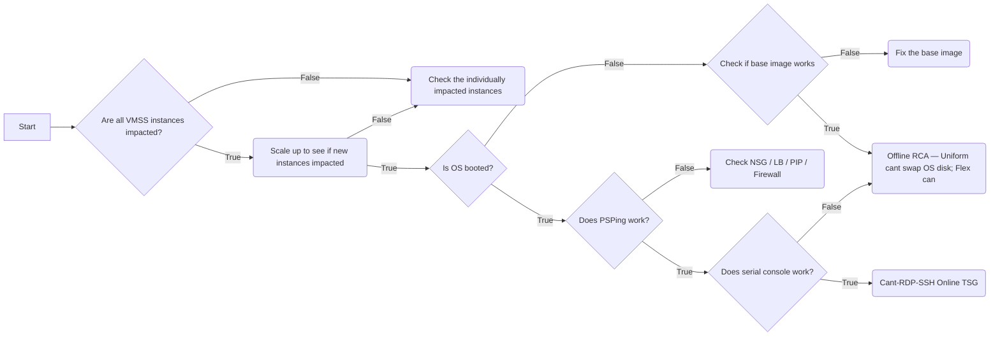

# Playbook E — VMSS (Virtual Machine Scale Sets) Deep TSGs

Companion to [`playbook-E-vmss-core.md`](playbook-E-vmss-core.md). All KQL bodies are verbatim from the AzureIaaSVM csswiki VMSS TSGs they cite — replace `{Placeholder}` tokens with case data before execution.

**Section-anchor prefixes used by this playbook** (unique across the `references/` directory; do not reuse for different concepts):
- `VMSS-Shape-*` — orchestration mode (Uniform vs Flex), singlePlacementGroup, capability matrix
- `VMSS-Alloc-*` — allocation failures during scale-out / start / resize (cluster / zone / sub-pin / subnet / 40-limit / publicIP / computerNamePrefix)
- `VMSS-SPG-*` — singlePlacementGroup placement-group errors
- `VMSS-Scale-*` — scaling behaviors NOT routed to alloc (overprovision, CostToBalance, autoscale, stale IP after scale-in, multi-PG Spot eviction, **scale-in policy**)
- `VMSS-StandbyPool-*` — Standby Pools RP investigation
- `VMSS-AutoAZ-*` — Auto AZ Balance
- `VMSS-Resilient-*` — Resilient Create / Resilient Delete (Flex-only)
- `VMSS-Throttle-*` — CRP throttling on VMSS deployments
- `VMSS-Spot-*` — Spot Known Issues + multi-PG eviction conflicts
- `VMSS-FailedState-*` — Failed State router
- `VMSS-HealthDegraded-*` — Health Degraded warning (Activity Log)
- `VMSS-OrchSvc-*` — OrchestrationServiceNotInRunningState (auto-repair paused)
- `VMSS-UDWalk-*` — VmssUDWalkTimeoutException (SF MR)
- `VMSS-LongRunningOp-*` — operations > 30 min
- `VMSS-MaxCerts-*` — MaxPerTenantCertificatesCountReached
- `VMSS-Retryable-*` — RetryableError (downstream resource not Succeeded)
- `VMSS-WrongSubId-*` — ResourceReferenceUsesWrongSubscriptionId (post-move VMSS network profile drift)
- `VMSS-Move-*` — move VMSS / NSG cross-RG / cross-sub move blockers
- `VMSS-ExportTemplate-*` — ARM Export Template 500 / parameter-name limit
- `VMSS-InstanceProtection-*` — Instance Protection + Isolation (protectFromScaleIn / protectFromScaleSetActions / standalone NIC isolation)
- `VMSS-Autoscale-*` — Autoscale metric source issues (e.g., ServiceBus queue metric reads)
- `VMSS-Delete-*` — delete-specific failures (AppGw config, blob lease, generic delete)
- `VMSS-CantCreate-*` / `VMSS-CantDelete-*` — workflow-style "create / delete won't work"
- `VMSS-Upgrade-*` — rolling upgrade, Auto OS Upgrade, image=latest, PropertyChangeNotAllowed, **Deprecated Images**
- `VMSS-OSPTO-*` — OSPTO during scale-out after image change
- `VMSS-CMG-*` — Cloud Management Gateway (SCCM/MECM) VMSS specifics
- `VMSS-Workflow-*` — Scaling / Cannot RDP-SSH / Cannot Update workflows
- `VMSS-CantRDPSSH-*` — H-series MTU NMAgent bug
- `VMSS-Ext-*` — generic extension errors, marked-for-deletion, Linux RPM lock (sequencing)
- `VMSS-Flex-*` — Flex-only TSGs (Orchestration Mode, Ghost LB, Instance Mix, Spot Priority Mix, Fleet, AutoOSUpgrade out-of-scope, scaling differences)
- `VMSS-HowTo-*` — short-form How-Tos (Host Caching, Terminate Notifications, Helpful Kusto Queries)

**Cluster shortcuts used below:**
- `azcrp` — `cluster("azcrp.kusto.windows.net").database("crp_allprod")` (also `Azcsupfollower2.centralus` as a follower)
- `azcrpbifollower` — `cluster("azcrpbifollower.kusto.windows.net").database("bi_allprod")`
- `azcsupfollower` — `cluster("Azcsupfollower.kusto.windows.net").database("AzureCM")` (also `azcsupfollower2.centralus` for crp_allprod follower)
- `armprodgbl` — `cluster("armprodgbl.eastus.kusto.windows.net").database("ARMProd")` (uses `macro-expand` across regional ARM clusters)
- `disks` — `cluster("disks.kusto.windows.net").database("Disks")`
- `nrp` — `cluster("nrp.kusto.windows.net").database("mdsnrp")`
- `azureinsights` — `cluster("azureinsights.kusto.windows.net").database("Insights")`
- `azurecm` — `cluster("azurecm.kusto.windows.net").database("AzureCM")` (StandbyPool PMaaS tables)
- `azmc2` — `cluster("azmc2.centralus.kusto.windows.net").database("rsm_prod")` (VmssStateEvent + AutomaticRebalancing + ArmActivityLogEvent)
- `azfleet` — `cluster("azfleet.southcentralus.kusto.windows.net").database("fleet_prod")`
- `icmbrain` — `cluster('icmbrain').database('AzureResourceHealth')` (ActivityLogForProdDiagnosticPipeline)
- `azcsup` — `cluster('Azcsup').database('azcsup')`

---

## TOC

### § VMSS-Shape — orchestration & SPG basics
- [§ VMSS-Shape-1: Uniform vs Flex orchestration mode (capability matrix + KQL to detect)](#vmss-shape-1-uniform-vs-flex-orchestration-mode)
- [§ VMSS-SPG-1: singlePlacementGroup errors (`OperationNotAllowed` exceeds 100/300 instances)](#vmss-spg-1-singleplacementgroup-errors)
- [§ VMSS-HowTo-HostCaching-1: Host caching in VMSS (Uniform vs Flex)](#vmss-howto-hostcaching-1-host-caching)

### § VMSS-Alloc — scale-out / start / resize allocation failures
- [§ VMSS-Alloc-1: Allocation Failures (capacity / zone / sub-pin / resize-constraint)](#vmss-alloc-1-allocation-failures)
- [§ VMSS-Alloc-2: Subnet is Full](#vmss-alloc-2-subnet-is-full)
- [§ VMSS-Alloc-3: Exceeds the Total Limit of '40' VM Instances (unmanaged custom image)](#vmss-alloc-3-exceeds-40-limit)
- [§ VMSS-Alloc-4: PublicIPCountLimitExceededByVMScaleSet / StaticPublicIPCountLimitReached](#vmss-alloc-4-publicip-count-limit)
- [§ VMSS-Alloc-5: Unable to Add More Instances (ComputerNamePrefixTooLongForScaleOut)](#vmss-alloc-5-computer-name-prefix-too-long)

### § VMSS-Scale — scaling behaviors NOT routed to allocation
- [§ VMSS-Scale-1: Scaling Differences Uniform vs Flex (Flex per-instance quota timing)](#vmss-scale-1-scaling-diff-uniform-vs-flex)
- [§ VMSS-Scale-2: More Instances Being Created than Requested (overprovisioning)](#vmss-scale-2-overprovisioning)
- [§ VMSS-Scale-3: Autoscale Issues (NatPool router + AKS pointer)](#vmss-scale-3-autoscale-issues)
- [§ VMSS-Scale-4: CostToBalance is not Zero (autoscale GoalState exception)](#vmss-scale-4-cost-to-balance-not-zero)
- [§ VMSS-Scale-5: Autoscale not honoring target on Spot VMSS](#vmss-scale-5-autoscale-spot-target)
- [§ VMSS-Scale-6: Stale IP after Instance Scaled In (manual+autoscale race)](#vmss-scale-6-stale-ip)
- [§ VMSS-Scale-AKS-1: VMSS Scaling Policy has no effect for AKS Instances + AKS-wide allocation errors query](#vmss-scale-aks-1)
- [§ VMSS-Scale-NetUnreach-1: scale-out Network is unreachable (ADO Pipelines agent)](#vmss-scale-netunreach-1)
- [§ VMSS-Scale-InPolicy-1: Scale-In Policy (Default / NewestVM / OldestVM) + scaling history function](#vmss-scale-inpolicy-1)

### § VMSS-Alloc — additional alloc-time KQL
- [§ VMSS-Alloc-NatPool-1: InboundNATPool FrontendPortRange Smaller than Requested Ports](#vmss-alloc-natpool-1)

### § VMSS-StandbyPool — Standby Pool RP
- [§ VMSS-StandbyPool-1: Standby Pools investigation (PMaaS RP tables)](#vmss-standbypool-1)

### § VMSS-Resilient — Resilient Create / Delete (Flex-only)
- [§ VMSS-Resilient-1: Resilient Create + Resilient Delete (RsmProd ResilientVMDeletionEligibilityEvent / ResilientVMDeletionEvent / ReliableVMDeletionContextEvent + CRP resilientVMCreationPolicy)](#vmss-resilient-1)

### § VMSS-AutoAZ — Auto AZ Balance
- [§ VMSS-AutoAZ-1: Auto Availability Zone Balance](#vmss-autoaz-1)

### § VMSS-Throttle — CRP throttling
- [§ VMSS-Throttle-1: Cannot Deploy Throttled Limit (OutOfTimeBudgetException / TenantTimeWindow)](#vmss-throttle-1)

### § VMSS-Move / VMSS-ExportTemplate / VMSS-WrongSubId
- [§ VMSS-Move-1: Cannot Move Resource due to Reference NSG (cross-RG / cross-sub NSG-move blocker)](#vmss-move-1)
- [§ VMSS-ExportTemplate-1: ARM Export Template Script fails with 500 / parameter-name limit](#vmss-exporttemplate-1)
- [§ VMSS-WrongSubId-1: ResourceReferenceUsesWrongSubscriptionId (post-move VMSS subnet drift)](#vmss-wrongsubid-1)

### § VMSS-CantCreate — additional CantCreate KQL
- [§ VMSS-CantCreate-AZ-1: Unable to Create VMSS with AvailabilityZone (region/zone doesn't support AZ)](#vmss-cantcreate-az-1)

### § VMSS-CantDelete — additional CantDelete KQL
- [§ VMSS-CantDelete-MarkedForDeletion-1: OperationNotAllowedOnVMScaleSetMarkedForDeletion (per-VMSS, distinct from § VMSS-Ext-2 which is per-extension)](#vmss-cantdelete-markedfordeletion-1)

### § VMSS-Autoscale — autoscale metric source
- [§ VMSS-Autoscale-ServiceBus-1: Unable to Read from Servicebus Queue Metric (CSP sub + RDFE limitation)](#vmss-autoscale-servicebus-1)

### § VMSS-InstanceProtection
- [§ VMSS-InstanceProtection-1: Instance Protection + Instance Isolation (protectFromScaleIn / protectFromScaleSetActions / standalone NIC isolation)](#vmss-instanceprotection-1)

### § VMSS-Spot
- [§ VMSS-Spot-1: Spot Known Issues (SkuNotAvailable + Autoscale not restoring)](#vmss-spot-1)
- [§ VMSS-Spot-2: Spot Evictions Multi Placement Group (KVS Write Conflict)](#vmss-spot-2)

### § VMSS-FailedState — Failed-state router
- [§ VMSS-FailedState-1: Failed State workflow](#vmss-failedstate-1)

### § VMSS-HealthDegraded
- [§ VMSS-HealthDegraded-1: Health Degraded warning](#vmss-healthdegraded-1)

### § VMSS-OrchSvc / VMSS-UDWalk / VMSS-LongRunningOp / VMSS-MaxCerts / VMSS-Retryable
- [§ VMSS-OrchSvc-1: OrchestrationServiceNotInRunningState (Auto-Repair paused)](#vmss-orchsvc-1)
- [§ VMSS-UDWalk-1: VmssUDWalkTimeoutException (SF MR durability mismatch)](#vmss-udwalk-1)
- [§ VMSS-LongRunningOp-1: Long Running Operation (gap analysis)](#vmss-longrunningop-1)
- [§ VMSS-MaxCerts-1: MaxPerTenantCertificatesCountReached](#vmss-maxcerts-1)
- [§ VMSS-Retryable-1: RetryableError (downstream resource not Succeeded)](#vmss-retryable-1)

### § VMSS-Delete / VMSS-CantCreate / VMSS-CantDelete
- [§ VMSS-Delete-AppGw-1: ApplicationGatewayErrorApplyingConfiguration](#vmss-delete-appgw-1)
- [§ VMSS-Delete-Lease-1: Already a Lease on Storage Container (blob snapshots)](#vmss-delete-lease-1)
- [§ VMSS-CantCreate-1: Unable to Create VMSS (workflow)](#vmss-cantcreate-1)
- [§ VMSS-CantDelete-1: Unable to Delete VMSS (workflow + network profile)](#vmss-cantdelete-1)

### § VMSS-Upgrade — rolling upgrade / Auto OS Upgrade / model upgrade
- [§ VMSS-Upgrade-1: MaxUnhealthyUpgradedInstancePercentExceededInRollingUpgrade](#vmss-upgrade-1)
- [§ VMSS-Upgrade-2: Uniform VMSS Automatic OS Upgrade (rollout phase)](#vmss-upgrade-2)
- [§ VMSS-Upgrade-3: Latest Version AutoOSUpgrades (image must be `latest`)](#vmss-upgrade-3)
- [§ VMSS-Upgrade-4: PropertyChangeNotAllowed during manual upgrade (Marketplace bug 32803545)](#vmss-upgrade-4)
- [§ VMSS-Upgrade-5: Deprecated Images (identify VMSS using deprecated marketplace image versions)](#vmss-upgrade-5)

### § VMSS-Flex — additional Flex-only KQL
- [§ VMSS-Flex-AttachVM-1: Attach standalone VM to Flex VMSS / Detach (PATCH virtualMachineScaleSet.id)](#vmss-flex-attachvm-1)

### § VMSS-OSPTO / VMSS-CMG
- [§ VMSS-OSPTO-1: OSPTO during scale-out after image change](#vmss-ospto-1)
- [§ VMSS-CMG-1: Failed to restart CMG VMSS (DSC SAS + Rolling Upgrade outage)](#vmss-cmg-1)

### § VMSS-Workflow
- [§ VMSS-Workflow-1: Scaling Issues Workflow (error-signature table)](#vmss-workflow-1)
- [§ VMSS-Workflow-2: Cannot Update Scale Set Workflow](#vmss-workflow-2)
- [§ VMSS-Workflow-3: Cannot RDP/SSH VMSS Instances Workflow](#vmss-workflow-3)

### § VMSS-CantRDPSSH (TSG)
- [§ VMSS-CantRDPSSH-1: H-series Unable to Ping/RDP/SSH (Jumbo MTU bug)](#vmss-cantrdpssh-1)

### § VMSS-Ext
- [§ VMSS-Ext-1: VM Extension Provisioning Error (generic router)](#vmss-ext-1)
- [§ VMSS-Ext-2: Operation Not Allowed on Extension Marked for Deletion](#vmss-ext-2)
- [§ VMSS-Ext-3: Resource Lock Causing Extension Failures (Linux RPM lock — extension sequencing)](#vmss-ext-3)

### § VMSS-Flex
- [§ VMSS-Flex-1: VMSS Flex Orchestration Mode (capability comparison + KQL labels)](#vmss-flex-1)
- [§ VMSS-Flex-Fleet-1: Azure Compute Fleet investigation](#vmss-flex-fleet-1)
- [§ VMSS-Flex-GhostLB-1: Ghost Load Balancing Devices (stale backend pool refs)](#vmss-flex-ghostlb-1)
- [§ VMSS-Flex-InstanceMix-1: VMSS Instance Mix (multi-SKU Flex)](#vmss-flex-instancemix-1)
- [§ VMSS-Flex-SpotMix-1: Spot Priority Mix](#vmss-flex-spotmix-1)
- [§ VMSS-Flex-AutoOSUpgrade-1: Vmss Flex Automatic OS Upgrade (Private Preview — NOT CSS scope)](#vmss-flex-autoosupgrade-1)

### § VMSS-HowTo
- [§ VMSS-HowTo-HelpfulKusto-1: Helpful Kusto Queries (per-cluster cheatsheet)](#vmss-howto-helpfulkusto-1)
- [§ VMSS-HowTo-AutoUpdate-vs-AutoOSUpgrade-1: enableAutomaticUpdates vs enableAutomaticOSUpgrade vs Upgrade Policy](#vmss-howto-autoupdate-vs-autoosupgrade-1)
- [§ VMSS-HowTo-TerminateNotif-1: Terminate Notifications (IMDS Scheduled Events)](#vmss-howto-terminatenotif-1)

---

## § VMSS-Shape — orchestration & SPG basics

### VMSS-Shape-1: Uniform vs Flex orchestration mode

> **TSG**: [VMSS Orchestration Mode How-To](https://supportability.visualstudio.com/AzureIaaSVM/_wiki/wikis/AzureIaaSVM?pagePath=%2FSME-Topics%2FVirtual-Machine-Scale-Sets-(VMSS)%2FHow-Tos%2FVMSS-Flex%2FOrchestration-Mode_VMSS)
> **Scope**: Decision context for EVERY VMSS case — orchestration mode and SPG drive every downstream decision. Set at create time, NOT changeable later.

#### VMSS-Shape-1.Compare — Feature comparison

| Feature | Flex | Uniform |
|---|---|---|
| Max instances | 1000 | 1000 |
| Autoscale | ✓ | ✓ |
| Spread across AZs | ✓ | ✓ |
| Multiple VM sizes / OS | ✓ | ✗ (single size/OS) |
| Persistent FD | ✓ | ✗ (FD can change on restart) |
| Full VM/NIC/Disk control | ✓ | ✗ (limited via VMSS VM API) |
| Assign VM to specific AZ / FD | ✓ | ✗ |
| Update domains | deprecated; FD-by-FD platform maintenance | 5 UDs |
| Azure Backup / Site Recovery | ✓ | ✗ |
| Azure Alerts | ✓ | ✓ |
| Instance Repair | ✓ | ✓ |
| Instance Protection | ✗ | ✓ |
| Azure Dedicated Host | ✗ | ✓ |
| Managed Identity | User-assigned only | System or User |
| Proximity Placement Group | ✓ | ✓ |
| Service Fabric | ✗ | ✓ |
| Spot + Standard mix | ✓ (Spot Priority Mix) | ✗ (all-Spot only) |
| Multiple OS | ✓ | ✗ |

#### VMSS-Shape-1.Ops — Operation-level differences

| Op | Flex (`VM` orchestration) | Uniform (`ScaleSetVM`) |
|---|---|---|
| VM config model | None | Required |
| Add new VM | Explicit per-VM add | Implicit via config model + autoscale rules |
| Delete VM | Per-VM; can have empty VMSS | Per-VM; deleting VMSS deletes all instances |
| Attach/detach VM | Not supported | Not supported |
| Instance lifecycle | Independent (disks/NICs survive) | Implicit; managed only via VMSS |
| FDs | 2–3 (region) or 5 (AZ) | 1–5 |
| Capacity | Empty allowed; up to 200 VMs initially | 0–1000 |
| `singlePlacementGroup=false` | Not supported | Supported |

#### VMSS-Shape-1.Q1 — Detect Flex VMSS (VMO) operations on a subscription
```kusto
let customerSubscriptionId = "{SubscriptionId}";
cluster('Azcsupfollower2.centralus.kusto.windows.net').database('crp_allprod').ApiQosEvent_nonGet
| where PreciseTimeStamp > ago(10d)
| where subscriptionId == customerSubscriptionId
| where operationName contains "VirtualMachineScaleSets"
| extend labelsJson = parse_json(labels)
| extend ConvergedApiVMSS = tostring(labelsJson.ConvergedApiVmss)
| where ConvergedApiVMSS == true
```

#### VMSS-Shape-1.Q2 — List per-VM operations within a Flex VMSS
```kusto
let customerSubscriptionId = "{SubscriptionId}";
cluster('Azcsupfollower2.centralus.kusto.windows.net').database('crp_allprod').ApiQosEvent_nonGet
| where PreciseTimeStamp > ago(10d)
| where subscriptionId == customerSubscriptionId
| extend labelsJson = parse_json(labels)
| extend VmssReferenceUri = tostring(labelsJson.VmssReferenceUri)
| where VmssReferenceUri != ""
```

#### VMSS-Shape-1.Escalation
- Sev 3 generic → [ICM Template l1Y1E3](https://portal.microsofticm.com/imp/v3/incidents/create?tmpl=l1Y1E3) (Azure RT)
- Sev 2 generic → [VCPE engagement](https://supportability.visualstudio.com/AzureIaaSVM/_wiki/wikis/AzureIaaSVM/2113626)

---

### VMSS-SPG-1: singlePlacementGroup errors

> **TSG**: [Placement Group Errors_VMSS](https://supportability.visualstudio.com/AzureIaaSVM/_wiki/wikis/AzureIaaSVM?pagePath=%2FSME-Topics%2FVirtual-Machine-Scale-Sets-(VMSS)%2FTSGs%2FPlacement-Group-Errors_VMSS)
> **Scope**: VMSS deploy/scale fails because `singlePlacementGroup=true` caps at 100 (or 100/zone × N zones = 300 for 3-AZ multi-zone VMSS).

#### VMSS-SPG-1.Symptom
```
Code: OperationNotAllowed
Message: Unable to create or update Virtual Machine Scale Set '<name>' as it exceeds the total limit of '300' Virtual Machine instances.
```

#### VMSS-SPG-1.Defaults
| Path | SPG default | FD default |
|---|---|---|
| **Uniform — API** | `true` | 5 |
| **Uniform — Portal** | `false` | 1 |
| **Uniform — CLI/PS** | (none → falls to API defaults `true`) | (none) |
| **Flex** | Platform-picks. Usually `false`. Only specialty SKUs with FDCount>1 (e.g., H-series with 3 FDs) need `true`. | — |

#### VMSS-SPG-1.Critical
- `singlePlacementGroup = true` → max 100 instances per PG → max 100 × number-of-zones for zonal
- `singlePlacementGroup = false` → up to 1,000 instances (Platform image) / 600 (Custom image)
- **Once SPG=false, CANNOT be reverted to true.**
- Service Fabric and some apps DO NOT support `SPG=false` → must rebuild VMSS via SF team

#### VMSS-SPG-1.Mitigation — Switch to SPG=false
Cannot change in Portal after deploy. PowerShell:
```powershell
Update-AzVmss -ResourceGroupName <RG> -VMScaleSetName <VMSS> -SinglePlacementGroup $false
# Then if manual upgrade policy:
Update-AzVmssInstances -ResourceGroupName <RG> -VMScaleSetName <VMSS> -InstanceId <ids comma-separated>
```
Azure CLI:
```bash
az vmss update -g <RG> -n <VMSS> --set singlePlacementGroup=false
az vmss update-instances -g <RG> -n <VMSS> --instance-ids "*"
```

#### VMSS-SPG-1.IcM Reference
https://portal.microsofticm.com/imp/v3/incidents/details/231446861/home

---

### VMSS-HowTo-HostCaching-1: Host Caching

> **TSG**: [Host Caching In VMSS](https://supportability.visualstudio.com/AzureIaaSVM/_wiki/wikis/AzureIaaSVM?pagePath=%2FSME-Topics%2FVirtual-Machine-Scale-Sets-(VMSS)%2FTSGs%2FHost-Caching-In-VMSS)
> **Scope**: Customer asks why host caching can't be changed on existing OS / data disks of VMSS Uniform.

#### VMSS-HowTo-HostCaching-1.Defaults
- **OS Disk**: `Read/Write`
- **Data Disk**: `Read-Only`
- Behavior identical whether VMSS powered on or off.

#### VMSS-HowTo-HostCaching-1.Capability matrix
| Feature | Uniform | Flex |
|---|---|---|
| VMSS-level OS-disk host caching | ❌ | ❌ |
| VMSS-level data-disk caching | ✓ new disks only | ✓ new disks only |
| Instance-level OS-disk caching | ❌ | ✓ |
| Instance-level existing data-disk caching | ❌ | ✓ |
| Instance-level new data-disk caching | ❌ | ✓ |

#### VMSS-HowTo-HostCaching-1.Customer-facing wording
> "For VMSS Uniform, host caching for OS disks and existing data disks cannot be modified at the VMSS or instance level after deployment. New data disks added to a Uniform VMSS can be configured at the VMSS level only. If per-instance OS or data disk cache flexibility is required, the workload must be on VMSS Flex."

---

## § VMSS-Alloc — scale-out / start / resize allocation failures

### VMSS-Alloc-1: Allocation Failures

> **TSG**: [Allocation Failures_VMSS](https://supportability.visualstudio.com/AzureIaaSVM/_wiki/wikis/AzureIaaSVM?pagePath=%2FSME-Topics%2FVirtual-Machine-Scale-Sets-(VMSS)%2FTSGs%2FVMSS-Uniform%2FAllocation-Failures_VMSS)
> **Scope**: VMSS scale-out / start / resize / reimage / upgrade fails with allocation error. Largest VMSS TSG — multi-cause router.

#### VMSS-Alloc-1.Prereqs
1. Is VMSS **Service Fabric**? → engage SF team via collab `Azure/Service Fabric/Issues related to the Cluster/My problem is related to cluster upgrade`. Do NOT apply VMSS mitigations directly.
2. Is VMSS **AKS**-managed? → engage AKS team; verify no pods running on node before any op.
3. Is VMSS on a **spanned tenant** (AzSM cluster)? See Q1 below.

#### VMSS-Alloc-1.Q1 — Is the VMSS on a spanned tenant?
```kusto
cluster('Azcsupfollower.kusto.windows.net').database('AzureCM').LogTenantSnapshot
| where tenantName == "{TenantName}"
| where PreciseTimeStamp > datetime({StartTime})
| project Tenant, tenantId, tenantName, isSpannable, isSpanned
```
**NOTE**: If `isSpanned == false`, tenant is NOT spanned even if `isSpannable == true`.

#### VMSS-Alloc-1.Concept — Placement Groups vs Availability Sets
- VMSS uses **placement groups** (backend = availability sets; renamed in frontend).
- Instances in same PG share one `tenantName` → pinned to single cluster (or spanned scope).
- `singlePlacementGroup=true` → all instances under one PG → one cluster.
- `singlePlacementGroup=false` → multiple PGs → different tenantNames → different clusters possible.

#### VMSS-Alloc-1.A — Allocation Failure due to Cluster Capacity
##### Error signatures
- `ComputeAllocationFailure`
- `VMScaleSetComputeAllocationFailureOnUpdateTenantClusterOutOfCapacity`
- `VMScaleSetComputeAllocationFailureOnUpdateTenant`
- `OverconstrainedAllocationRequest`
- `CannotAllocateRemainingVMsInAvailabilitySet`

##### Sample customer-visible errors
1. "Allocation failed. ... cluster where the Virtual Machine Scale Set is allocated to is currently out of capacity."
2. "Allocation failed. VM(s) ... cannot be allocated, because the condition is too restrictive. Constraints applied: VM Size, Availability Set Pinning."
3. "Delete/Deallocate operation on VM 'vmname' failed because the remaining VMs in the Availability Set 'avset/placementgroupName' cannot be allocated together."

##### Cause
Cluster the VMSS is pinned to is out of capacity.

##### ⚠ NOT for Service Fabric VMSS — engage SF team

##### Mitigation 1 — Scale out (Non-Spanned VMSS)
1. Stop all VMSS instances (unpins from cluster)
2. Scale out
3. Start the stopped instances

##### Mitigation 2 — Starting a partially started VMSS
1. Stop all instances (unpin)
2. Start them

If multi-PG: stop/start only the affected PG (find PG via instance properties `Availability Set Name`).

##### Mitigation 3 — Resize VMSS
1. Stop all instances
2. Resize + upgrade all instances
3. Start all instances

##### Mitigation (CLI commands)
```bash
az vmss deallocate --resource-group <rg> --name <vmss>
az vmss update --resource-group <rg> --name <vmss> --set sku.name=Standard_D2s_v3
az vmss update-instances --resource-group <rg> --name <vmss> --instance-id "*"
az vmss start --resource-group <rg> --name <vmss>
```

##### Mitigation (PowerShell)
```powershell
Stop-AzVmss -ResourceGroupName <rg> -VMScaleSetName <vmss>
Update-AzVmss -ResourceGroupName <rg> -VMScaleSetName <vmss> -SkuCapacity <count> -SkuTier Standard -SkuName <new size>
Update-AzVmssInstances -ResourceGroupName <rg> -VMScaleSetName <vmss> -InstanceId "*"
Start-AzVmss -ResourceGroupName <rg> -VMScaleSetName <vmss>
```

#### VMSS-Alloc-1.B — Allocation Failure due to Region/Zone Capacity
##### Error signatures
- `ComputeAllocationFailureInZone`
- `ComputeAllocationFailure`
- `OverconstrainedZonalAllocationRequest`

##### Mitigation
- Use **Allocation Success Recommender (ASR)** in Azure Support Center → Virtual Machines → **Compute Capacity Advisory** tab.
- Suggest alternative SKUs in the same zone/region.

#### VMSS-Alloc-1.C — Internal Error
- `ComputeAllocationInternalError` → retry; if persistent, engage VMSS SME / TA.

#### VMSS-Alloc-1.D — Subscription Pinning
- `ComputeAllocationFailureWithSubscriptionPinning`
- `ComputeAllocationFailureInZoneWithSubscriptionPinning`

Subscription constrained to set of clusters (PG debug or premium pinning). Engage WACAP via [ICM template N3o3z1](https://portal.microsofticm.com/imp/v3/incidents/create?tmpl=N3o3z1). Confirm sub admin + involve TAM + gather business impact.

#### VMSS-Alloc-1.E — Resize Constraints (VMSizeValidation_GenericFailure)
- Error: "Unable to add or update the VM. The requested VM size Standard_F8s_v2 may not be available in the existing allocation unit. Read more on VM resizing strategy at https://aka.ms/azure-resizevm."
- Cluster doesn't support requested SKU → deallocate-resize-start (see Mitigation 3 above).

---

### VMSS-Alloc-2: Subnet is Full

> **TSG**: [Subnet is Full_VMSS](https://supportability.visualstudio.com/AzureIaaSVM/_wiki/wikis/AzureIaaSVM?pagePath=%2FSME-Topics%2FVirtual-Machine-Scale-Sets-(VMSS)%2FTSGs%2FScaling%2FSubnet-is-Full_VMSS)
> **Scope**: Manual/auto scale-out fails with `SubnetIsFull` ("Subnet ... does not have enough capacity for N IP addresses").

#### VMSS-Alloc-2.Cause
Subnet runs out of IPs for scale-out.

#### VMSS-Alloc-2.Mitigation
1. Remove unused resources from subnet to free IPs.
2. Move VMSS to **another subnet within the same VNet** with more available IPs (cannot move across VNets). Edit via `resources.azure.com` → VMSS → NIC config. **Subnet change restarts running instances.** Manual upgrade policy → must upgrade each instance to apply.
3. Cannot add more IPs to current subnet directly (`Subnet ... is in use and cannot be updated.`). Workaround:
   - Move VMSS + all resources off subnet
   - Update subnet IP prefix range
   - Move VMSS back

NO KUSTO (Portal/CLI evidence).

---

### VMSS-Alloc-3: Exceeds 40 Limit

> **TSG**: [Exceeds the Total Limit of '40' VM Instances_VMSS](https://supportability.visualstudio.com/AzureIaaSVM/_wiki/wikis/AzureIaaSVM?pagePath=%2FSME-Topics%2FVirtual-Machine-Scale-Sets-(VMSS)%2FTSGs%2FScaling%2FExceeds-the-Total-Limit-of-%2740%27-VM-Instances_VMSS)
> **Scope**: VMSS created with **custom image + unmanaged disks** capped at 40 instances.

#### VMSS-Alloc-3.Symptom
```
Code: OperationNotAllowed
Message: Unable to create or update VirtualMachineScaleSet '<name>' as it exceeds the total limit of '40' Virtual Machine instances.
```

#### VMSS-Alloc-3.Workaround
Rebuild VMSS with **managed disks** based on the same custom image (convert .vhd → managed disk first). Limit becomes 100 (SPG=true) or 1000 (SPG=false; Large Scale Set).

Steps:
1. Copy base .vhd to a new storage account.
2. Convert .vhd → managed disk.
3. Create new VMSS based on the managed disk.

NO KUSTO.

---

### VMSS-Alloc-4: PublicIP Count Limit

> **TSG**: [PublicIPCountLimitExceededByVMScaleSet or StaticPublicIPCountLimitReached_VMSS](https://supportability.visualstudio.com/AzureIaaSVM/_wiki/wikis/AzureIaaSVM?pagePath=%2FSME-Topics%2FVirtual-Machine-Scale-Sets-(VMSS)%2FTSGs%2FScaling%2FPublicIPCountLimitExceededByVMScaleSet-or-StaticPublicIPCountLimitReached_VMSS)
> **Scope**: VMSS create/update fails on regional Public IP or Static Public IP quota.

#### VMSS-Alloc-4.Symptom
```
Code='PublicIPCountLimitExceededByVMScaleSet' Message='The requested number of publicIPAddresses N for VM Scale Set ... will exceed the maximum number of publicIPAddresses allowed <#> for subscription ...'
```
or
```
Code='StaticPublicIPCountLimitReached' Message='Cannot create more than 10 public IP addresses with static allocation method for this subscription in this region'
```

#### VMSS-Alloc-4.Diagnostics
```bash
az network public-ip list
```

#### VMSS-Alloc-4.Mitigation
Engage **ASMS** via collab — SAP: `Azure/Service and subscription limits (quotas)/Networking`. Or reduce static IP usage / switch to dynamic.

References:
- [Limits for Azure Networking](https://learn.microsoft.com/en-us/azure/azure-resource-manager/management/azure-subscription-service-limits)
- [How to Engage Billing/ASMS](https://supportability.visualstudio.com/AzureIaaSVM/_wiki/wikis/AzureIaaSVM/494923)

---

### VMSS-Alloc-5: Computer Name Prefix Too Long

> **TSG**: [Unable to Add More Instances_VMSS](https://supportability.visualstudio.com/AzureIaaSVM/_wiki/wikis/AzureIaaSVM?pagePath=%2FSME-Topics%2FVirtual-Machine-Scale-Sets-(VMSS)%2FTSGs%2FScaling%2FUnable-to-Add-More-Instances_VMSS)
> **Scope**: Scale-out fails with `BadRequest/ComputerNamePrefixTooLongForScaleOut` — old-API VMSS exceeds VM-name char limit when instance index goes 2+ digits.

#### VMSS-Alloc-5.Symptom
```
Failed to update autoscale configuration for 'VMSS-XXXX'.
{ 'error': { 'code': 'BadRequest', 'message': 'Unable to add more Virtual Machine instances to the Virtual Machine Scale Set because the computerNamePrefix is too long.' } }
```

#### VMSS-Alloc-5.Cause
Convention: `computerNamePrefix` must be **6 chars shorter** than guest OS name limit:
- Windows guest OS limit 15 → max prefix 9.
- Linux guest OS limit 64 → max prefix 58.

Old VMSS created with API < `2016-03-30` could exceed; modern API blocks at create.

#### VMSS-Alloc-5.Mitigation
Create new VMSS with shorter prefix using modern API version. **Cannot fix in place.**

#### VMSS-Alloc-5.Reference
SR 117100416444805 / ICM 48925627.

NO KUSTO.

---

## § VMSS-Scale — scaling behaviors NOT routed to allocation

### VMSS-Scale-1: Scaling Diff Uniform vs Flex

> **TSG**: [Scaling_Out_Differences_Uniform_and_Flex_VMSS](https://supportability.visualstudio.com/AzureIaaSVM/_wiki/wikis/AzureIaaSVM?pagePath=%2FSME-Topics%2FVirtual-Machine-Scale-Sets-(VMSS)%2FTSGs%2FScaling%2FScaling_Out_Differences_Uniform_and_Flex_VMSS)
> **Scope**: Customer asks why Flex VMSS reports capacity=4 but only 2 VMs exist (and Uniform would have failed atomically). **By-design**.

#### VMSS-Scale-1.Internal Root Cause
- **Uniform**: Quota checked **before** allocation begins. Insufficient quota → entire scale-out fails atomically. Capacity stays at original value.
- **Flex**: Operation accepted. VMSS internal state updated to new capacity. VM creation attempted **per instance**. Quota evaluated per VM. Successful ones land in CRP; failed ones do NOT land in CRP but ARE visible at VMSS level as failed instances. → capacity != actual VM count.

#### VMSS-Scale-1.Q1 — Confirm via CRP correlation
```kusto
cluster("azcrp.kusto.windows.net").database("crp_allprod").ApiQosEvent_nonGet
| where PreciseTimeStamp between (datetime({StartTime})..datetime({EndTime}))
| where correlationId =~ trim(" ", "{CorrelationId}")
| extend startTime = datetime_add('millisecond', -e2EDurationInMilliseconds, PreciseTimeStamp)
| project-reorder startTime, PreciseTimeStamp, e2EDurationInMilliseconds, region, operationId, operationName, resourceGroupName, resourceName, httpStatusCode, resultCode, requestEntity, errorDetails, labels
| sort by PreciseTimeStamp asc
```
Expect: PATCH on VMSS returns 200; per-VM `VirtualMachines.ResourceOperation.PUT` returns 409 `OperationNotAllowed/QuotaExceededWithPortalLink`.

#### VMSS-Scale-1.Customer-facing wording (Public RCA — verbatim)
> "Thank you for reaching out to Microsoft Azure Support. It is always our top priority to ensure that our customers have a smooth and uninterrupted experience when using our services. We have completed our analysis of the issue related to the behavioral differences between different orchestration modes of Azure Virtual Machine Scale Sets when it comes to Autoscaling today and having insufficient quota in a subscription.
>
> The two orchestration modes, Flexible and Uniform, have different architectures, resulting in varied behaviors in different scenarios, including autoscaling. This behavior also applies to manual scaling due to how allocation occurs and when the available quota for a subscription is evaluated.
>
> In Flexible orchestration mode, quota evaluation happens when individual virtual machines begin the allocation process. If there is a lack of quota, the virtual machines are not created on the infrastructure but remain in a failed state within the desired configuration of the virtual machine scale set. These failed instances will be reprocessed the next time the virtual machine scale set pipeline is executed, such as when an update on the quota is made. You can run an update without changing properties to attempt to reallocate these failed instances.
>
> Contrasting this, Uniform orchestration mode checks the quota ahead of creation time. If there is a lack of quota, the entire deployment will fail.
>
> Regarding the question as to why you only see 2 of the 4 instances, the Azure portal UI queries virtual machines instances via Azure Resource Graph (ARG). As those instances were never created in the Compute resource provider, they are not listed in the results from ARG.
>
> Meanwhile, please accept our sincerest apologies for any inconvenience this may have caused. We are committed to providing the best possible service and will continue to work hard to ensure that our customers have a seamless experience when using Microsoft Azure. We will be evaluating this behavior, and look at possibilities to change this experience.  If you have any further questions or concerns, please do not hesitate to reach out to us again. Thank you for choosing Microsoft Azure."

#### VMSS-Scale-1.Mitigation
1. Ensure customer has sufficient quota (SKU family + regional cores).
2. After quota OK, fix capacity/instance mismatch:
   - List VMSS VMs API + compare against live VMs; delete bad instances.
   - Scale down to 0 + scale back up to desired capacity.
   - Use the PowerShell auto-detect script below.

#### VMSS-Scale-1.PS — Detect + Delete Failed Flex VMSS Instances
```powershell
#####################################################
# Part 1: Detect all bad VMSS Flex VM instances
#####################################################
$resourceGroup = "<RGName>"
$vmssName = "<VmssName>"

$vmNames = az vmss list-instances `
    --resource-group $resourceGroup `
    --name $vmssName `
    --query "[].{name:name}" `
    -o tsv

$results = @()
foreach ($vmName in $vmNames) {
    Write-Host "Getting instance view for VM: $vmName"
    try {
        $json = az vm get-instance-view `
            --resource-group $resourceGroup `
            --name $vmName `
            --query "{Name:name, Status:instanceView.statuses[0].displayStatus}" `
            -o json 2>$null
        if ($json) {
            $view = $json | ConvertFrom-Json
            $results += [PSCustomObject]@{ Name = $view.Name; Status = $view.Status }
        }
        else {
            $results += [PSCustomObject]@{ Name = $vmName; Status = "NotFound" }
        }
    }
    catch {
        $results += [PSCustomObject]@{ Name = $vmName; Status = "Error" }
    }
}
$results | Format-Table -AutoSize

#################################
# Part 2: Delete Failed instances (only those returning NotFound from VM API)
#################################
foreach ($vmName in $vmNames) {
    try {
        $json = az vm get-instance-view `
            --resource-group $resourceGroup `
            --name $vmName `
            --query "{Name:name, Status:instanceView.statuses[0].displayStatus}" `
            -o json 2>$null
        if (-not $json) {
            az vmss delete-instances --resource-group $resourceGroup `
                --name $vmssName --instance-ids $vmName
        }
    }
    catch { }
}
```

---

### VMSS-Scale-2: Overprovisioning

> **TSG**: [More VMSS Instances Being Created than Requested Amount_VMSS](https://supportability.visualstudio.com/AzureIaaSVM/_wiki/wikis/AzureIaaSVM?pagePath=%2FSME-Topics%2FVirtual-Machine-Scale-Sets-(VMSS)%2FTSGs%2FScaling%2FMore-VMSS-Instances-Being-Created-than-Requested-Amount_VMSS)
> **Scope**: Customer worried about "extra" VMs during scale-out. **Expected — overprovisioning.**

#### VMSS-Scale-2.Explanation
Default-on. Spins up MORE than requested, deletes extras after request count met. Improves provisioning success rate + reduces deployment time. Customer **NOT billed** for extras + extras DO NOT count toward quota.

Apps not designed for transient VMs may see confusing behavior. Disable via template: `"overprovision": "false"`.

If using user-managed storage + overprovision off → can have >20 VMs per storage account, but not recommended >40 (IO perf).

#### VMSS-Scale-2.Verify
`resources.azure.com` → Subscription → RGs → RG-of-VMSS → Providers → Microsoft.Compute → virtualMachineScaleSets → properties.

NO KUSTO.

---

### VMSS-Scale-3: Autoscale Issues (index)

> **TSG**: [Autoscale Issues_VMSS](https://supportability.visualstudio.com/AzureIaaSVM/_wiki/wikis/AzureIaaSVM?pagePath=%2FSME-Topics%2FVirtual-Machine-Scale-Sets-(VMSS)%2FTSGs%2FScaling%2FAutoscale-Issues_VMSS) (outdated index page; most autoscale TSGs covered elsewhere)

#### VMSS-Scale-3.Pointers
- Autoscale fails with "Natpool is smaller than the requested number of ports in VM Scale set" → [Update Natpool Config TSG](https://supportability.visualstudio.com/AzureIaaSVM/_wiki/wikis/AzureIaaSVM/496421)
- AKS-managed VMSS autoscale not working → § VMSS-Scale-AKS-1
- Spot autoscale not restoring count → § VMSS-Scale-5
- General autoscale not triggering → § VMSS-Workflow-1 (Q3 ScaleAction history + Application Insights / Azure Monitor collab)

NO KUSTO directly here (delegates).

---

### VMSS-Scale-4: Cost To Balance Not Zero

> **TSG**: [CostToBalance is not Zero_VMSS](https://supportability.visualstudio.com/AzureIaaSVM/_wiki/wikis/AzureIaaSVM?pagePath=%2FSME-Topics%2FVirtual-Machine-Scale-Sets-(VMSS)%2FTSGs%2FScaling%2FCostToBalance-is-not-Zero_VMSS) (outdated)
> **Scope**: Autoscale fails with goal-state exception `Tenant is not balanced because CostToBalance is not zero!`.

#### VMSS-Scale-4.Error
> 'The autoscale engine unable to scale resource '/subscriptions/.../providers/Microsoft.Compute/virtualMachineScaleSets/...' from X instances count to Y instances count.'

Jarvis trace:
```
Exception occurred while applying Goal state: Microsoft.Windows.Azure.GCM.ContractException: Contract.Assert failed: Tenant is not balanced because CostToBalance is not zero!
Call stack:
   at Microsoft.WindowsAzure.ComputeResourceProvider.Core.VMScaleSet.Shared.BalancedTenant.Update(...)
   at Microsoft.WindowsAzure.ComputeResourceProvider.Core.VMScaleSet.Shared.TenantVMUdFdDistribution..ctor(...)
```

#### VMSS-Scale-4.Tracking Bug
RDBug 9156278 (http://vstfrd:8080/Azure/RD/_workitems#_a=edit&id=9156278)

#### VMSS-Scale-4.Mitigation
**Scale gradually** (smaller increments). Avoid bulk scale-in/out.

#### VMSS-Scale-4.Reference
SR 117062115929475 / ICM 40743320

NO KUSTO (Jarvis trace).

---

### VMSS-Scale-5: Autoscale Spot Target

> **TSG**: [Spot Known Issues — Issue 2: Autoscale Not Honoring Target](https://supportability.visualstudio.com/AzureIaaSVM/_wiki/wikis/AzureIaaSVM?pagePath=%2FSME-Topics%2FVirtual-Machine-Scale-Sets-(VMSS)%2FTSGs%2FSpot-Known-Issues_VMSS)
> **Scope**: Spot evictions bring VMSS below target; autoscale fails to restore.

#### VMSS-Scale-5.Mitigation — manually update VMSS to retrigger autoscale
```powershell
$vmss = Get-AzVmss -ResourceGroup <rg> -Name <vmss>
Update-AzVmss -ResourceGroup <rg> -VMSS $vmss
```
```bash
az vmss update --resource-group <rg> --name <vmss>
```
Spot will only restore instances if capacity is available in the region.

NO KUSTO.

---

### VMSS-Scale-6: Stale IP

> **TSG**: [Stale IP After Instance Scaled in_VMSS](https://supportability.visualstudio.com/AzureIaaSVM/_wiki/wikis/AzureIaaSVM?pagePath=%2FSME-Topics%2FVirtual-Machine-Scale-Sets-(VMSS)%2FTSGs%2FVMSS-Uniform%2FStale-IP-After-Instance-Scaled-in_VMSS)
> **Scope**: VMSS shows stale IP in NRP config after instance scaled in. Caused by NRP race during simultaneous manual scale → autoscale toggle.

#### VMSS-Scale-6.Repro
1. VMSS running with N instances.
2. Scaling → Manual → capacity 0 → Save (scale-in).
3. **Immediately** switch to Autoscale → instance count 1.
4. NRP receives concurrent delete + create → NIC for old instance not cleaned up.

#### VMSS-Scale-6.Internal Cause
NRP `PutVMSS` called with VM to delete, but new VM/tenant not yet created → VMSS never calls `deleteTenant` to clean NIC. Fix in progress: move NIC creation from `NRP.PutVMSS` → `NRP.AllocateTenant`.

#### VMSS-Scale-6.Workaround
Run a VMSS update operation via CLI/PS — re-syncs config and removes stale IP.

#### VMSS-Scale-6.Q1 — NRP operation trace
```kusto
cluster("nrp.kusto.windows.net").database("mdsnrp").QosEtwEvent
| where PreciseTimeStamp > datetime({StartTime})
| where SubscriptionId == "{SubscriptionId}"
| where Region == "{Region}"
| where ResourceName == "{VMSSName}"
| project PreciseTimeStamp, CorrelationRequestId, OperationId, OperationName, ResourceGroup, ResourceName, Message, Region
| order by PreciseTimeStamp asc
```

#### VMSS-Scale-6.IcM
https://portal.microsofticm.com/imp/v3/incidents/incident/461630510/summary

---

### VMSS-Scale-AKS-1: AKS Scaling Policy + AKS-wide allocation errors

> **TSG**: [VMSS scaling policy has no effect for AKS Instances_VMSS](https://supportability.visualstudio.com/AzureIaaSVM/_wiki/wikis/AzureIaaSVM?pagePath=%2FSME-Topics%2FVirtual-Machine-Scale-Sets-(VMSS)%2FTSGs%2FScaling%2FVMSS-scaling-policy-has-no-effect-for-AKS-Instances_VMSS) + [AKS Support Boundaries_VMSS](https://supportability.visualstudio.com/AzureIaaSVM/_wiki/wikis/AzureIaaSVM?pagePath=%2FSME-Topics%2FVirtual-Machine-Scale-Sets-(VMSS)%2FTSGs%2FVMSS-Uniform%2FAKS-Support-Boundaries_VMSS)
> **Scope**: (a) AKS-managed VMSS scale-in removes random (not oldest) instances despite VMSS scaling policy. (b) Compute-side errors across all node pools in an AKS cluster.

#### VMSS-Scale-AKS-1.Cause (scaling policy)
AKS does NOT honor VMSS-blade/CLI scaling policy changes. Operating on VMSS directly for AKS-managed scale sets is **unsupported**.

#### VMSS-Scale-AKS-1.Solution
Use AKS-native scaling:
- **Cluster autoscaler**: https://docs.microsoft.com/en-us/azure/aks/cluster-autoscaler
- **HPA (Horizontal Pod Autoscaler)**: https://kubernetes.io/docs/tasks/run-application/horizontal-pod-autoscale/

#### VMSS-Scale-AKS-1.IMPORTANT note
AKS does NOT support changing the VM SKU of an existing node pool. To change SKU: provision a new node pool with desired SKU, migrate workloads, then delete the old node pool.
Ref: [Troubleshoot ZonalAllocationFailed, AllocationFailed, or OverconstrainedAllocationRequest (AKS)](https://learn.microsoft.com/en-us/troubleshoot/azure/azure-kubernetes/create-upgrade-delete/error-code-zonalallocationfailed-allocationfailed) + [Create node pools for a cluster in AKS](https://learn.microsoft.com/en-us/azure/aks/create-node-pools).

#### VMSS-Scale-AKS-1.Q1 — Compute-side errors across all node pools in an AKS cluster
```kusto
let start = ago(30d);
let end = now();
let subId = "{SubscriptionId}";
let aksClusterName = "{AKSClusterName}";
let aksRGName = "{AKSResourceGroupName}";
cluster("azcrp").database("crp_allprod").VMApiQosEvent
| where PreciseTimeStamp between (start .. end)
    and subscriptionId == subId
    and resourceGroupName has_all (aksClusterName, aksRGName)
| where resultType > 0 and errorDetails !contains "Escrow" //comment this line out to check if there are succeeded operations after the failure
| project
    PreciseTimeStamp,
    resourceGroupName,
    resourceName,
    operationId,
    operationName,
    resultType,
    resultCode,
    vMSize,
    physicalAvailablityZone,
    fabricCluster,
    fabricTenantName,
    errorDetails,
    MonitoringApplication,
    extraVMProperties
| order by PreciseTimeStamp desc
```
Filters down to failures only (`resultType > 0`) and excludes Escrow noise. Use this to triage AKS-side scaling/allocation issues that surface on multiple node pools simultaneously.

---

### VMSS-Scale-NetUnreach-1: Scale-out Network Unreachable (ADO Pipelines)

> **TSG**: [scale out Network is unreachable_VMSS](https://supportability.visualstudio.com/AzureIaaSVM/_wiki/wikis/AzureIaaSVM?pagePath=%2FSME-Topics%2FVirtual-Machine-Scale-Sets-(VMSS)%2FTSGs%2FScaling%2Fscale-out-Network-is-unreachable_VMSS)
> **Scope**: VMSS scale-out fails with `VMExtensionProvisioningTimeout` when VMSS is an Azure DevOps Pipelines agent pool. Cause: firewall/proxy blocks ADO outbound endpoints.

#### VMSS-Scale-NetUnreach-1.Error
```
Provisioning of VM extension Microsoft.Azure.DevOps.Pipelines.Agent has timed out. ...
[stdout]
[Microsoft.VisualStudio.Services.TeamServicesAgentLinux-1.22.0.0] <urlopen error [Errno 101] Network is unreachable>
```

#### VMSS-Scale-NetUnreach-1.Q1 — Identify impacted ops
```kusto
cluster('Azcsupfollower2.centralus.kusto.windows.net').database('crp_allprod').ApiQosEvent_nonGet
| where PreciseTimeStamp between (datetime({StartTime})..datetime({EndTime}))
  and subscriptionId =~ "{SubscriptionId}"
  and resourceGroupName =~ "{ResourceGroupName}"
  and resourceName =~ "{VMSSName}"
  and resultCode =~ 'VMExtensionProvisioningTimeout'
| project PreciseTimeStamp, operationName, resourceGroupName, resourceName, resultCode, operationId, errorDetails
```
Confirm `errorDetails` contains `<urlopen error [Errno 101] Network is unreachable>`.

#### VMSS-Scale-NetUnreach-1.Mitigation
Allow ADO IPs through customer firewall/proxy: https://learn.microsoft.com/en-us/azure/devops/pipelines/agents/hosted?view=azure-devops&tabs=yaml#networking

---

### VMSS-Scale-InPolicy-1: Scale-In Policy

> **TSG**: [Scale in Policy_VMSS](https://supportability.visualstudio.com/AzureIaaSVM/_wiki/wikis/AzureIaaSVM?pagePath=%2FSME-Topics%2FVirtual-Machine-Scale-Sets-(VMSS)%2FHow-Tos%2FScale-in-Policy_VMSS)
> **Scope**: VMSS scale-in policy = order VMs are scaled-in (`Default` / `NewestVM` / `OldestVM`). Investigate which VM was deleted by autoscale + why.

#### VMSS-Scale-InPolicy-1.Where to find
- ASC: ScaleIn Policy under ScaleSets Properties (current policy)
- Autoscale-driven removal → ASC Scaling history tab
- Manual scale-in → ASC CRP operations

#### VMSS-Scale-InPolicy-1.Q1 — Scale-set scaling history (Azcsup function — use sparingly per PG ask)
```kusto
cluster('Azcsup').database('azcsup').GetScaleSetScalingHistory("{SubscriptionId}", "{ResourceGroupName}", "{VMSSName}", "{Region}", datetime({StartTime}), datetime({EndTime}))
```

#### VMSS-Scale-InPolicy-1.Q2 — Use operationId from Q1 as activityId for ContextActivity (policy selection details)
```kusto
cluster("azcrp.kusto.windows.net").database("crp_allprod").ContextActivity
| where PreciseTimeStamp >= datetime({StartTime}) and PreciseTimeStamp <= datetime({EndTime})
| where subscriptionId contains "{SubscriptionId}"
| where activityId contains "{OperationId}"
| project PreciseTimeStamp, activityId, message, traceCode, subscriptionId
```
Results contain the scaling policy selection logic for each removed instance.

#### VMSS-Scale-InPolicy-1.Common scenarios
- **`BadRequest` "Could not find member 'scaleInPolicy' on object of type 'properties'"** → VMSS API version < 2019-03-01. Bump API version.
- **Wrong VMs selected for scale-in** → For Zonal VMSS, scale-in policy is applied first to imbalanced zones, then across the scale set after zone balance. Verify against this rule before assuming bug.

#### VMSS-Scale-InPolicy-1.Escalation
[ICM template — Azure RT](https://aka.ms/CRI-AzureRT) (PG contact: Varun Shandilya)

---

## § VMSS-Alloc — additional alloc-time KQL

### VMSS-Alloc-NatPool-1: InboundNATPool FrontendPortRange Smaller than Requested Ports

> **TSG**: [InboundNATPool FrontendPortRange Smaller than Requested Ports_VMSS](https://supportability.visualstudio.com/AzureIaaSVM/_wiki/wikis/AzureIaaSVM?pagePath=%2FSME-Topics%2FVirtual-Machine-Scale-Sets-(VMSS)%2FTSGs%2FVMSS-Uniform%2FInboundNATPool-FrontendPortRange-Smaller-than-Requested-Ports_VMSS)
> **Scope**: Autoscale fails because new instance count × per-instance NAT-port count exceeds the LB inbound NAT pool's frontend port range.

#### VMSS-Alloc-NatPool-1.Symptom
> "The Frontend port range for the InboundNATpool is smaller than the requested number of ports in VM Scale set"

#### VMSS-Alloc-NatPool-1.Q1 — ARM EventServiceEntries by correlationId
Get the correlationId from the failed ASC operation, then:
```kusto
cluster('armprodgbl.eastus.kusto.windows.net').database('ARMProd')
| macro-expand isfuzzy=true ARMProdEG as X (
    X.database('Requests').EventServiceEntries
    | where (PreciseTimeStamp >= datetime({StartTime}) and PreciseTimeStamp <= datetime({EndTime}))
    | where correlationId has @"{CorrelationId}"
)
```

#### VMSS-Alloc-NatPool-1.Mitigation 1 — Update NatPool via PowerShell
Cannot edit InboundNATPool via Portal — must use PowerShell.
```powershell
$slb = Get-AzLoadBalancer -Name <lbname> -ResourceGroupName <rg>
$feipconfig = Get-AzLoadBalancerFrontendIpConfig -Name "LoadBalancerFrontEnd" -LoadBalancer $slb
New-AzLoadBalancerInboundNatPoolConfig -Name "LoadbalancerFrontend" `
    -FrontendIpConfigurationId $feipconfig.id `
    -Protocol "TCP" -FrontendPortRangeStart 50000 -FrontendPortRangeEnd 50100 -BackendPort 22
```

#### VMSS-Alloc-NatPool-1.Mitigation 2 — Redeploy ARM template with widened range
Increase `FrontendPortRangeEnd - FrontendPortRangeStart` so it covers `instanceCount × portsPerInstance`.

---

## § VMSS-Move / VMSS-ExportTemplate / VMSS-WrongSubId

### VMSS-Move-1: Cannot Move Resource due to Reference NSG

> **TSG**: [Cannot Move Resource due to Reference NSG_VMSS](https://supportability.visualstudio.com/AzureIaaSVM/_wiki/wikis/AzureIaaSVM?pagePath=%2FSME-Topics%2FVirtual-Machine-Scale-Sets-(VMSS)%2FTSGs%2FVMSS-Uniform%2FCannot-Move-Resource-due-to-Reference-NSG_VMSS)
> **Scope**: Customer cannot move an NSG (used by a VMSS NIC) to another RG or subscription. Validation step fails.

#### VMSS-Move-1.Symptom
```
"code":"ResourceMoveProviderValidationFailed"
"details":[{"code":"CannotMoveResourceDueToReference","message":"Cannot move resource /subscriptions/{SubId}/resourceGroups/VMSS/providers/Microsoft.Network/networkSecurityGroups/{NsgName} since it references resource /subscriptions/{SubId}/resourceGroups/VMSS/providers/Microsoft.Compute/virtualMachineScaleSets/{VmssName}, which does not support move or updating references after the move."}]
```

#### VMSS-Move-1.Cause
NSG is referenced by VMSS NIC. The resource ID in the VMSS model is not auto-updated after the move → VMSS would break → ARM blocks the move at validation.

#### VMSS-Move-1.Q1 — Verify in ARM logs
```kusto
cluster('armprodgbl.eastus.kusto.windows.net').database('ARMProd')
| macro-expand isfuzzy=true ARMProdEG as X (
    X.database('Requests').EventServiceEntries
    | where PreciseTimeStamp between (datetime({StartTime})..datetime({EndTime}))
    | where subscriptionId == "{SubscriptionId}"
    | where resourceUri has "{ResourceGroupName}"
    | where operationName has 'validateMoveResources' and status == 'Failed'
    | project PreciseTimeStamp, operationName, resourceUri, status, properties
)
```
Check the `properties` column for the same `CannotMoveResourceDueToReference` error.

#### VMSS-Move-1.Mitigation (CLI is recommended over PowerShell)
1. Remove NSG reference from VMSS model (repeat for each NIC referencing the NSG):
   ```bash
   az vmss update -g MyRG1 -n MyVmss --remove virtualMachineProfile.networkProfile.networkInterfaceConfigurations[0].networkSecurityGroup
   ```
   Or via [resources.azure.com](https://resources.azure.com/) — delete the entire `networkSecurityGroup` block under `networkProfile.networkInterfaceConfigurations[].properties` + PUT/PATCH.
2. Upgrade all instances (if Manual upgrade policy).
3. Move the resources (the error should now be gone).
4. After move, add the NSG back referencing the new resource ID:
   ```bash
   az vmss update -g MyRG2 -n MyVmss --set virtualMachineProfile.networkProfile.networkInterfaceConfigurations[0].networkSecurityGroup.id="/subscriptions/{newSubId}/resourceGroups/{newRG}/providers/Microsoft.Network/networkSecurityGroups/{NsgName}"
   ```

> PowerShell is NOT recommended — there is no easy way to incrementally update networkProfile; the entire block must be re-supplied, increasing mistake risk.

---

### VMSS-ExportTemplate-1: ARM Export Template Script 500 / Parameter-name Limit

> **TSG**: [Export Template Script_VMSS](https://supportability.visualstudio.com/AzureIaaSVM/_wiki/wikis/AzureIaaSVM?pagePath=%2FSME-Topics%2FVirtual-Machine-Scale-Sets-(VMSS)%2FTSGs%2FVMSS-Uniform%2FExport-Template-Script_VMSS)
> **Scope**: Customer's `Export-AzureRmResourceGroup` or "Automation Script" returns HTTP 500 — caused by RG having too many resources generating > 100 parameter names. Common with VMSS + SF combos that bundle many sub-resources.

#### VMSS-ExportTemplate-1.Symptom
Repeated 500 errors. PowerShell returns a correlationId.

#### VMSS-ExportTemplate-1.Q1 — ARM Traces.Errors by correlationId
```kusto
cluster('armprodgbl.eastus.kusto.windows.net').database('ARMProd')
| macro-expand isfuzzy=true ARMProdEG as X (
    X.database('Traces').Errors
    | where correlationId == "{CorrelationId}"
    | where PreciseTimeStamp > ago(7d)
    | project PreciseTimeStamp, operationName, message, exception
)
```
If hitting the limit, messages contain:
```
Http request failed with unhandled exception of type 'InvalidOperationException' and message: 'No parameter name available within the parameter name limit. Limit: '100', proposedName: ...'
```

#### VMSS-ExportTemplate-1.Workaround
Move some resources OUT of the RG and retry. Seen most often with SF / VMSS RGs that include many additional sub-resources.

---

### VMSS-WrongSubId-1: ResourceReferenceUsesWrongSubscriptionId (post-move VMSS subnet drift)

> **TSG**: [ResourceReferenceUsesWrongSubscriptionId_VMSS](https://supportability.visualstudio.com/AzureIaaSVM/_wiki/wikis/AzureIaaSVM?pagePath=%2FSME-Topics%2FVirtual-Machine-Scale-Sets-(VMSS)%2FTSGs%2FVMSS-Uniform%2FResourceReferenceUsesWrongSubscriptionId_VMSS)
> **Scope**: VMSS operation fails with `ResourceReferenceUsesWrongSubscriptionId`. Cause: linked-resource (e.g., VNet) move-notification to CRP failed → VMSS model still points to the old subnet ID.

#### VMSS-WrongSubId-1.Q1 — VMScaleSetNetworkResourceNotifications.Notify.POST history
```kusto
cluster('azcrp.kusto.windows.net').database('crp_allprod').ApiQosEvent_nonGet
| where PreciseTimeStamp between (datetime({StartTime})..datetime({EndTime}))
| where operationName == "VMScaleSetNetworkResourceNotifications.Notify.POST"
| where subscriptionId =~ trim(" ", "{SubscriptionId}")
| where resourceGroupName =~ trim(" ", "{ResourceGroupName}")
| where resourceName has trim(" ", "{ResourceName}")
| extend startTime = datetime_add('millisecond', -e2EDurationInMilliseconds, PreciseTimeStamp)
| project-reorder startTime, PreciseTimeStamp, e2EDurationInMilliseconds, region, operationId, operationName, resourceGroupName, resourceName, httpStatusCode, resultCode, requestEntity, errorDetails, labels
| sort by PreciseTimeStamp asc
```
Look for `202 InternalOperationError` rows with `requestEntity` containing `Microsoft.Network/virtualNetworks/move/action` and `errorDetails` containing `System.FormatException: Input string was not in a correct format` deep in the stack trace (`UpdateNetworkProfileInVMScaleSetModels`).

#### VMSS-WrongSubId-1.Mitigation
Update the subnet id directly on the VMSS model via CLI:
```bash
az vmss update -n {VMSSName} -g {ResourceGroupName} \
  --set virtualMachineProfile.networkProfile.networkInterfaceConfigurations[0].ipConfigurations[0].subnet.id={NewSubnetId}
```

---

## § VMSS-CantCreate — additional CantCreate KQL

### VMSS-CantCreate-AZ-1: Unable to Create VMSS with AvailabilityZone

> **TSG**: [Unable to Create VMSS with AvailabilityZone_VMSS](https://supportability.visualstudio.com/AzureIaaSVM/_wiki/wikis/AzureIaaSVM?pagePath=%2FSME-Topics%2FVirtual-Machine-Scale-Sets-(VMSS)%2FTSGs%2FVMSS-Uniform%2FUnable-to-Create-VMSS-with-AvailabilityZone_VMSS)
> **Scope**: VMSS create fails when AZ is specified — region doesn't support AZ, or zone-specific constraint.

#### VMSS-CantCreate-AZ-1.Scoping
- New or repeat deploy?
- Deploy method (Portal / PS / CLI / JSON)?
- Error + correlationId?
- High Availability options selected?
- Region?

#### VMSS-CantCreate-AZ-1.Q1 — Find the failure via ARM HttpIncomingRequests
```kusto
cluster('armprodgbl.eastus.kusto.windows.net').database('ARMProd')
| macro-expand isfuzzy=true ARMProdEG as X (
    X.database('Requests').HttpIncomingRequests
    | where subscriptionId == "{SubscriptionId}"
    | where PreciseTimeStamp > ago(2h)
    | where httpStatusCode !in ('-1', 0, 200)
    | where httpMethod != 'GET'
    | where operationName has "/VIRTUALMACHINESCALESETS/"
    | project TIMESTAMP, TaskName, operationName, httpMethod, httpStatusCode, correlationId, targetUri
    | order by TIMESTAMP asc
)
```
Pick the correlationId of the failed VMSS create.

#### VMSS-CantCreate-AZ-1.Q2 — Dig into ARM EventServiceEntries for that correlationId
```kusto
cluster('armprodgbl.eastus.kusto.windows.net').database('ARMProd')
| macro-expand isfuzzy=true ARMProdEG as X (
    X.database('Requests').EventServiceEntries
    | where subscriptionId == "{SubscriptionId}"
    | where PreciseTimeStamp > ago(2h)
    | where correlationId contains "{CorrelationId}"
    | project TIMESTAMP, TaskName, status, operationName, ActivityId, tenantId, operationId, resourceProvider, properties
    | order by TIMESTAMP asc
)
```

#### VMSS-CantCreate-AZ-1.Mitigation
Not all regions support Availability Zones. Check the [Azure regions with Availability Zone support](https://learn.microsoft.com/en-us/azure/reliability/availability-zones-service-support#azure-regions-with-availability-zone-support) and pick a supported region.

---

## § VMSS-CantDelete — additional CantDelete KQL

### VMSS-CantDelete-MarkedForDeletion-1: OperationNotAllowedOnVMScaleSetMarkedForDeletion

> **TSG**: [OperationNotAllowedOnVMExtensionMarkedForDeletion_VMSS](https://supportability.visualstudio.com/AzureIaaSVM/_wiki/wikis/AzureIaaSVM?pagePath=%2FSME-Topics%2FVirtual-Machine-Scale-Sets-(VMSS)%2FTSGs%2FVMSS-Uniform%2FOperationNotAllowedOnVMExtensionMarkedForDeletion_VMSS)
> **Scope**: VMSS-level marker (NOT per-extension). After a previously failed/stuck VMSS DELETE, the VMSS has `ToBeDeleted=true`. All instance-level ops (start/stop/upgrade/scale) fail until the entire VMSS is deleted.
>
> **Disambiguation**: § VMSS-Ext-2 is the **per-extension** version of "marked for deletion" (`OperationNotAllowedOnVMExtensionMarkedForDeletion`). This § is the **per-VMSS** version (`OperationNotAllowedOnVMScaleSetMarkedForDeletion`). Both share the same wiki page slug but address different scenarios.

#### VMSS-CantDelete-MarkedForDeletion-1.Symptom
```json
{
  "innererror": { "internalErrorCode": "OperationNotAllowedOnVMScaleSetMarkedForDeletion" },
  "code": "OperationNotAllowed",
  "message": "Operation 'VirtualMachineScaleSets.Delete.POST' is not allowed on Virtual Machine Scale Set '{VMSS Name}' since it is marked for deletion."
}
```

#### VMSS-CantDelete-MarkedForDeletion-1.Cause
A prior failed/stuck VMSS-level DELETE marked the VMSS for deletion but never completed. Only allowed action: delete the entire VMSS. Watch for "Fabric Operation Failed" errors (known SF cluster issue — check with TA).

#### VMSS-CantDelete-MarkedForDeletion-1.Step 1 — Retry full VMSS delete
Portal: VMSS → Overview → Delete. Or:
```powershell
Remove-AzVmss -ResourceGroupName "{ResourceGroupName}" -VMScaleSetName "{VMSSName}"
```
```bash
az vmss delete --name "{VMSSName}" --resource-group "{ResourceGroupName}"
```
Force-delete instructions: § VMSS-CantDelete-1.

#### VMSS-CantDelete-MarkedForDeletion-1.Q1 — Find the previously failed VMSS-level DELETE
```kusto
cluster("azcrp").database("crp_allprod").ApiQosEvent
| where TIMESTAMP >= ago(7d)
| where subscriptionId == "{SubscriptionId}"
| where resourceGroupName == "{ResourceGroupName}"
| where resourceName == "{VMSSName}"
| where operationName == "VirtualMachineScaleSets.ResourceOperation.DELETE"
| extend startTime = format_datetime((PreciseTimeStamp-e2EDurationInMilliseconds*1ms), 'yy-MM-dd HH:mm:ss')
| extend endTime = format_datetime(PreciseTimeStamp, 'yyyy-MM-dd HH:mm:ss')
| project startTime, endTime, operationName, resultCode, errorDetails, requestEntity
| sort by startTime asc
```

> ⚠ Operation-name distinction (critical for this TSG):
> - `VirtualMachineScaleSets.ResourceOperation.DELETE` — **entire VMSS** delete
> - `VirtualMachineScaleSets.Delete.POST` — **individual instance** delete
>
> To find the root-cause error, you want `ResourceOperation.DELETE`, NOT `Delete.POST`.

#### VMSS-CantDelete-MarkedForDeletion-1.Step 2 — Mitigate the original error + retry delete
Investigate based on `errorDetails`. If the VMSS still can't be deleted after fixing the original blocker, engage TA for ICM approval to remove the blocker from backend.

---

## § VMSS-Autoscale — autoscale metric source

### VMSS-Autoscale-ServiceBus-1: Unable to Read from Servicebus Queue Metric

> **TSG**: [Unable to Read from Servicebus Queue Metric_VMSS](https://supportability.visualstudio.com/AzureIaaSVM/_wiki/wikis/AzureIaaSVM?pagePath=%2FSME-Topics%2FVirtual-Machine-Scale-Sets-(VMSS)%2FTSGs%2FVMSS-Uniform%2FUnable-to-Read-from-Servicebus-Queue-Metric_VMSS)
> **Scope**: VMSS configured to autoscale on Service Bus `MessageCount` but autoscale logs "Autoscale has not been able to read monitoring data for resource ... since ..." and never fires.

#### VMSS-Autoscale-ServiceBus-1.Cause (known)
Limitation in the autoscale engine: it reads Service Bus queue depth from **RDFE**. CSP subscriptions support only ARM → no RDFE presence → autoscale engine cannot read the queue depth.

#### VMSS-Autoscale-ServiceBus-1.Q1 — Autoscale JobTraces (PG-restricted table)
> ⚠ **Table is restricted to PG only** as of the wiki's latest revision. Use as a reference for context; engage PG via TA if you need to query.
```kusto
cluster('armprodgbl.eastus.kusto.windows.net').database('ARMProd')
| macro-expand isfuzzy=true ARMProdEG as X (
    X.database('Jobs').JobTraces
    | where jobPartition == "{SubscriptionId}"
    | where jobId == "GENERICAUTOSCALE:3A:2FSUBSCRIPTIONS:2F{SubIdHexEncoded}:2FRESOURCEGROUPS:2F{RGHexEncoded}:2FPROVIDERS:2FMICROSOFT:2ECOMPUTE:2FVIRTUALMACHINESCALESETS:2F{VMSSHexEncoded}:3A{Region}"
    | where PreciseTimeStamp > ago(15m)
    | where Role contains "Autoscale"
)
```
Look for `NotFound` referencing the ServiceBus queue path.

#### VMSS-Autoscale-ServiceBus-1.Mitigation
- For CSP subscriptions: use a different autoscale metric source that goes through ARM (e.g., Azure Monitor metrics, VMSS CPU, custom App Insights metric).
- Long-term fix is in PG planning (autoscale engine to read from ARM only). No ETA from the wiki.

#### VMSS-Autoscale-ServiceBus-1.Reference
SR 118022217689795 / [ICM 60994772](https://portal.microsofticm.com/imp/v3/incidents/details/60994772/home)

---

## § VMSS-Upgrade — Deprecated Images (extension)

### VMSS-Upgrade-5: Deprecated Images

> **TSG**: [Deprecated Images_VMSS](https://supportability.visualstudio.com/AzureIaaSVM/_wiki/wikis/AzureIaaSVM?pagePath=%2FSME-Topics%2FVirtual-Machine-Scale-Sets-(VMSS)%2FTSGs%2FVMSS-Uniform%2FDeprecated-Images_VMSS)
> **Scope**: Customer notified that VMSS uses deprecated Marketplace image (Plan/SKU or specific Version). New scale-outs / instance creates will fail with `ImageVersionDeprecated`. Existing VMs keep running but cannot reimage.

#### VMSS-Upgrade-5.Customer Symptoms
1. Email titled "Your workloads are running on images that have been deprecated"
2. Scale-out fails:
   ```json
   "error": {
     "code": "ImageVersionDeprecated",
     "message": "VM Image from publisher: <publisher> with - Offer: <offer>, Sku: <Sku/Plan>, Version: <version> is deprecated."
   }
   ```

#### VMSS-Upgrade-5.Identify via Azure CLI (deprecated **Version**)
```bash
az vmss list --query "[?virtualMachineProfile.storageProfile.imageReference.version=='<Deprecated image version>'].{VMSS:id, imageOffer:virtualMachineProfile.storageProfile.imageReference.offer, imagePublisher:virtualMachineProfile.storageProfile.imageReference.publisher, imageSku: virtualMachineProfile.storageProfile.imageReference.sku, imageVersion:virtualMachineProfile.storageProfile.imageReference.version}"
```
Deprecated **Sku**:
```bash
az vmss list --query "[?virtualMachineProfile.storageProfile.imageReference.sku=='<Deprecated Image SKU/Plan>'].{VMSS:id, imageOffer:virtualMachineProfile.storageProfile.imageReference.offer, imagePublisher:virtualMachineProfile.storageProfile.imageReference.publisher, imageSku: virtualMachineProfile.storageProfile.imageReference.sku, imageVersion:virtualMachineProfile.storageProfile.imageReference.version}"
```

#### VMSS-Upgrade-5.Identify via Azure PowerShell (deprecated Version)
```powershell
$vmsslist = Get-AzVmss
$vmsslist | where {$_.virtualMachineProfile.storageProfile.imageReference.Version -eq '<Deprecated image version>'} | Select-Object -Property ResourceGroupName, Name, @{label='imageOffer'; expression={$_.virtualMachineProfile.storageProfile.imageReference.Offer}}, @{label='imagePublisher'; expression={$_.virtualMachineProfile.storageProfile.imageReference.Publisher}}, @{label='imageSKU'; expression={$_.virtualMachineProfile.storageProfile.imageReference.Sku}}, @{label='imageVersion'; expression={$_.virtualMachineProfile.storageProfile.imageReference.Version}}
```

#### VMSS-Upgrade-5.Identify via Azure Resource Graph (Resource Graph Explorer)
```
Resources
| where type == "microsoft.compute/virtualmachinescalesets"
//| where properties.virtualMachineProfile.storageProfile.imageReference.sku =~ '2016-Datacenter' //optional filter
//| where properties.virtualMachineProfile.storageProfile.imageReference.version == '14393.4467.2106061537' //optional filter
//| where properties.virtualMachineProfile.storageProfile.imageReference.version != "latest" //optional — exclude VMSS using "latest"
| project name, subscriptionId, resourceGroup,
    ImagePublisher = properties.virtualMachineProfile.storageProfile.imageReference.publisher,
    ImageOffer = properties.virtualMachineProfile.storageProfile.imageReference.offer,
    imageSku = properties.virtualMachineProfile.storageProfile.imageReference.sku,
    imageVersion = properties.virtualMachineProfile.storageProfile.imageReference.version
```

#### VMSS-Upgrade-5.Q1 — Identify via Kusto (azcrpbifollower)
```kusto
cluster('azcrpbifollower').database('bi_allprod').VMScaleSetModel
| where PreciseTimeStamp between (datetime({StartTime})..7d)
  and SubscriptionId in ("{SubscriptionId}")
  and PIR_Sku in ("2019-Datacenter-with-Containers", "2016-Datacenter-with-Containers") //optional filter
  and PIR_Version in ("14393.4402.2105052108", "17763.2029.2107060607") //optional filter
| summarize max(TIMESTAMP) by TimeCreated, SubscriptionId, VMScaleSetName, ResourceGroupName, PIR_Publisher, PIR_Offer, PIR_Sku, PIR_Version
```

#### VMSS-Upgrade-5.Update Scale Set Image reference
1. **Non-SF/AKS VMSS**: Change [Upgrade policy](https://docs.microsoft.com/en-us/azure/virtual-machine-scale-sets/virtual-machine-scale-sets-upgrade-scale-set#how-to-bring-vms-up-to-date-with-the-latest-scale-set-model) to Manual or Rolling, then [Update image reference](https://docs.microsoft.com/en-us/azure/virtual-machine-scale-sets/virtual-machine-scale-sets-upgrade-scale-set#update-the-os-image-for-your-scale-set). Rolling auto-applies; Manual = scale out + delete old, or upgrade instances one by one.
2. **SF VMSS**: Engage SF team via collab SAP `Azure/Service Fabric/Issues related to the Cluster/I need help with modifying an existing cluster config`.
3. **AKS VMSS**: Engage AKS team via SAP `Azure/Kubernetes Service`.

#### VMSS-Upgrade-5.Related ICMs
- https://portal.microsofticm.com/imp/v3/incidents/details/329799827/home
- https://portal.microsofticm.com/imp/v3/incidents/details/326462416/home

#### VMSS-Upgrade-5.Public doc
[Deprecated Images](https://learn.microsoft.com/en-us/azure/virtual-machines/deprecated-images)

---

## § VMSS-Resilient — Resilient Create / Resilient Delete (Flex-only)

### VMSS-Resilient-1: Resilient Create + Resilient Delete

> **TSG**: [Resilient Create Delete_VMSS](https://supportability.visualstudio.com/AzureIaaSVM/_wiki/wikis/AzureIaaSVM?pagePath=%2FSME-Topics%2FVirtual-Machine-Scale-Sets-(VMSS)%2FHow-Tos%2FResilient-Create-Delete_VMSS)
> **Scope**: Resilient Create/Delete is a Flex-only feature that auto-retries failed VM creates (OSPTO / VMStartTimedOut) and forced VM deletes. Useful for large-scale VMSS workloads.

#### VMSS-Resilient-1.Behavior
- **Resilient Create**: runs during initial create + scale-out. Auto-retries on `OSProvisioningTimeout` / `VirtualMachineStartTimeout` for up to 30 min total.
- **Resilient Delete**: forced-delete retries on `InternalExecutionError` / `TransientFailure` / `InternalOperationError`. Max 5 retries per VM with exponential backoff.
- Per the wiki: "While Resilient VM Delete is going on, the customer will see the VM alternate states between **Deleting** and **Failed**."

#### VMSS-Resilient-1.Prereqs
```powershell
az feature register --namespace "Microsoft.Compute" --name "ResilientVMScaleSetVMCreation"
az feature register --namespace "Microsoft.Compute" --name "ReliableVMDeletion"

az feature show --namespace "Microsoft.Compute" --name "ResilientVMScaleSetVMCreation"
az feature show --namespace "Microsoft.Compute" --name "ReliableVMDeletion"
```
API version ≥ 2023-07-01.

#### VMSS-Resilient-1.Enable
PowerShell:
```powershell
Update-AzVmss -ResourceGroupName <rg> -VMScaleSetName <vmss> -EnableResilientVMCreate $true -EnableResilientVMDelete $true
```
CLI:
```bash
az vmss update --name <vmss> --resource-group <rg> --enable-resilient-deletion true
az vmss update --name <vmss> --resource-group <rg> --enable-resilient-creation true
```

#### VMSS-Resilient-1.Q1 — VM instances eligible for Resilient Delete
```kusto
cluster("azmc2.centralus.kusto.windows.net").database("rsm_prod").ResilientVMDeletionEligibilityEvent
| where TIMESTAMP > ago(1d)
| where MonitoringApplication contains "{Region}"
```
Replace `{Region}` with e.g. `eastus2euap`. Add `| where resourceId contains "{VMSSResourceId}"` to narrow to a single VMSS.

#### VMSS-Resilient-1.Q2 — Resilient Delete events for a specific VMSS (gets operationId)
```kusto
cluster("azmc2.centralus.kusto.windows.net").database("rsm_prod").ResilientVMDeletionEvent
| where TIMESTAMP > ago(1d)
| where MonitoringApplication contains "{Region}"
| where resourceId contains "{VMSSResourceId}"
```

#### VMSS-Resilient-1.Q3 — Context activity for a specific Resilient Delete run
```kusto
cluster("azmc2.centralus.kusto.windows.net").database("rsm_prod").ReliableVMDeletionContextEvent
| where TIMESTAMP > ago(1d)
| where MonitoringApplication contains "{Region}"
| where activityId contains "{ActivityId}"
```

#### VMSS-Resilient-1.Q4 — Find Resilient Create PUT (the policy enable op)
```kusto
cluster("azcrp.kusto.windows.net").database("crp_allprod").ApiQosEvent_nonGet
| where PreciseTimeStamp >= ago(2d)
| where requestEntity contains "resilientVMCreationPolicy"
| where operationName == "VirtualMachineScaleSets.ResourceOperation.PUT"
```

#### VMSS-Resilient-1.Q5 — Context activity for Resilient Create run
```kusto
cluster("azcrp.kusto.windows.net").database("crp_allprod").ContextActivity
| where PreciseTimeStamp between (datetime({StartTime}) .. datetime({EndTime}))
| where activityId == "{ActivityId}"
| project PreciseTimeStamp, traceLevel, message, callerName, lineNumber, sourceFile, Node, Pid, Tid
| where message startswith "[ReliableVmssVMCreation]"
```

#### VMSS-Resilient-1.ResilientVMDeletionStatus enum (returned by GetVMSS-VM-Instances / GetVM-on-VMSS-VM APIs)
| Status | Meaning |
|---|---|
| Enabled | Policy is set on the VMSS |
| InProgress | VM currently being deleted or marked for deletion |
| Failed | Max retries exhausted |
| Disabled | No policy or policy=false |

#### VMSS-Resilient-1.Limitations
- Flex orchestration ONLY (NOT Classic / Uniform).
- Resilient Create does NOT speed up provisioning — it only improves success odds.
- Resilient Create does NOT operate when attaching an existing standalone VM to a Flex VMSS (see § VMSS-Flex-AttachVM-1).

---

## § VMSS-Flex — Attach VMs to Flex VMSS (extension)

### VMSS-Flex-AttachVM-1: Attach / Detach standalone VM to Flex VMSS

> **TSG**: [Attach VMs to VMSS_VMSS](https://supportability.visualstudio.com/AzureIaaSVM/_wiki/wikis/AzureIaaSVM?pagePath=%2FSME-Topics%2FVirtual-Machine-Scale-Sets-(VMSS)%2FHow-Tos%2FVMSS-Flex%2FAttach-VMs-to-VMSS_VMSS)
> **Scope**: Flex VMSS supports attaching/detaching pre-existing standalone VMs via a single PATCH on the VM (set `virtualMachineScaleSet.id` to the Flex VMSS resource id; to detach, set it to `null`).

#### VMSS-Flex-AttachVM-1.Restrictions for attach
- VM and Flex VMSS must be in the **same RG**.
- Both zonal in **same zone**, or both non-zonal.
- VM must NOT have a self-defined availability set.
- VM must use **managed disks**.
- VM must NOT be in a Proximity Placement Group.

#### VMSS-Flex-AttachVM-1.Operation
```
PATCH https://management.azure.com/subscriptions/{SubscriptionId}/resourcegroups/{ResourceGroupName}/providers/Microsoft.Compute/virtualMachines/{VMName}?api-version=2022-08-01
```
Attach — body sets `virtualMachineScaleSet.id` to the target Flex VMSS resource id. Detach — set it to `null`.

#### VMSS-Flex-AttachVM-1.Actionable errors

| Error | Resolution |
|---|---|
| `VmssDoesNotSupportAttachingExistingAvsetVM` | VMs in Availability Set cannot attach. |
| `VmssDoesNotSupportAttachingExistingVMUnmanagedDisk` | Convert to managed disk first. |
| `VmssDoesNotSupportAttachingPPGVM` | Remove VM from PPG first. |
| `VmssDoesNotSupportDetachNotUncoordinatedVM` | Only VMs ATTACHED via this feature can be detached this way. |
| `OperationNotAllowed ... does not have orchestration mode set to 'Flexible'` | Target VMSS must be Flex, not Uniform. |
| `VmssDoesNotSupportDetachNonDeallocatedVM` | Flex-created VMs must be deallocated before detach. |
| `PropertyChangeNotAllowed Changing property virtualMachineScaleSet.id is not allowed` | Detach first before re-attaching to a different VMSS. For detach, the value MUST be `null` (not `""` or `"null"`). |

#### VMSS-Flex-AttachVM-1.Q1 — Summary of VM PATCH operations (find the attach/detach call)
```kusto
cluster("azcrp").database("crp_allprod").ApiQosEvent_nonGet
| where PreciseTimeStamp > datetime({StartTime}) and PreciseTimeStamp < datetime({EndTime})
| where subscriptionId has "{SubscriptionId}"
| where operationName contains "VirtualMachines.ResourceOperation.PATCH"
| where resourceGroupName contains "{ResourceGroupName}"
| where correlationId contains "{CorrelationId}"
| project PreciseTimeStamp, resourceName, correlationId, operationId, userAgent, operationName, httpStatusCode, region, clientApplicationId, subscriptionId, requestEntity
```

#### VMSS-Flex-AttachVM-1.Q2 — Verbose ContextActivity for the attach/detach operation
```kusto
cluster("azcrp").database("crp_allprod").ContextActivity
| where PreciseTimeStamp > datetime({StartTime}) and PreciseTimeStamp < datetime({EndTime})
| where activityId contains "{OperationId}"
| project PreciseTimeStamp, callerName, traceLevel, activityId, message
```

#### VMSS-Flex-AttachVM-1.Escalation
- Sev 3 → [ICM template l1Y1E3](https://portal.microsofticm.com/imp/v3/incidents/create?tmpl=l1Y1E3) (Azure RT)
- Sev 2 → [VCPE](https://supportability.visualstudio.com/AzureIaaSVM/_wiki/wikis/AzureIaaSVM/2113626)

---

## § VMSS-InstanceProtection — Instance Protection + Instance Isolation

### VMSS-InstanceProtection-1: Instance Protection and Isolation

> **TSG**: [Instance Isolation and Protection_VMSS](https://supportability.visualstudio.com/AzureIaaSVM/_wiki/wikis/AzureIaaSVM?pagePath=%2FSME-Topics%2FVirtual-Machine-Scale-Sets-(VMSS)%2FHow-Tos%2FVMSS-Uniform%2FInstance-Isolation-and-Protection_VMSS)
> **Scope**: VMSS Uniform supports protecting individual instances from scale-in or any scale-set-driven action via `protectionPolicy` on the instance.

#### VMSS-InstanceProtection-1.Protection types
- `protectFromScaleIn`: scale-in won't pick this instance.
- `protectFromScaleSetActions`: any scale-set-driven action (upgrade, reimage, etc.) skips this instance. **Inherently provides scale-in protection.**
- Setting `protectFromScaleIn=false` while `protectFromScaleSetActions=true` is invalid (conflict).

#### VMSS-InstanceProtection-1.How to verify protection is set on an instance
GET on `https://management.azure.com/subscriptions/{subscriptionId}/resourceGroups/{resourceGroupName}/providers/Microsoft.Compute/virtualMachineScaleSets/{vmScaleSetName}/virtualMachines/{instanceId}?$expand=instanceView&$select=instanceView&api-version=2024-07-01` — look under `protectionPolicy`.

#### VMSS-InstanceProtection-1.Q1 — VMScaleSetVMs PUT operations (find protection-policy change)
The `requestEntity` contains the request body, which shows the Instance Protection setting or networkProfile (for isolation).
```kusto
let _subid = "{SubscriptionId}";
let _vmssname = "{VMSSName}";
let _instanceid = "{InstanceId}";
cluster("azcrp").database("crp_allprod").ApiQosEvent
| where subscriptionId == _subid and resourceName contains strcat(_vmssname, "/", _instanceid) //or "contains _vmssname" to show ops on all instances
| where operationName contains "VMScaleSetVMs.VMScaleSetVMsOperation.PUT"
| where TIMESTAMP > ago(1d)
| project TIMESTAMP, operationId, operationName, requestEntity, clientPrincipalName, clientApplicationId
```

#### VMSS-InstanceProtection-1.Q2 — Failed protection ops (Error 1: cannot delete protected instance; Error 3: protectFromScaleIn/protectFromScaleSetActions conflict)
Common errors:
- `Failed to delete virtual machine instance X. Error: InstanceIds may not contain instances that are protected from scale set actions. The following instance ids are protected from scale set action: Y, Z.`
- `Virtual Machine Scale Set ABC VM instance X protectionPolicy properties protectFromScaleIn and protectFromScaleSetActions conflict with each other. protectFromScaleIn cannot be false when protectFromScaleSetActions is true.`
```kusto
let _start = ago(3d);
let _end = now();
let _subid = "{SubscriptionId}";
let _vmssname = "{VMSSName}";
cluster("armprodgbl.eastus.kusto.windows.net").database("ARMProd")
| macro-expand isfuzzy=true ARMProdEG as X (
    X.database('Requests').EventServiceEntries
    | where TIMESTAMP between (_start .. _end)
    | where subscriptionId =~ _subid
    | where resourceUri contains _vmssname
    | where status contains "Failed"
    | project PreciseTimeStamp, ActivityId, operationId, operationName, status, subStatus, properties
)
```

#### VMSS-InstanceProtection-1.Common errors
1. **Cannot delete protected instance** → either unprotect first, or expect this is by-design behavior.
2. **API version too old** → use `api-version=2019-03-01` or later to see/set protection via REST.
3. **`protectFromScaleIn=false` + `protectFromScaleSetActions=true` conflict** → set `protectFromScaleIn=true` too.

#### VMSS-InstanceProtection-1.Escalation
- Sev 3/4 → [Open ICM with Azure RT](https://aka.ms/CRI-AzureRT)
- Sev 1/2 → [engage VCPE](https://supportability.visualstudio.com/AzureIaaSVM/_wiki/wikis/AzureIaaSVM/2113626)

### VMSS-StandbyPool-1: Standby Pools investigation

> **TSG**: [StandBy Pools_VMSS](https://supportability.visualstudio.com/AzureIaaSVM/_wiki/wikis/AzureIaaSVM?pagePath=%2FSME-Topics%2FVirtual-Machine-Scale-Sets-(VMSS)%2FTSGs%2FScaling%2FStandBy-Pools_VMSS)
> **Scope**: Customer uses Standby Pools (Microsoft.StandbyPool RP) to accelerate VMSS scale-out. Pool issues are NOT visible under parent VMSS — separate RP.

#### VMSS-StandbyPool-1.Sizing
`Standby Pool Size = Max Ready Capacity - VM Scale Set Capacity`. Scale-out pulls from pool first; pool exhausted → falls back to normal scale-out.

#### VMSS-StandbyPool-1.Limitations
- Pool + VMSS total ≤ 1000 instances
- NOT supported: Spot / Spot Priority Mix
- NOT supported: VMSS Uniform (Flex only)
- NOT supported: FaultDomain > 1
- NOT supported: Zonal scale set (in progress)
- NOT supported: Pool + Azure autoscale together
- NOT supported: Different region / different subscription
- NOT supported: Multiple pools per VMSS

#### VMSS-StandbyPool-1.Registration
```powershell
Register-AzResourceProvider -ProviderNamespace Microsoft.StandbyPool
Register-AzProviderFeature -FeatureName StandbyVMPoolPreview -ProviderNamespace Microsoft.StandbyPool
```
Wait ~30 min.

#### VMSS-StandbyPool-1.RBAC
Standby Pool RP service principal needs at subscription scope:
- Virtual Machine Contributor
- Network Contributor
- Compute Gallery Sharing Admin (if customized image)

#### VMSS-StandbyPool-1.Operations
```bash
az standbypool create --resource-group myRG --name myStandbyPool \
  --max-ready-capacity 20 --virtual-machine-state "Deallocated" \
  --attached-scale-set "/subscriptions/.../virtualMachineScaleSets/myScaleSet"
az standbypool update --resource-group myRG --name myStandbyPool \
  --max-ready-capacity 20 --virtual-machine-state "Deallocated" \
  --attached-scale-set "..."
az standbypool delete --resource-group myRG --name myStandbyPool
```

#### VMSS-StandbyPool-1.Q1 — Pool basic properties (VirtualMachine pool)
Cluster: `azurecm` · Database: `AzureCM`. `ResourceType` = `VirtualMachine` or `ContainerGroup`. `ResourceName` = StandbyPool name.
```kusto
PMaaSPoolRPPoolOverviewSnapshot
| where SubscriptionId =~ "{SubscriptionId}"
| where ResourceGroupName =~ "{ResourceGroupName}"
| where ResourceType =~ "VirtualMachine"
| where StandbyPoolName =~ "{ResourceName}"
| sort by PreciseTimeStamp desc
| take 1
| extend PoolModelJson = parse_json(PoolModel)
| project SubscriptionId, ResourceGroupName, StandbyPoolName, ResourceType,
    MaxReadyCapacity = tostring(PoolModelJson.MaxReadyCapacity),
    MinReadyCapacity = tostring(PoolModelJson.MinReadyCapacity),
    AttachedResourceIds,
    StandbyResourceState = tostring(PoolModelJson.StandbyResourceState),
    ToBeDeleted = tostring(PoolModelJson.ToBeDeleted)
```

#### VMSS-StandbyPool-1.Q2 — Pool history (model changes)
```kusto
let AllSnapshots =
    PMaaSPoolRPPoolOverviewSnapshot
    | where SubscriptionId =~ "{SubscriptionId}"
    | where ResourceGroupName =~ "{ResourceGroupName}"
    | where ResourceType =~ "{ResourceType}"
    | where StandbyPoolName =~ "{ResourceName}"
    | sort by PreciseTimeStamp desc;
AllSnapshots
| extend PreviousPoolModel = prev(PoolModel)
| where PoolModel != PreviousPoolModel or isempty(PreviousPoolModel)
| project PreciseTimeStamp, MaxReadyCapacity, StandbyPoolName, AttachedResourceIds, ResourceType, PoolModel, PoolMappings
| sort by PreciseTimeStamp desc
```

#### VMSS-StandbyPool-1.Q3 — VM Pool detailed snapshot
```kusto
let PoolManagerPoolIds =
    PMaaSPoolRPPoolOverviewSnapshot
    | where SubscriptionId =~ "{SubscriptionId}"
    | where ResourceGroupName =~ "{ResourceGroupName}"
    | where ResourceType =~ "VirtualMachine"
    | where StandbyPoolName =~ "{ResourceName}"
    | sort by PreciseTimeStamp desc
    | project PoolManagerPoolId
    | distinct PoolManagerPoolId
    | mv-expand PoolIds = split(PoolManagerPoolId, ",")
    | where PoolIds != "" and isnotempty(PoolIds)
    | project PoolIds;
let AllVmSnapshots =
    PMaaSVMPoolOverviewSnapshot
    | where SubscriptionId =~ "{SubscriptionId}"
    | where ResourceGroupName =~ "{ResourceGroupName}"
    | where PoolId has_any(PoolManagerPoolIds)
    | sort by PreciseTimeStamp desc;
AllVmSnapshots
| extend PreviousResourcesCount = prev(ResourcesCount)
| where ResourcesCount != PreviousResourcesCount or isempty(PreviousResourcesCount)
| project PreciseTimeStamp, VMSSName, CurrentPoolState, PreviousPoolState, ResourcesCount, RequestCount, ReservedCount, ReservationResponseCount, PoolReservationsTableCount, PoolPrediction, ApiVersion
| sort by PreciseTimeStamp desc
```

#### VMSS-StandbyPool-1.Q4 — Pool in Degraded State (events + error details)
```kusto
PMaaSPoolManagerPoolInDegradedStateMetric
| where PoolRPId has "{SubscriptionId}"
| where ResourceType =~ "{ResourceType}"
| where PoolRPId has "{ResourceGroupName}"
| where PoolRPId has "{ResourceName}"
| project PreciseTimeStamp, PoolRPId, PoolId, DegradedOperationName, ErrorDetails, ResourceType, env_dt_traceId
| sort by PreciseTimeStamp desc
| summarize arg_max(PreciseTimeStamp, *) by DegradedOperationName, env_dt_traceId
| project PreciseTimeStamp, DegradedOperationName, ErrorDetails, env_dt_traceId, PoolRPId, PoolId, ResourceType
```

#### VMSS-StandbyPool-1.Q5 — Reservation events (during scale-out drawing from pool)
```kusto
let PoolRPIds =
    PMaaSPoolRPPoolOverviewSnapshot
    | where SubscriptionId =~ "{SubscriptionId}"
    | where ResourceGroupName =~ "{ResourceGroupName}"
    | where ResourceType =~ "{ResourceType}"
    | where StandbyPoolName =~ "{ResourceName}"
    | distinct PoolRPId;
PMaaSReservationEvent
| where PoolARMResourceId in (PoolRPIds)
| project PreciseTimeStamp, PoolId, ReservationId, PoolARMResourceId, Action, RequestedCount, ReservedCount, CurrentResourceCountByState, Zone
| sort by PreciseTimeStamp desc
```

#### VMSS-StandbyPool-1.Q6 — Worker service errors (VM/CG creation failures)
```kusto
let PoolManagerPoolIds =
    PMaaSPoolRPPoolOverviewSnapshot
    | where SubscriptionId =~ "{SubscriptionId}"
    | where ResourceGroupName =~ "{ResourceGroupName}"
    | where ResourceType =~ "{ResourceType}"
    | where StandbyPoolName =~ "{ResourceName}"
    | sort by PreciseTimeStamp desc
    | project PoolManagerPoolId
    | distinct PoolManagerPoolId
    | mv-expand PoolIds = split(PoolManagerPoolId, ",")
    | where PoolIds != "" and isnotempty(PoolIds)
    | project PoolIds;
PMaaSPoolWorkerServiceEvent
| where Message has_any (PoolManagerPoolIds)
| parse Message with *"Text="msg
| where msg contains "exception"
| where msg !contains "TaskCanceledException"
| project PreciseTimeStamp, msg
| sort by PreciseTimeStamp desc
| take 100
```

#### VMSS-StandbyPool-1.Escalation
[ICM template H11243](https://portal.microsofticm.com/imp/v3/incidents/create?tmpl=H11243)

---

## § VMSS-AutoAZ — Auto AZ Balance

### VMSS-AutoAZ-1: Auto Availability Zone Balance

> **TSG**: [Auto Availability Zones (AZ) Balance_VMSS](https://supportability.visualstudio.com/AzureIaaSVM/_wiki/wikis/AzureIaaSVM?pagePath=%2FSME-Topics%2FVirtual-Machine-Scale-Sets-(VMSS)%2FTSGs%2FVMSS-Uniform%2FAuto-Availability-Zones-(AZ)-Balance_VMSS)
> **Scope**: Auto AZ Balance redistributes VMSS instances across AZs (Delete + Recreate) every ~10 min when imbalance detected.

#### VMSS-AutoAZ-1.Prereqs
- App Health Extension (Uniform + Flex) OR LB Health Probes (Uniform only)
- Zonal VMSS with ≥ 2 zones (`zones = [1, 2]`)
- VMSS has SKU configured
- Compute API ≥ 2024-07-01
- AFEC enabled: `Microsoft.Compute.AutomaticZoneRebalancing`

#### VMSS-AutoAZ-1.Limitations
- **Stateless workloads only** — Delete+Recreate means InstanceId/networking/disks NOT preserved.
- Best-effort; rebalance may be delayed if a zone has limited capacity.
- Requires subscription quota — Phase 1 creates new VM in target zone BEFORE deleting source.
- **VMSS Flex**: new VM uses VMSS-model SKU (custom SKUs attached to instances NOT preserved).
- Cannot rebalance stateful workloads (disks can't move across AZs maintaining ID).

#### VMSS-AutoAZ-1.Q1 — List rebalance actions
```kusto
let ResourceURI = "{VMSSResourceId}";
let StartTime = datetime({StartTime});
let EndTime = datetime({EndTime});
cluster("azmc2.centralus.kusto.windows.net").database("rsm_prod").ArmActivityLogEvent
| where operationName == "Microsoft.Compute/virtualMachineScaleSets/balanceVMsAcrossZones/action"
| where TIMESTAMP between (StartTime .. EndTime)
| where resourceId =~ ResourceURI
| sort by TIMESTAMP desc
| project TIMESTAMP, resultType, resultSignature, resultDescription, properties
```

#### VMSS-AutoAZ-1.Q2 — Why VMSS is not eligible for rebalancing
```kusto
let vmssId = "{VMSSResourceId}";
let region = "{Region}";
cluster("azmc2.centralus.kusto.windows.net").database("rsm_prod").AutomaticRebalancingV2ContextEvent
| where MonitoringApplication contains strcat(region, "_Monitor")
| where TIMESTAMP > ago(20d)
| where message contains vmssId
| where message contains "not eligible for rebalancing because"
| project TIMESTAMP, message
| summarize arg_max(TIMESTAMP, *) by message
| project TIMESTAMP, message
```

#### VMSS-AutoAZ-1.Q3 — Rebalancing operations summary (last 1d)
```kusto
cluster('azmc2.centralus.kusto.windows.net').database('rsm_prod').ArmActivityLogEvent
| where TIMESTAMP > ago(1d)
| where operationName contains "Microsoft.Compute/virtualMachineScaleSets/balanceVMsAcrossZones/action"
| extend resourceId=tolower(resourceId)
| parse resourceId with "/subscriptions/" subscriptionId "/resourcegroups/" resourceGroupName "/providers/microsoft.compute/virtualmachinescalesets/" vmssName
| project TIMESTAMP, subscriptionId, resourceGroupName, vmssName, resultType, properties
```

#### VMSS-AutoAZ-1.Error codes (Activity Log)
| ErrorCode / StringId | Scenario | Fix |
|---|---|---|
| `ZoneRebalancingNotEnabledOnVMScaleSet` | RebalancingPolicy disabled | Enable `RebalancingPolicy.enabled = true` |
| `OperationNotAllowedOnRegionalVMScaleSet` | VMSS not zonal | Add `zones` parameter |
| `OperationNotAllowedOnVMScaleSet` | AFEC not registered / ARC VMSS / no profile/SKU | Register `Microsoft.Compute.AutomaticZoneRebalancing`; ensure non-ARC + profile + SKU |
| `ZoneRebalancingRequestedOnVmssWithExpansionInProgress` | Expansion active, capacity < target | Warning. Rebalance defers until `minTargetZonalInstanceCount` reached |
| `VMScaleSetDoesNotContainTargetAvailabilityZone` | Target zone removed from VMSS | Verify zones param wasn't accidentally edited |
| `VMScaleSetCapacityMismatch` (various StringIds) | Capacity changed mid-rebalance / VM deallocated / protected / ToBeDeleted / replacement unhealthy | Generally warnings; for "ReplacementVM Unhealthy" → check App Health Ext / LB probes |

---

## § VMSS-Throttle

### VMSS-Throttle-1: Cannot Deploy Throttled Limit

> **TSG**: [Cannot Deploy Throttled Limit_VMSS](https://supportability.visualstudio.com/AzureIaaSVM/_wiki/wikis/AzureIaaSVM?pagePath=%2FSME-Topics%2FVirtual-Machine-Scale-Sets-(VMSS)%2FTSGs%2FVMSS-Uniform%2FCannot-Deploy-Throttled-Limit_VMSS)
> **Scope**: VMSS deploy fails with `InternalExecutionError` rooted in CRP throttling (`OutOfTimeBudgetException`, `ServiceUnavailableFault`, `TenantTimeWindow throttled`).

#### VMSS-Throttle-1.Error signature
```
"Category": "InternalError"
"ExceptionType": "Microsoft.Windows.Azure.GCM.FabricInterface.OutOfTimeBudgetException"
"ErrorContent": "Code: ThrottledException ... The resource X of type TenantTimeWindow has been throttled for a limit of 3600"
```

#### VMSS-Throttle-1.Get activityId
Azure Resource Explorer → RG → Microsoft.Compute → VirtualMachineScaleSets → VMSS → Events → ARM Operations → grab Service Request ID = activityId for Jarvis.

#### VMSS-Throttle-1.Q1 — AzureCM Tenant audit
```kusto
cluster("Azcsupfollower").database("AzureCM").TMMgmtTenantEventsEtwTable
| where PreciseTimeStamp > datetime({StartTime}) and PreciseTimeStamp < datetime({EndTime})
  and TenantName == "{TenantId}"
| project PreciseTimeStamp, Message
```
Look for repeated `[AuditEvent] OperationName:AddTenantSecret;` — indicates Tenant Secret churn driving throttling.

#### VMSS-Throttle-1.Mitigation
- ARM and CRP throttling rate limits are **global, not per-subscription** — cannot be increased.
- Advise customer to spread out API requests, avoid bulk operations.
- Use [Throttling Error Analyzer](https://docs.microsoft.com/en-us/azure/virtual-machines/troubleshooting/troubleshooting-throttling-errors#api-call-rate-and-throttling-error-analyzer).
- If recurrent → open ICM (ref ICM 46598975).

#### VMSS-Throttle-1.Customer-facing wording (verbatim)
> "The Azure monitoring and diagnostics systems identified that your subscription has encountered API throttling. During this time requests from the portal and other client code (PS/CLI, SDK, etc.) may have failed to complete or runbook requests may have been delayed.
>
> **Root Cause**: The throttling was triggered by the Azure Platform Protection measures interface after detecting that API call limits were exceeded.
>
> **Resolution**: To prevent throttling in the future it is advised that you adjust the rate at which calls are being made in the subscription. Please take advantage of our documentation below to better understand the issue, manage the load and reduce API calls. Unfortunately, this is a globally set limit, not per subscription and cannot be adjusted. The hard limit is set as one of our several methods that we utilize to prevent DDOS attacks and performance related issues across the platform.
>
> To troubleshoot similar issues in the future, you can use the Azure API call rate and throttling error analyzer as well, which provides insights into the current status of your API calls.
>
> **Recommended Reference Documentation:**
> - https://docs.microsoft.com/en-us/azure/azure-resource-manager/management/azure-subscription-service-limits#general-limits
> - https://docs.microsoft.com/en-us/azure/azure-resource-manager/management/request-limits-and-throttling
> - https://docs.microsoft.com/en-us/azure/virtual-machines/troubleshooting/troubleshooting-throttling-errors#api-call-rate-and-throttling-error-analyzer
> - https://docs.microsoft.com/en-us/azure/architecture/best-practices/retry-service-specific#general-rest-and-retry-guidelines"

#### VMSS-Throttle-1.RCA Coding
| Scenario | RCA Coding |
|---|---|
| Single-VM op blocked | Windows Azure\Virtual Machines\...\Azure Platform\ARM throttling |
| Advisory only | ...HowTo: Customer exceeded Reads/Writes triggering throttling |
| Cannot create VMSS | Windows Azure\VM Scale Sets\Deployment Issues\Throttling limits |
| Cannot reimage/upgrade VMSS | ...Reimage/Upgrade\Throttling |
| Cannot scale-out VMSS | ...Scale-out Issues\Throttling limits |
| Cannot scale-in VMSS | ...Scale-In Issues\Throttling limits |

---

## § VMSS-Spot

### VMSS-Spot-1: Spot Known Issues

> **TSG**: [Spot Known Issues_VMSS](https://supportability.visualstudio.com/AzureIaaSVM/_wiki/wikis/AzureIaaSVM?pagePath=%2FSME-Topics%2FVirtual-Machine-Scale-Sets-(VMSS)%2FTSGs%2FSpot-Known-Issues_VMSS)

#### VMSS-Spot-1.Issue1 — SkuNotAvailable when deploying Spot VM/VMSS
Starting 2020-02-03, Spot only available to Modern Azure, EA, and Internal subscriptions.

##### Offers Available for Spot
- Any offers with `billingType == Modern`
- Legacy EA: `Azure_MS-AZR-0017P`, `Azure_MS-AZR-0148P`, `Azure_MS-AZR-0017G`, `Azure_MS-AZR-0148G`
- Internal: `Azure_MS-AZR-0015P`, `Azure_MS-AZR-0016P`, `Azure_MS-AZR-USGOV-0015P` (FairFax)
- FairFax: `Azure_MS-AZR-USGOV-0017P`, `Azure_MS-AZR-USGOV-0017G`
- WebDirect: `Azure_MS-AZR-0003P` (legacy+Modern), `Azure_MS-AZR-USGOV-0003P` (FairFax)

##### Regions WITHOUT Spot
Mooncake, Blackforest.

##### Find sub offer via ASC
ASC → Resource Explorer → click subscription → Properties → Offer Category.

##### Q1 — Verify subscription supports Spot
```kusto
cluster("armprodgbl.eastus.kusto.windows.net").database("ARMProd")
| macro-expand isfuzzy=true ARMProdEG as X (
     X.database("General").CapacityTraces
     | where TIMESTAMP > ago(30d)
     | where subscriptionId contains "{SubscriptionId}"
     | where operationName contains "CapacityCacheProvider.IsCapacityAvailable"
     | where status contains "Disallow"
     | where message contains "\"priority\":\"Spot\""
     and message contains "\"responseMessage\":\"Deployment is blocked as customer is not eligible for spot VM or VMSS\""
)
```
Note: Requires [ARM Logs - All | Core Identity](https://coreidentity.microsoft.com/manage/Entitlement/entitlement/armlogsall-3wwr) entitlement.

##### Mitigation
Engage **ASMS** for sub upgrade. Collab SAP: `Azure/Subscription Management/Cancel, Switch, or Re-enable My Subscription/Switch to Another Subscription Offer`.

#### VMSS-Spot-1.Issue2 — Autoscale Not Honoring Target on Spot VMSS
See [§ VMSS-Scale-5](#vmss-scale-5-autoscale-spot-target).

---

### VMSS-Spot-2: Spot Evictions Multi Placement Group

> **TSG**: [Spot Evictions Multi Placement Group_VMSS](https://supportability.visualstudio.com/AzureIaaSVM/_wiki/wikis/AzureIaaSVM?pagePath=%2FSME-Topics%2FVirtual-Machine-Scale-Sets-(VMSS)%2FTSGs%2FSpot-Evictions-Multi-Placement-Group_VMSS)
> **Scope**: Multi-PG VMSS Spot eviction; instances end in "Stopped" state instead of deleted as configured.

#### VMSS-Spot-2.Step1 — Confirm FabricCallback eviction op
```kusto
let resourceUri = "{VMSSResourceId}";
cluster("azcrp.kusto.windows.net").database("crp_allprod").VmssVMApiQosEvent
| where PreciseTimeStamp between (datetime({StartTime}) .. 1d)
| where subscriptionId =~ split(resourceUri,"/")[2] and resourceGroupName contains split(resourceUri,"/")[4] and resourceName contains split(resourceUri,"/")[8]
| where operationName =~ "FabricCallback.OnVMScaleSetVMsEvicted.POST"
| project PreciseTimeStamp, subscriptionId, resourceGroupName, resourceName, correlationId, operationId, operationName, resultCode, errorDetails
```

#### VMSS-Spot-2.Step2 — Gather TenantName from ContextActivity
```kusto
cluster("azcrp.kusto.windows.net").database("crp_allprod").ContextActivity
| where PreciseTimeStamp between (datetime({StartTime}) .. 1d)
| where activityId =~ "{OperationId}"
| project PreciseTimeStamp, message
```
Look for: `Invoking action FabricCallback.OnEvicted.POST(subscriptionId=..., tenantName=..., evictionNotification={...})`.

#### VMSS-Spot-2.Step3 — Confirm conflict failures via TenantName
```kusto
cluster("azcrp.kusto.windows.net").database("crp_allprod").ApiQosEvent_nonGet
| where PreciseTimeStamp between (datetime({StartTime}) .. 1d)
| where resourceName contains "{TenantName}"
| where operationName =~ "FabricCallback.OnVMScaleSetVMsEvicted.POST"
| project PreciseTimeStamp, subscriptionId, resourceGroupName, resourceName, correlationId, operationId, operationName, httpStatusCode, resultCode, errorDetails
```
Expect: `409 Conflict / ConcurrentRequestConflict`.

#### VMSS-Spot-2.Step4 — Confirm KVS write conflict via ContextActivity
```kusto
cluster("azcrp.kusto.windows.net").database("crp_allprod").ContextActivity
| where PreciseTimeStamp between (datetime({StartTime}) .. 1d)
| where activityId =~ "{OperationId}"
| project PreciseTimeStamp, message
```
Expect message: `Committing the entity transaction to KVS failed. ... Write conflict (WriteConflict)`.

#### VMSS-Spot-2.Internal Root Cause
By-design: when multiple evictions trigger simultaneously, fabric is unaware that all instances belong to the same VMSS → sends individual eviction requests for each. KVS handles them serially → others fail with 409/ConcurrentRequestConflict → impacted instances remain "Stopped".

#### VMSS-Spot-2.Customer-Facing wording (verbatim public RCA)
> "Thank you for reaching out to Microsoft Azure Support. We have completed the analysis into the eviction action of several of the VMSS **[VMSS Name]** instances that occurred on **[Issue Date/Time]**.
>
> We identified that several of the VMSS instances were evicted due to a capacity-based action.
>
> The eviction from the underlying infrastructure occurred successfully. However, when communicating those changes to the Compute Resource Provider (CRP) layer, the requests for all instances occurred at the exact same time. Although these are different instances, each update of its instances requires the VMSS metadata to be updated.
>
> As a consequence, only one eviction at a time was occurring in each reattempt by the Azure platform and, as you experienced, the instance status would be visible as a stopped state.
>
> Azure Compute teams involved in the eviction mechanism have been made aware of this behavior and are currently reviewing it for a better customer experience.
>
> We apologize for any inconvenience this has caused you.
>
> Microsoft Azure Team"

---

## § VMSS-FailedState

### VMSS-FailedState-1: Failed State workflow

> **TSG**: [Failed State_VMSS](https://supportability.visualstudio.com/AzureIaaSVM/_wiki/wikis/AzureIaaSVM?pagePath=%2FSME-Topics%2FVirtual-Machine-Scale-Sets-(VMSS)%2FTSGs%2FVMSS-Uniform%2FFailed-State_VMSS)
> **Scope**: VMSS shows `ProvisioningState/failed/{ErrorCode}` in Portal overview.

#### VMSS-FailedState-1.Cause categories
1. At least one instance in failed state.
2. At least one extension in failed state (instance itself can still appear Running).

#### VMSS-FailedState-1.Common Error Codes
- `VMExtensionProvisioningTimeout` / `VMExtensionHandlerNonTransientError` / `VMExtensionDependencyError`
- `NetworkingInternalOperationError`
- `InternalExecutionError`
- `OSProvisioningTimedOut`
- `VMStartTimedOut`
- `InvalidResourceReference`
- `AllocationFailed`
- `ContainerAlreadyOnLease`
- `PropertyChangeNotAllowed`
- `DifferentSkuLoadBalancersAndPublicIPAddressNotAllowed`

#### VMSS-FailedState-1.Q1 — Identify the error code + when it started (VMSS level)
```kusto
let resourceUri = "/subscriptions/{SubscriptionId}/resourceGroups/{ResourceGroupName}/providers/Microsoft.Compute/virtualMachineScaleSets/{VMSSName}";
let startTime = datetime({StartTime});
let endTime = datetime({EndTime});
let resoureUriSplit = split(resourceUri, "/");
let indSub = array_index_of(resoureUriSplit, "subscriptions");
let SubId = iff(indSub > 0 and array_length(resoureUriSplit) > indSub + 1, resoureUriSplit[indSub + 1], "");
let indRG = array_index_of(resoureUriSplit, "resourceGroups");
let RGName = iff(indRG > 0 and array_length(resoureUriSplit) > indRG + 1, resoureUriSplit[indRG + 1], "");
let indVmss = array_index_of(resoureUriSplit, "virtualMachineScaleSets");
let Vmss = iff(indVmss > 0 and array_length(resoureUriSplit) > indVmss + 1, resoureUriSplit[indVmss + 1], "");
cluster('azcrpbifollower.kusto.windows.net').database('bi_allprod').VMScaleSetAllocationInfo
| where TIMESTAMP between (startTime .. endTime)
and SubscriptionId == SubId
and ResourceGroupName =~ RGName
and VMScaleSetName =~ Vmss
| summarize min(TIMESTAMP) by State, Error, LastGoalSeekingActivityId, LastGoalSeekingCompletionTime
| project-reorder min_TIMESTAMP
```

#### VMSS-FailedState-1.Q2 — Per-instance error + start time
```kusto
cluster('azcrpbifollower').database('bi_allprod').VMScaleSetVMInstanceAllocationInfo
| where TIMESTAMP between (datetime({StartTime}) .. 20d)
and SubscriptionId == "{SubscriptionId}"
and ResourceGroupName =~ "{ResourceGroupName}"
and VMScaleSetName =~ "{VMSSName}"
| summarize min(TIMESTAMP) by InstanceIdString, State, ExtensionState, Error
| order by InstanceIdString, min_TIMESTAMP asc
| project-reorder InstanceIdString, min_TIMESTAMP
```

#### VMSS-FailedState-1.Routing matrix
| Error code | Deep §  |
|---|---|
| `VMExtensionProvisioningError`/`Timeout`/`HandlerNonTransientError`/`DependencyError` | § VMSS-Ext-1 |
| `NetworkingInternalOperationError` | [Fabric Internal Server Error TSG](https://supportability.visualstudio.com/AzureIaaSVM/_wiki/wikis/AzureIaaSVM/495442) |
| `OSProvisioningTimedOut` | § VMSS-OSPTO-1 |
| `ContainerAlreadyOnLease` | § VMSS-Delete-Lease-1 |
| `VMStartTimedOut` | [VM Did Not Start in Allotted Time TSG](https://supportability.visualstudio.com/AzureIaaSVM/_wiki/wikis/AzureIaaSVM/495485) + Playbook B § OP-StartTimeout |
| `PropertyChangeNotAllowed`/`DifferentSkuLoadBalancersAndPublicIPAddressNotAllowed` | revert customer change + upgrade all instances (update may return same failed-state error during revert — OK to continue) |
| `AllocationFailed` | § VMSS-Alloc-1 |

#### VMSS-FailedState-1.FAQ
1. **Failed state ≠ instances down**. Instances may still be running (if only extensions failed) OR may be inoperable (NetworkingInternalOperationError, OSPTO).
2. Operations while VMSS is failed may return the same error in the response, but the operation can still partially succeed (e.g., revert config changes can take effect). Always verify post-op state.

---

## § VMSS-HealthDegraded

### VMSS-HealthDegraded-1: Health Degraded

> **TSG**: [Health Degraded_VMSS](https://supportability.visualstudio.com/AzureIaaSVM/_wiki/wikis/AzureIaaSVM?pagePath=%2FSME-Topics%2FVirtual-Machine-Scale-Sets-(VMSS)%2FTSGs%2FVMSS-Uniform%2FHealth-Degraded_VMSS)
> **Scope**: VMSS shows "Health Degraded" in Activity Log / Resource Health blade.

#### VMSS-HealthDegraded-1.Note
Activity Log and Resource Health are different services on the same data source (Geneva Health Systems) and can display different info. For VMSS instance health, **trust Activity Log**.

#### VMSS-HealthDegraded-1.Example
> Your virtual machine scale set is degraded because 1 out of 7 virtual machines are unavailable. Use Azure resource health and the troubleshoot tool to address the issues with the unavailable virtual machines.

#### VMSS-HealthDegraded-1.Scenarios
- **Scenario 1 — Operation-induced (>90% of cases — no action needed)**: scale out 3→4, during creation health sees 4 but only 3 respond → degraded. Same for scale-in / restart / reallocate / stop+start / live migration. Expected.
- **Scenario 2 — Unresponsive instance (real issue)**: one instance crashed and didn't recover. Investigate.

#### VMSS-HealthDegraded-1.Workflow
1. Match timestamp of degraded msg vs VMSS operations (ASC → Events tab + Scaling tab). Match → Scenario 1, no action.
2. No matching ops → Scenario 2. Use Q1 below.

#### VMSS-HealthDegraded-1.Q1 — VMSS instance health from Activity Log
Cluster `icmbrain.AzureResourceHealth` (or [ADX](https://dataexplorer.azure.com/clusters/icmbrain/databases/AzureResourceHealth)):
```kusto
let startTime = datetime({StartTime});
let endTime = datetime({EndTime});
cluster('icmbrain').database('AzureResourceHealth').ActivityLogForProdDiagnosticPipeline
| where env_time between (startTime..endTime)
| where resourceId has "{VMSSResourceId}"
| project env_time, level, resultType, ['time'], operationName, category, resourceId, properties
```

3. Identify impacted instance ID → check ASC Health tab → review InspectIaaSDisk / Host Analyzer.
4. Use [Basic Restart Workflow](https://supportability.visualstudio.com/AzureIaaSVM/_wiki/wikis/AzureIaaSVM/496376) for further triage.
5. Set expectation: Health Degraded RCA is **best-effort**. If instance was deleted, RCA may not be possible.
6. Mitigation: delete broken instance + scale back out.

#### VMSS-HealthDegraded-1.Reference Video
[VMSS Advanced 2 — Failed State & Health Degraded](https://microsoft.sharepoint.com/:v:/t/VMHub/IQALa3wCUMU1T4kbVqDj1szrAT8bd71IuYRPKZFQk4tPQHw?e=TukOY6)

---

## § VMSS-OrchSvc / VMSS-UDWalk / VMSS-LongRunningOp / VMSS-MaxCerts / VMSS-Retryable

### VMSS-OrchSvc-1: OrchestrationServiceNotInRunningState

> **TSG**: [OrchestrationServiceNotInRunningState_VMSS](https://supportability.visualstudio.com/AzureIaaSVM/_wiki/wikis/AzureIaaSVM?pagePath=%2FSME-Topics%2FVirtual-Machine-Scale-Sets-(VMSS)%2FTSGs%2FOrchestrationServiceNotInRunningState_VMSS)
> **Scope**: Auto-repair stopped working. ASC shows failed `VirtualMachineScaleSets.repairVMs.POST` with `OrchestrationServiceNotInRunningState`.

#### VMSS-OrchSvc-1.Symptom
```
"internalErrorCode": "OrchestrationServiceNotInRunningState"
"code": "BadRequest"
"message": "Operation 'repairVMs' for AutomaticRepairs is not allowed on Virtual Machine Scale Set because orchestration service 'AutomaticRepairs' is not in Running state."
```

#### VMSS-OrchSvc-1.Prereq
VMSS must have **Application Health Extension** OR **LB health probes** — **only one** can be enabled. If extension: check extension logs.

#### VMSS-OrchSvc-1.Check state
```bash
az vmss get-instance-view --name MyScaleSet --resource-group MyResourceGroup
```

#### VMSS-OrchSvc-1.Resume if paused
```bash
az vmss set-orchestration-service-state \
    --service-name AutomaticRepairs \
    --action Resume \
    --name MyScaleSet \
    --resource-group MyResourceGroup
```

NO KUSTO (shell only).

---

### VMSS-UDWalk-1: VmssUDWalkTimeoutException

> **TSG**: [VmssUDWalkTimeoutException_VMSS](https://supportability.visualstudio.com/AzureIaaSVM/_wiki/wikis/AzureIaaSVM?pagePath=%2FSME-Topics%2FVirtual-Machine-Scale-Sets-(VMSS)%2FTSGs%2FVMSS-Uniform%2FVmssUDWalkTimeoutException_VMSS)
> **Scope**: VMSS start/stop/delete/scaling fails after 7h40m with `VmssUDWalkTimeoutException`. **SF MR-enabled VMSS only** (silver/gold durability).

#### VMSS-UDWalk-1.Symptom
```
An internal execution error occurred. InternalDetail: [Details of predominant failure] Microsoft.WindowsAzure.ComputeResourceProvider.VMScaleSet.GoalSeeking.VmssUDWalkTimeoutException: VMSS UD walk timedout in PollForUpdateTenantStatus after 07:40:00
```

#### VMSS-UDWalk-1.Background
MR = communication protocol between SF and VMSS. When MR enabled, VMSS MR talks to SF MR before executing restart/delete/deallocate. SF can BLOCK ops it considers unsafe. If never unblocked → times out 7h40m.

#### VMSS-UDWalk-1.Common causes
1. **Durability mismatch**: SF silver/gold but VMSS extension bronze (or vice versa) → MR only one side → operations time out.
2. **MR blocking unsafe op**: SF blocks delete/deallocate/restart of too many instances at once.

#### VMSS-UDWalk-1.IMPORTANT
**SF team drives**. Engage via collab SAP: `Azure/Service Fabric/Issues related to the Cluster`. VM team supports SF as needed.

#### VMSS-UDWalk-1.Investigation
Use [Sample Kusto Query](https://supportability.visualstudio.com/AzureIaaSVM/_wiki/wikis/AzureIaaSVM/496398?anchor=azurecm) (Helpful Kusto Queries → § VMSS-HowTo-HelpfulKusto-1.Q5 below) to identify MR blocking.

#### VMSS-UDWalk-1.Mitigation 1 — Durability mismatch
1. Check SF durability: ASC → SF cluster → properties.
2. Check VMSS SF extension durability: ASC → VMSS → Model View.
3. Update mismatched side:
   - SF lower → upgrade SF (engage SF team)
   - VMSS lower → upgrade VMSS SF extension (resources.azure.com)
4. ⚠ Cannot downgrade silver/gold → bronze (must rebuild VMSS via SF team).

#### VMSS-UDWalk-1.Mitigation 2 — MR blocking unsafe op
- Could be: op damages SF cluster OR VMSS was unhealthy before op.
- Engage SF team via `Azure/Service Fabric/Issues related to the Cluster`. SF can unblock MR manually or VM team makes VMSS healthy first.

---

### VMSS-LongRunningOp-1: Long Running Operation

> **TSG**: [Long Running Operation_VMSS](https://supportability.visualstudio.com/AzureIaaSVM/_wiki/wikis/AzureIaaSVM?pagePath=%2FSME-Topics%2FVirtual-Machine-Scale-Sets-(VMSS)%2FTSGs%2FVMSS-Uniform%2FLong-Running-Operation_VMSS)
> **Scope**: VMSS deploy / instance op takes > 30 min. **NO SLA on deployment time — set this expectation first.**

#### VMSS-LongRunningOp-1.Data Collection
- VMSS Name + RG
- Timestamp of operation
- Exact operation
- SF durability level (if SF VMSS)

#### VMSS-LongRunningOp-1.Step1 — Get operationId
ASC → VMSS → Operations tab → find long-running op → get `operationId`.

#### VMSS-LongRunningOp-1.Q1 — ContextActivity per-step
```kusto
cluster("Azcsupfollower2.centralus.kusto.windows.net").database("crp_allprod").ContextActivity
| where PreciseTimeStamp > datetime({StartTime}) and PreciseTimeStamp < datetime({EndTime})
| where activityId == "{OperationId}"
| project goalStateResourceId, PreciseTimeStamp, traceLevel, message, sourceFile, lineNumber, subscriptionId, activityId, Node
```

#### VMSS-LongRunningOp-1.Q2 — VmssVMGoalSeekingActivity per-VM progress
```kusto
cluster("Azcsupfollower2.centralus.kusto.windows.net").database("crp_allprod").VmssVMGoalSeekingActivity
| where PreciseTimeStamp > datetime({StartTime}) and PreciseTimeStamp < datetime({EndTime})
| where activityId == "{OperationId}"
| project PreciseTimeStamp, vMName, message
```

#### VMSS-LongRunningOp-1.Scenario 1 — Gaps + repeated "waiting for..."
- "Failed to get most recent VM Agent status" in VmssVMGoalSeekingActivity → Guest Agent issue → [AGEX Basic Workflow](https://supportability.visualstudio.com/AzureIaaSVM/_wiki/wikis/AzureIaaSVM/495022)
- "VMExtensionProvisioningError" in ContextActivity/VmssVMGoalSeekingActivity → identify failed extension → § VMSS-Ext-1
- HPC SKU → engage HCLV team

#### VMSS-LongRunningOp-1.Scenario 2 — [SF VMSS only] no gap in ContextActivity but gap in VmssVMGoalSeekingActivity
Get TenantId by searching "tenant" in `VmssVMGoalSeekingActivity` output.

##### Q3 — TMMgmtTenantEventsEtwTable — "Connecting tenant UD" events
```kusto
cluster("Azcsupfollower").database("AzureCM").TMMgmtTenantEventsEtwTable
| where TenantName == "{TenantId}"
| where PreciseTimeStamp > datetime({StartTime})
| where PreciseTimeStamp < datetime({EndTime})
| project PreciseTimeStamp, Message, EventId
```
"Connecting tenant update domain" events typically 2-3 min each — normal for SF silver/gold.

##### Q4 — TMMgmtTenantChangeProfilingEventEtwTable — UDWalk timing
```kusto
cluster("Azcsupfollower").database("AzureCM").TMMgmtTenantChangeProfilingEventEtwTable
| where TenantName == "{TenantId}"
| where PreciseTimeStamp > datetime({StartTime})
| where PreciseTimeStamp < datetime({EndTime})
| project PreciseTimeStamp, CurrentUD, ChangeEventType, FromState, ToState, RoleName, RoleInstanceName, NodeId, ContainerId, Region
```
UDWalk states swap between `WaitingForRolesInUpdateJob` ↔ `WaitForManagementRole`. 1-2 min per event = normal; > 15 min per event → engage SF team.

#### VMSS-LongRunningOp-1.Exceptions
- **Unhealthy node** → [Unhealthy Node TSG](https://supportability.visualstudio.com/AzureIaaSVM/_wiki/wikis/AzureIaaSVM/495487) + [Unhealthy Node Investigation](https://supportability.visualstudio.com/AzureIaaSVM/_wiki/wikis/AzureIaaSVM/496370)
- **Operation Preempted** (multiple ops complete at same time but started different times) → [CRP Operation Preempted TSG](https://supportability.visualstudio.com/AzureIaaSVM/_wiki/wikis/AzureIaaSVM/495605)

---

### VMSS-MaxCerts-1: MaxPerTenantCertificatesCountReached

> **TSG**: [MaxPerTenantCertificatesCountReached_VMSS](https://supportability.visualstudio.com/AzureIaaSVM/_wiki/wikis/AzureIaaSVM?pagePath=%2FSME-Topics%2FVirtual-Machine-Scale-Sets-(VMSS)%2FTSGs%2FVMSS-Uniform%2FMaxPerTenantCertificatesCountReached_VMSS)
> **Scope**: VMSS op fails with `InternalExecutionError` rooted in 199-cert per-tenant limit.

#### VMSS-MaxCerts-1.Symptom
```
Code: InternalExecutionError
Message: An internal execution error occurred. Please retry later.
```
ASC actual error:
```
System.ServiceModel.FaultException`1[RD.Fabric.Controller.Faults.MaxPerTenantCertificatesCountReachedFault]: Maximum per-tenant certificates count has reached. Cleanup old certificates of the tenant before adding new certificates.
```

#### VMSS-MaxCerts-1.Cause
Per-tenant cert limit (199) reached. Triggering op added certs to VMSS model but failed at Fabric Controller backend. Inconsistent state: model has certs that backend doesn't have.

Subsequent remove-cert ops also fail — platform always tries to ADD missing-in-backend certs FIRST before any removal.

#### VMSS-MaxCerts-1.Confirm (FcShell, internal only)
Get Cluster + Deployment Id / Tenant Name from ASC → VMSS properties.
```
$f = gf <Cluster e.g. am5prdapp43>
$t = Get-Tenant <DeploymentId/TenantName> -Fabric $f
$t.Certificates.Count
199
```

#### VMSS-MaxCerts-1.Mitigation
Identify certs in VMSS model but NOT in Azure Backend (Jarvis ContextActivity shows "Successfully retrieved certificate with Uri ..."). Remove those exact certs:
```powershell
$CertUrl = "https://...kv.vault.azure.net/secrets/<SecretName_1>/<SecretId>"
$vmss.VirtualMachineProfile.OsProfile.Secrets[0].VaultCertificates.Remove($CertUrl)

$CertUrl = "https://...kv.vault.azure.net/secrets/<SecretName_2>/<SecretId>"
$vmss.VirtualMachineProfile.OsProfile.Secrets[0].VaultCertificates.Remove($CertUrl)

Update-AzVmss -VirtualMachineScaleSet $vmss -ResourceGroup $rg -Name $vmssName
```

#### VMSS-MaxCerts-1.Reference
SR 120070125001551 / ICM 195375864.

NO KUSTO (Jarvis + FcShell).

---

### VMSS-Retryable-1: RetryableError

> **TSG**: [Retryable Error_VMSS](https://supportability.visualstudio.com/AzureIaaSVM/_wiki/wikis/AzureIaaSVM?pagePath=%2FSME-Topics%2FVirtual-Machine-Scale-Sets-(VMSS)%2FTSGs%2FRetryable-Error_VMSS)
> **Scope**: VMSS op fails with `RetryableError` referencing a downstream resource (AppGw backend pool, NIC, LB, etc.) in Updating state.

#### VMSS-Retryable-1.Sample error
> "A retryable error occurred. ... Cannot proceed with operation because resource /subscriptions/.../applicationGateways/.../backendAddressPools/... used by resource /subscriptions/.../networkInterfaces/... is not in Succeeded state. Resource is in Updating state and the last operation that updated/is updating the resource is PutApplicationGatewayOperation."

#### VMSS-Retryable-1.Cause
Resources used by VMSS aren't Succeeded. If Updating → wait + retry. If stuck/failed → engage owning team (AppGw / LB → Azure Networking).

#### VMSS-Retryable-1.Q1 — Identify CRP op
```kusto
cluster('Azcsupfollower2.centralus.kusto.windows.net').database('crp_allprod').ApiQosEvent_nonGet
| where PreciseTimeStamp between (datetime({StartTime})..datetime({EndTime}))
and subscriptionId =~ "{SubscriptionId}"
and resourceGroupName =~ "{ResourceGroupName}"
and resourceName =~ "{VMSSName}"
and resultCode =~ 'RetryableError'
| project PreciseTimeStamp, operationName, resourceGroupName, resourceName, resultCode, operationId, errorDetails
```

#### VMSS-Retryable-1.Collab
- AppGw unhealthy → `Azure/Application Gateway/502 errors/Unhealthy backend pool`
- LB unhealthy → `Azure/Load Balancer/No connectivity to backend pool/Sudden loss of connectivity without any configuration changes`

#### VMSS-Retryable-1.Next steps
If VMSS is in AKS or SF cluster:
- [AKS/VMSS Support Boundaries](https://supportability.visualstudio.com/AzureIaaSVM/_wiki/wikis/AzureIaaSVM/496411)
- [Service Fabric/VMSS Support Boundaries](https://supportability.visualstudio.com/AzureIaaSVM/_wiki/wikis/AzureIaaSVM/496437)

---

## § VMSS-Delete / VMSS-CantCreate / VMSS-CantDelete

### VMSS-Delete-AppGw-1: ApplicationGatewayErrorApplyingConfiguration

> **TSG**: [ApplicationGatewayErrorApplyingConfiguration_VMSS](https://supportability.visualstudio.com/AzureIaaSVM/_wiki/wikis/AzureIaaSVM?pagePath=%2FSME-Topics%2FVirtual-Machine-Scale-Sets-(VMSS)%2FTSGs%2FApplicationGatewayErrorApplyingConfiguration_VMSS)
> **Scope**: VMSS delete fails with `ApplicationGatewayErrorApplyingConfiguration`.

#### VMSS-Delete-AppGw-1.Symptom
```
Error Code: ApplicationGatewayErrorApplyingConfiguration
Message: An error occurred while applying configuration to the Application Gateway. You can retry the operation. If it persists, please contact our Support.
Source: Nrp.Common.GwmFacade
```

#### VMSS-Delete-AppGw-1.Action
Engage **AzNet** via collab. If AzNet can't resolve → they engage **EEE Cloudnet** via ICM.

AzNet reference TSG: https://supportability.visualstudio.com/AzureNetworking/_wiki/wikis/Wiki/2129107/Unable-to-delete-VMSS

NO KUSTO (handoff TSG).

---

### VMSS-Delete-Lease-1: Already a Lease on Storage Container

> **TSG**: [Already a Lease on the Storage Container Holding the Blob_VMSS](https://supportability.visualstudio.com/AzureIaaSVM/_wiki/wikis/AzureIaaSVM?pagePath=%2FSME-Topics%2FVirtual-Machine-Scale-Sets-(VMSS)%2FTSGs%2FAlready-a-Lease-on-the-Storage-Container-Holding-the-Blob_VMSS)
> **Scope**: VMSS Delete / Scale-In / OS Image Upgrade fails with blob lease error.

#### VMSS-Delete-Lease-1.Symptom
```
There is already a lease on the storage container holding the blob with URI https://storageaccount.blob.core.windows.net/vhds/XXXXXX.vhd.
```

#### VMSS-Delete-Lease-1.A — Unmanaged disks

##### Q1 — Identify CRP op
```kusto
cluster("Azcsupfollower2.centralus.kusto.windows.net").database("crp_allprod").ApiQosEvent_nonGet
| where PreciseTimeStamp > datetime({StartTime}) and PreciseTimeStamp < datetime({EndTime})
| where subscriptionId == "{SubscriptionId}"
| where resourceGroupName == "{ResourceGroupName}"
| where resourceName == "{ResourceName}"
| where operationName !contains "AsyncOperationCallbackOperation"
| project PreciseTimeStamp, operationId, operationName, resourceGroupName, resourceName, resultCode, errorDetails
| order by PreciseTimeStamp asc
```
Error signature: 409 Conflict; SnapshotsPresent — "This operation is not permitted because the blob has snapshots."

##### Root Cause
Misleading error — actual issue is **blob has page snapshots** that block delete. Often caused by **Azure Forensics Service** (App ID `95cfa93e-2078-4f78-98e9-3a372ff46cf4`) or other apps creating snapshots that weren't cleaned up.

##### Q2 — Identify if Forensics or other app created the snapshots
```kusto
let Clusters = entity_group [cluster('https://armprodeus.eastus.kusto.windows.net'), cluster('https://armprodweu.westeurope.kusto.windows.net'), cluster('https://armprodsea.southeastasia.kusto.windows.net')];
macro-expand isfuzzy = true Clusters as ARMProd
(
ARMProd.database('Requests').HttpIncomingRequests
  | where subscriptionId == "{SubscriptionId}"
  | where clientApplicationId == "{clientApplicationId}"
  | where operationName !contains "GET"
  | project PreciseTimeStamp, subscriptionId, operationName, targetUri
  | order by PreciseTimeStamp asc
)
```
Cross-check `Version Timestamp` of snapshot in Portal vs. `listKeys` request time.

##### Mitigation
Delete blob snapshots, retry VMSS op. For high-volume Azure Forensics snapshots: contact `AzForensics@microsoft.com`.

#### VMSS-Delete-Lease-1.B — Managed disks

##### Q3 — Fetch disk operation ID
```kusto
cluster("disks.kusto.windows.net").database("Disks").DiskManagerApiQoSEvent
| where PreciseTimeStamp > datetime({StartTime}) and PreciseTimeStamp < datetime({EndTime})
| where subscriptionId == "{SubscriptionId}"
| where correlationId == "{CorrelationId}"
```

##### Q4 — Check soft-/hard-delete state
```kusto
cluster("disks.kusto.windows.net").database("Disks").DiskRPResourceLifecycleEvent
| where PreciseTimeStamp > datetime({StartTime}) and PreciseTimeStamp < datetime({EndTime})
| where MonitoringApplication == "{MonitoringApplication}" //-- e.g., DiskRP-canadacentral_Monitoring
| where subscriptionId == "{SubscriptionId}"
| where resourceName contains "{DiskName}"
| distinct resourceName, PreciseTimeStamp, resourceGroupName, pseudosubscriptionId, blobUrl, diskEvent, RPTenant
```

##### Mitigation
Raise CRI ICM to **EEE Azure RT team**. PG breaks lease from backend.

#### VMSS-Delete-Lease-1.Reference IcMs
- https://portal.microsofticm.com/imp/v3/incidents/incident/491508717/summary
- https://portal.microsofticm.com/imp/v3/incidents/incident/421430629/summary

---

### VMSS-CantCreate-1: Unable to Create

> **TSG**: [Unable to Create_VMSS](https://supportability.visualstudio.com/AzureIaaSVM/_wiki/wikis/AzureIaaSVM?pagePath=%2FSME-Topics%2FVirtual-Machine-Scale-Sets-(VMSS)%2FTSGs%2FVMSS-Uniform%2FUnable-to-Create_VMSS)
> **Scope**: Generic VMSS create-time workflow.

#### VMSS-CantCreate-1.Scoping
1. New deployment or repeat?
2. When was last successful deploy?
3. Deploy method: Portal / PS / CLI / JSON template / IaC?
4. Exact error message + correlationId?
5. Does Portal deploy work as a baseline?

#### VMSS-CantCreate-1.Workflow
1. Get **template** if custom — most issues are template config.
2. Check error layer: Compute / Storage / Network.
3. Template validation failure → diff vs. [Azure quickstart-templates](https://github.com/Azure/azure-quickstart-templates/tree/master/201-vmss-windows-autoscale).
4. F12 in Portal for network captures during validation.
5. Try known-good template from Github quickstart to isolate user vs platform.
6. Quota limit → engage Billing.
7. Extension failure during deploy → remove extension section, deploy bare VMSS first, then add extension with `Add-AzVmssExtension` (cannot add/remove per instance).
8. OSPTO with custom image → InspectIaaSDisk → check `state.ini` for `OOBE` state. Confirm with single-VM deploy from same image. → § VMSS-OSPTO-1 or [OSPTO_Deploy TSG](https://supportability.visualstudio.com/AzureIaaSVM/_wiki/wikis/AzureIaaSVM/495667).

#### VMSS-CantCreate-1.Data Collection
- `Get-Sub` for subscription
- VMSS overview screenshot
- resources.azure.com → Sub → RG → Microsoft.Compute → VMSS → properties
- Get-Sub events for create failures under Compute
- Existing VNet add: see [Create Scale Set in Existing VNet TSG](https://supportability.visualstudio.com/AzureIaaSVM/_wiki/wikis/AzureIaaSVM/496396)

---

### VMSS-CantDelete-1: Unable to Delete

> **TSG**: [Unable to Delete_VMSS](https://supportability.visualstudio.com/AzureIaaSVM/_wiki/wikis/AzureIaaSVM?pagePath=%2FSME-Topics%2FVirtual-Machine-Scale-Sets-(VMSS)%2FTSGs%2FVMSS-Uniform%2FUnable-to-Delete_VMSS)
> **Scope**: Generic VMSS delete workflow + network profile errors.

#### VMSS-CantDelete-1.Scoping
- Whole VMSS or just an instance?
- Portal / programmatic / RG delete?
- correlationId? Exact error message?

#### VMSS-CantDelete-1.Mitigation — Delete whole VMSS
```powershell
Remove-AzVmss -ResourceGroupName <rg> -VMScaleSetName <vmss> -Force
```
```bash
az vmss delete --resource-group <rg> --name <vmss> --force
```

#### VMSS-CantDelete-1.Mitigation — Delete an instance
```powershell
Remove-AzVmss -ResourceGroupName <rg> -VMScaleSetName <vmss> -InstanceId "<id>"
```
```bash
az vmss delete-instances --resource-group <rg> --name <vmss> --instance-ids <id1> <id2>
# Use --instance-ids "*" for all
```

After failed instance delete, VMSS may be in Failed. Run update to converge:
```powershell
Update-AzVmss -ResourceGroupName <rg> -VMScaleSetName <vmss>
```
```bash
az vmss update --name <vmss> --resource-group <rg>
```

#### VMSS-CantDelete-1.Other common delete errors
- **`There is already a lease on the storage container holding the blob with URI ...`** → § VMSS-Delete-Lease-1
- **`An unexpected error occured while processing the network profile of the VM`** → [Fabric Internal Server Error TSG](https://supportability.visualstudio.com/AzureIaaSVM/_wiki/wikis/AzureIaaSVM/495442)

#### VMSS-CantDelete-1.Q1 — ARM EventServiceEntries (network profile delete failure)
```kusto
cluster("armprodgbl.eastus.kusto.windows.net").database("ARMProd")
| macro-expand isfuzzy=true ARMProdEG as X (
    X.database("Requests").EventServiceEntries
    | where PreciseTimeStamp between (datetime({StartTime})..datetime({EndTime}))
    | where subscriptionId == "{SubscriptionId}"
    | where correlationId has "{CorrelationId}"
    | where resourceUri has "{VMSSName}"
    | where authorization has "delete"
)
```

#### VMSS-CantDelete-1.Q2 — CRP ApiQosEvent_nonGet by correlationId
```kusto
cluster("Azcsupfollower2.centralus.kusto.windows.net").database("crp_allprod").ApiQosEvent_nonGet
| where PreciseTimeStamp between (datetime({StartTime})..datetime({EndTime}))
| where correlationId has "{CorrelationId}"
```
Inspect `errorDetails` for NIC/IP/VNet references → collab Azure Networking (may need EEE fix).

---

## § VMSS-Upgrade

### VMSS-Upgrade-1: MaxUnhealthyUpgradedInstancePercentExceededInRollingUpgrade

> **TSG**: [MaxUnhealthyUpgradedInstancePercentExceededInRollingUpgrade_VMSS](https://supportability.visualstudio.com/AzureIaaSVM/_wiki/wikis/AzureIaaSVM?pagePath=%2FSME-Topics%2FVirtual-Machine-Scale-Sets-(VMSS)%2FTSGs%2FVMSS-Uniform%2FMaxUnhealthyUpgradedInstancePercentExceededInRollingUpgrade_VMSS)
> **Scope**: VMSS Rolling Upgrade aborts because too many instances unhealthy post-upgrade.

#### VMSS-Upgrade-1.Background
Rolling Upgrade health monitoring driven by App Health Extension OR LB health probes. Used by Auto OS Upgrade + Auto VM Guest Patching.
Ref: https://learn.microsoft.com/en-us/azure/virtual-machine-scale-sets/virtual-machine-scale-sets-health-extension

#### VMSS-Upgrade-1.Scenarios
1. Customer has Auto OS Upgrade enabled → new image version published → upgrade fails on instances.
2. Customer made VMSS changes that put instances in failed state during rolling upgrade.

#### VMSS-Upgrade-1.Common causes
1. **OSPTO** → § VMSS-OSPTO-1
2. Instance not working on the LB probe / App Health Ext port/protocol
3. Extension error → § VMSS-Ext-1

#### VMSS-Upgrade-1.Mitigation

For Auto OS Upgrade:
1. Try scaling out — test if new image deploys cleanly on fresh instances.
2. Manually upgrade the failing instance.
3. Hard to repro after rollback.

For VMSS change scenarios:
1. Create standalone VM with same image → confirm image not the issue.
2. Manually upgrade an instance (new OS disk based on latest image).
3. Reproduce + review extension logs.

NO KUSTO (process-only).

---

### VMSS-Upgrade-2: Uniform VMSS Automatic OS Upgrade

> **TSG**: [uniform vmss automatic os upgrade](https://supportability.visualstudio.com/AzureIaaSVM/_wiki/wikis/AzureIaaSVM?pagePath=%2FSME-Topics%2FVirtual-Machine-Scale-Sets-(VMSS)%2FTSGs%2FVMSS-Uniform%2Funiform-vmss-automatic-os-upgrade)
> **Scope**: VMSS not receiving Auto OS Upgrade for Marketplace image.

#### VMSS-Upgrade-2.Causes
- Unhealthy instances exceed `MaxUnhealthyInstancePercent` (default 20%)
- Reference image not `latest` or unsupported for Auto OS Upgrade
- Marketplace image still rolling out across regions

#### VMSS-Upgrade-2.Step1 — Verify VMSS config (ASC)
- `UpgradePolicy = Automatic`
- Image version = `latest`
- Customer Portal checkbox "Enable automatic OS upgrades"

#### VMSS-Upgrade-2.Step2 — Check instance health
Upgrade won't run if `unhealthy% > MaxUnhealthyInstancePercent` (default 20%).
Ref: https://learn.microsoft.com/en-us/azure/virtual-machine-scale-sets/virtual-machine-scale-sets-automatic-upgrade#upgrading-vms-in-a-scale-set

#### VMSS-Upgrade-2.Step3 — Check Marketplace versions
```bash
az vm image list --all --location "West Europe" --publisher "Canonical" \
  --offer "0001-com-ubuntu-server-focal" --sku "20_04-lts-gen2" | grep version
```
```powershell
Get-AzVMImage -Location "West Europe" -PublisherName "Canonical" \
  -Offer "0001-com-ubuntu-server-focal" -Sku "20_04-lts-gen2" | Select Version
```
Customer must use Marketplace image marked **latest** + image must be Auto-OS-Upgrade-supported.

#### VMSS-Upgrade-2.Step4 — Region rollout phase
Auto OS upgrade for Marketplace images rolls out **by phase per region** (2-3 days each phase). Full cycle up to **1 month** (availability-first model).

Exceptions:
- Manual OS upgrade pulls latest immediately
- New scale-out instances always pull latest

#### VMSS-Upgrade-2.Q1 — Has the VMSS reached rollout phase?
```kusto
let vmssURI = "{VMSSResourceId}";
let timeStampStart = ago(20d);
cluster('azmc2.centralus.kusto.windows.net').database('rsm_prod').VmssStateEvent
 | where TIMESTAMP >= timeStampStart
 | where scaleSetId == vmssURI
 | project TIMESTAMP, MonitoringApplication, scaleSetId, currentVersion, targetVersion, upgradeState
```
- `currentVersion < targetVersion` → upgrade triggered; instances below targetVersion will be upgraded.
- `currentVersion == targetVersion` with no prior `<` → customer did **manual** upgrade.

#### VMSS-Upgrade-2.Q2 — VMSS previous Auto OS upgrades history
```kusto
let subID = "{SubscriptionId}";
let RGName = "{ResourceGroupName}";
let vmssName = "{VMSSName}";
let startDate = datetime({StartTime});
let endDate = datetime({EndTime});
cluster('azcrp.kusto.windows.net').database('crp_allprod').ApiQosEvent_nonGet
| where subscriptionId == subID
| where PreciseTimeStamp between(startDate .. endDate)
| where resourceGroupName has RGName
| where resourceName has vmssName
| where operationName has 'VirtualMachineScaleSets.AutoOSUpgrade.POST'
| where operationName !has 'AsyncOperationCompletionOperation'
| sort by PreciseTimeStamp desc
| project PreciseTimeStamp, operationName, resourceGroupName, resourceName, e2EDurationInMilliseconds
```

#### VMSS-Upgrade-2.Mitigation
- Bring instance health back above threshold.
- Use supported Marketplace image.
- Educate customer on availability-first rollout.

#### VMSS-Upgrade-2.Next Steps
If not getting Auto OS Upgrade within 2-3 days of region rollout phase → escalate to **EEE** to check current rollout phase + unblock.

#### VMSS-Upgrade-2.Case Reference
https://portal.microsofticm.com/imp/v3/incidents/incident/501439395/summary

---

### VMSS-Upgrade-3: Latest Version AutoOSUpgrades

> **TSG**: [Latest Version AutoOSUpgrades_VMSS](https://supportability.visualstudio.com/AzureIaaSVM/_wiki/wikis/AzureIaaSVM?pagePath=%2FSME-Topics%2FVirtual-Machine-Scale-Sets-(VMSS)%2FTSGs%2FVMSS-Uniform%2FLatest-Version-AutoOSUpgrades_VMSS)
> **Scope**: Enabling Auto OS Upgrade returns error requiring image version `latest`.

#### VMSS-Upgrade-3.Symptom
```
virtualMachineScaleSets with Automatic OS Upgrade enabled must use Platform or Gallery image with version set to latest
```

#### VMSS-Upgrade-3.Cause
Image reference version must be `latest`. Example violating reference:
```
"imageReference": {
    "id": "/subscriptions/.../images/imgjiradevcc01/versions/1.1.2"
}
```

#### VMSS-Upgrade-3.Mitigation
1. Verify via Jarvis (Get VMScaleset) that `imageReference.version` is not `latest`.
2. Set version to `latest` + upgrade instances if manual policy:
```bash
az vmss update -g <rg> -n <vmss> \
  --set virtualMachineProfile.storageProfile.imageReference.version=latest
az vmss update-instances -g <rg> -n <vmss> --instance-ids "*"
```
3. Enable Auto OS Upgrade:
```bash
az vmss update --name myScaleSet --resource-group myResourceGroup \
  --set UpgradePolicy.AutomaticOSUpgradePolicy.EnableAutomaticOSUpgrade=true
```

NO KUSTO.

---

### VMSS-Upgrade-4: PropertyChangeNotAllowed (Marketplace bug)

> **TSG**: [Unable to upgrade VMSS with error 'PropertyChangeNotAllowed'_VMSS](https://supportability.visualstudio.com/AzureIaaSVM/_wiki/wikis/AzureIaaSVM?pagePath=%2FSME-Topics%2FVirtual-Machine-Scale-Sets-(VMSS)%2FTSGs%2FVMSS-Flex%2FUnable-to-upgrade-VMSS-with-error-%27PropertyChangeNotAllowed%27_VMSS)
> **Scope**: Manual upgrade on VMSS instance fails with `PropertyChangeNotAllowed` even though only image version changed.

#### VMSS-Upgrade-4.Symptom
```
'code':'PropertyChangeNotAllowed','target':'{vmssName}','message':'Gallery image reference for Virtual Machine can only be updated if the new image-version has the same number of data disks and luns as the old image-version, and same operating system type. If the Virtual Machine required plan information to deploy, then only version part of gallery image reference can be updated.'
```
ASC shows failed `VirtualMachineScaleSets.ManualUpgrade.POST`.

#### VMSS-Upgrade-4.Q1 — Confirm no image change happened on VMSS model
```kusto
cluster("Azcsupfollower2.centralus.kusto.windows.net").database("crp_allprod").VmssQoSEvent
| where PreciseTimeStamp > datetime({StartTime}) and PreciseTimeStamp < datetime({EndTime})
| where subscriptionId == "{SubscriptionId}"
| where resourceGroupName contains "{ResourceGroupName}"
| project PreciseTimeStamp, operationName, operationId, resourceGroupName, vmssName, oSType, availabilitySetCount, targetInstanceCount, vMCountDelta, e2EDurationSeconds, extensionNamesCsv, predominantErrorCode, predominantErrorDetail, predominantExceptionType, image
```
Expected: PUT extension op shows new image; subsequent ManualUpgrade fails with `PropertyChangeNotAllowed` even though version-only change.

#### VMSS-Upgrade-4.Cause
PG bug [Bug 32803545 — Marketplace image VM PUTs are rejected regardless of whether it is VersionOnlyChange](https://msazure.visualstudio.com/One/_workitems/edit/32803545)

#### VMSS-Upgrade-4.Workaround
1. Use [Max Surge rolling upgrade](https://learn.microsoft.com/en-us/azure/virtual-machine-scale-sets/virtual-machine-scale-sets-maxsurge?tabs=portal)
2. Scale up VMSS to create new VMs with new image, delete old VMs.
3. Create new scale set, delete old one.

#### VMSS-Upgrade-4.Internal Issue Tracking
https://portal.microsofticm.com/imp/v5/incidents/details/606515302/summary

---

## § VMSS-OSPTO / VMSS-CMG

### VMSS-OSPTO-1: OSPTO during scale-out after image change

> **TSG**: [OSProvisioningTimedOut (OSPTO)_VMSS](https://supportability.visualstudio.com/AzureIaaSVM/_wiki/wikis/AzureIaaSVM?pagePath=%2FSME-Topics%2FVirtual-Machine-Scale-Sets-(VMSS)%2FTSGs%2FScaling%2FOSProvisioningTimedOut-(OSPTO)_VMSS)
> **Scope**: VMSS scale-out after image-reference change fails with OSPTO. Scope = mitigations, not RCA (RCA = Deploy OSPTO TSG).

#### VMSS-OSPTO-1.Symptom
```
ErrorCode: OSProvisioningTimedOut
ErrorMessage: OS Provisioning for VM 'somevmname' did not finish in the allotted time. However, the VM guest agent was detected running. This suggests the guest OS has not been properly prepared to be used as a VM image (with CreateOption=FromImage).
```

#### VMSS-OSPTO-1.Common causes (general — see Deploy OSPTO TSG for RCA)
- Provisioning Agent (PA) issue → InspectIaaSDisk → Windows `c:\windows\panther\wasetup.xml` / Linux `/var/log/waagent.log`
- Image not sysprep'ed/deprovisioned correctly → `state.ini` must show `IMAGE_STATE_GENERALIZE_RESEAL_TO_OOBE`
- Host transient WireServer issue → Node AllLogs from Jarvis
- VM extensions in deployment take too long → marked failed even though VM started

Cross-link: [OSProvisioningTimedOut (OSPTO)_Deploy TSG](https://supportability.visualstudio.com/AzureIaaSVM/_wiki/wikis/AzureIaaSVM/495667)

#### VMSS-OSPTO-1.Q1 — Identify recent VMSS operations + image reference changes
```kusto
let resourceUri = "/subscriptions/{SubscriptionId}/resourceGroups/{ResourceGroupName}/providers/Microsoft.Compute/virtualMachineScaleSets/{VMSSName}";
let starttime = datetime("{StartTime}");
let endtime = datetime("{EndTime}");
let resoureUriSplit = split(resourceUri, "/");
let indSub = array_index_of(resoureUriSplit, "subscriptions");
let SubId = iff(indSub > 0 and array_length(resoureUriSplit) > indSub + 1, resoureUriSplit[indSub + 1], "");
let indRG = array_index_of(resoureUriSplit, "resourceGroups");
let RGName = iff(indRG > 0 and array_length(resoureUriSplit) > indRG + 1, resoureUriSplit[indRG + 1], "");
let indVmss = array_index_of(resoureUriSplit, "virtualMachineScaleSets");
let Vmss = iff(indVmss > 0 and array_length(resoureUriSplit) > indVmss + 1, resoureUriSplit[indVmss + 1], "");
cluster("azcrp").database("crp_allprod").ApiQosEvent_nonGet
| where PreciseTimeStamp between (starttime..endtime)
and subscriptionId =~ SubId
and resourceGroupName =~ RGName
and resourceName =~ Vmss
and operationName has_any ("PATCH", "PUT", "POST", "Delete")
| extend startTime = format_datetime((PreciseTimeStamp-e2EDurationInMilliseconds*1ms), 'yyyy-MM-dd HH:mm:ss')
| extend endTime = format_datetime(PreciseTimeStamp, 'yyyy-MM-dd HH:mm:ss')
| extend duration = format_timespan(e2EDurationInMilliseconds*1ms, 'mm:ss')
| extend capacity = extractjson("$.sku.capacity", requestEntity)
| extend Preemption = iff(operationId != goalSeekingActivityId, "True", "False"), durationInSeconds = e2EDurationInMilliseconds/1000, OperationResult = iff(resultType == 1, "FailedWithClientError", iff(resultType == 2, "FailedWithServerError", "Success"))
| extend image = extractjson("$.properties.virtualMachineProfile.storageProfile.imageReference.id", requestEntity)
| join kind=inner (cluster("azcrp").database("crp_allprod").VmssQoSEvent
| where PreciseTimeStamp between (starttime..endtime)
and operationName has_any ("PATCH", "PUT", "POST", "Delete")) on operationId
| order by startTime asc
| project startTime, image1, hasModelChanged, errorDetails, operationName, capacity, vMCountDelta, resultCode, requestEntity
```

#### VMSS-OSPTO-1.Step 2 — Find broken vs last-good image
From query output: locate first OSPTO error → note `image` (broken). Locate prior successful scale-out → note its `image` (good).

#### VMSS-OSPTO-1.Step 3 — Roll back image reference
```bash
az vmss update --resource-group myResourceGroup --name myScaleSet \
  --set virtualMachineProfile.storageProfile.imageReference=/subscriptions/.../images/img-good-version
```
```powershell
Update-AzVmss `
    -ResourceGroupName "myResourceGroup" `
    -VMScaleSetName "myScaleSet" `
    -ImageReferenceId /subscriptions/.../images/img-good-version
```

#### VMSS-OSPTO-1.Step 4 — Force apply (manual upgrade policy)
```bash
az vmss update-instances --instance-ids * --name MyScaleSet --resource-group MyResourceGroup
```

#### VMSS-OSPTO-1.Step 5 — Diagnose the broken image
Use Deploy OSPTO TSG. Test fix on a single VM before pushing back to VMSS. **Delegate to [`vm-log-analyzer`](../../../vm-log-analyzer/SKILL.md)** for guest waagent / cloud-init / sysprep state.ini analysis.

---

### VMSS-CMG-1: Failed to restart CMG VMSS

> **TSG**: [Failed to restart CMG VMSS_VMSS](https://supportability.visualstudio.com/AzureIaaSVM/_wiki/wikis/AzureIaaSVM?pagePath=%2FSME-Topics%2FVirtual-Machine-Scale-Sets-(VMSS)%2FTSGs%2FVMSS-Uniform%2FFailed-to-restart-CMG-VMSS_VMSS)
> **Scope**: SCCM/MECM Cloud Management Gateway (CMG) VMSS restart fails — DSC extension cannot download config (SAS expired) + Rolling Upgrade leaves all instances unhealthy.

#### VMSS-CMG-1.Background
CMG = Cloud Management Gateway in SCCM. Uses VMSS for load balancing, redundancy, security, IIS auto-config.

#### VMSS-CMG-1.Symptom
```
VM has reported a failure when processing extension 'Microsoft.Powershell.DSC' (publisher 'Microsoft.Powershell' and type 'DSC'). Error message: 'The DSC Extension failed to install: Error downloading https://{Storage}.blob.core.windows.net/{Container}/{folder}/{file}.zip after 2 attempts'
```

#### VMSS-CMG-1.Investigation
1. Extension log `C:\Packages\Plugins\Microsoft.Powershell.DSC\<ver>\bin\..\DSCWork\...` shows:
   ```
   Download failed: <Error><Code>AuthenticationFailed</Code><Message>Server failed to authenticate ...</Message><AuthenticationErrorDetail>Signature not valid in the specified time frame: Start [...] - Expiry [...] - Current [...]</AuthenticationErrorDetail></Error>
   ```
2. Confirm storage account is private + requires valid SAS token.
3. Generate new SAS token, update config URL.
4. Uninstall failed extension, restart VMSS.
5. Recreate extension by scaling out (forces re-install).

#### VMSS-CMG-1.Root Cause (known bug)
- Many CMG cases: **Rolling Upgrade policy threshold exceeded** → stops upgrade → all instances unhealthy → stuck indefinitely.
- Rolling Upgrade is the default but **does not work well with MECM CMG workload design**.
- Bug 26450055: CMG VMSS Rolling Upgrade policy causes outages.

#### VMSS-CMG-1.Resolution
1. Cancel Rolling Upgrade in Portal.
2. Manually stop all VM instances.
3. Change Upgrade Policy from `Rolling` to `Automatic`.
4. Manually start all VM instances.
5. Verify all "Healthy".

#### VMSS-CMG-1.Collaboration
Engage SC ConfigMgr team via SAP: `Management Tools/Configuration Manager/Microsoft Configuration Manager (current branch)/Cloud Services/Cloud Management Gateway (CMG)`.

NO PRIMARY KUSTO (extension-log driven).

---

## § VMSS-Workflow

### VMSS-Workflow-1: Scaling Issues Workflow

> **TSG**: [Scaling Issues Workflow_VMSS](https://supportability.visualstudio.com/AzureIaaSVM/_wiki/wikis/AzureIaaSVM?pagePath=%2FSME-Topics%2FVirtual-Machine-Scale-Sets-(VMSS)%2FWorkflows%2FScaling-Issues-Workflow_VMSS)
> **Scope**: High-level workflow for any VMSS scaling (manual + autoscale) issue.

#### VMSS-Workflow-1.Manual vs Autoscale
- **Manual**: customer sets instance count via Portal/PS/CLI.
- **Autoscale**: based on metrics from current scale set, storage account, Service Bus queue, or app. Managed by **Application Insights**.

#### VMSS-Workflow-1.Scoping
1. Manual or Autoscale?
2. When did it last work?
3. Error message?
4. Is VMSS in AKS / Azure DevOps Pipelines agent pool / Service Fabric cluster?

Autoscale-specific:
1. Expected behavior + metric driving the rule?
2. How are autoscale rules declared (Portal/template/3rd-party)?
3. Does manual scale work with autoscale disabled?
4. What evidence supports the misfire claim? (Azure Monitor metrics needed)

#### VMSS-Workflow-1.Ownership (when to engage other teams)
- **AKS**: VMSS Scaling tab in ASC has no autoscale data → AKS cluster autoscaler. Get Client Application Id of failed op → ASC Tenant Explorer → Application search by AppId → AKS cluster name → engage AKS team.
- **Azure DevOps**: scale set agent → AzDO sizing job triggers Azure Pipelines call to VMSS. Engage AzDO Services team.
- **Service Fabric**: SF managed cluster autoscaler. Engage SF team; do NOT operate on VMSS directly.

#### VMSS-Workflow-1.Known Limitations
- `singlePlacementGroup`: Platform Image SPG=true → 100; SPG=false → 1,000. Custom Image SPG=true → 100; SPG=false → 600. **SPG=false irreversible.**
- Quota → engage ASMS.
- Allocation failures → § VMSS-Alloc-1.
- RG locks → check + remove.

#### VMSS-Workflow-1.Q1 — Scale operations join (ApiQos + VmssQos)
```kusto
let querySubscriptionId = "{SubscriptionId}";
let queryResourceGroupName = "{ResourceGroupName}";
cluster('Azcsupfollower2.centralus.kusto.windows.net').database('crp_allprod').ApiQosEvent_nonGet
| where PreciseTimeStamp > datetime({StartTime}) and PreciseTimeStamp < datetime({EndTime})
| where subscriptionId == querySubscriptionId
| where resourceGroupName has queryResourceGroupName
| join (
    cluster('Azcsupfollower2.centralus.kusto.windows.net').database('crp_allprod').VmssQoSEvent
    | where PreciseTimeStamp > datetime({StartTime}) and PreciseTimeStamp < datetime({EndTime})
    | where subscriptionId == querySubscriptionId
    | where resourceGroupName has queryResourceGroupName
) on $left.operationId == $right.operationId
| distinct PreciseTimeStamp, resourceName, operationName, targetInstanceCount, vMCountDelta, userAgent, correlationId, operationId, clientPrincipalName, errorDetails, resourceGroupName, resultCode, e2EDurationInMilliseconds, durationInMilliseconds, httpStatusCode, region, clientApplicationId, subscriptionId, requestEntity
```

#### VMSS-Workflow-1.Q2 — VmssQoSEvent per-op summary
```kusto
cluster('Azcsupfollower2.centralus.kusto.windows.net').database('crp_allprod').VmssQoSEvent
| where PreciseTimeStamp > datetime({StartTime}) and PreciseTimeStamp < datetime({EndTime})
| where subscriptionId == "{SubscriptionId}"
| where resourceGroupName contains "{ResourceGroupName}"
| project PreciseTimeStamp, operationName, operationId, resourceGroupName, vmssName, oSType, availabilitySetCount, targetInstanceCount, vMCountDelta, e2EDurationSeconds, extensionNamesCsv, predominantErrorCode, predominantErrorDetail, predominantExceptionType, image
```

#### VMSS-Workflow-1.Q3 — Autoscale ScaleAction history
```kusto
cluster('azureinsights.kusto.windows.net').database('Insights').ScaleAction
| where subscriptionId == "{SubscriptionId}"
| where PreciseTimeStamp between (datetime({StartTime}) .. datetime({EndTime}))
| where resourceId contains "{VMSSName}"
| project PreciseTimeStamp, TaskName, resourceType, direction, previousCapacity, newCapacity, minimumCapacity, defaultCapacity, maximumCapacity, resourceId
```

#### VMSS-Workflow-1.Common Error Signatures → TSG
| Signature | TSG |
|---|---|
| `OperationNotAllowed/QuotaExceededWithPortalLink` | https://aka.ms/CCSupQuotaExceeded |
| `AllocationFailed/VMScaleSetComputeAllocationFailureOnUpdateTenantClusterOutOfCapacity` etc. | § VMSS-Alloc-1 |
| `SubnetIsFull` | § VMSS-Alloc-2 |
| `BadRequest/ComputerNamePrefixTooLongForScaleOut` | § VMSS-Alloc-5 |
| `OperationNotAllowed/TooManyRequestsReceived` | [CRP Throttle TSG](https://supportability.visualstudio.com/AzureIaaSVM/_wiki/wikis/AzureIaaSVM/495607) |
| `InboundNatPoolFrontendPortRangeSmallerThanRequestedPorts` | [Update NatPool Config](https://supportability.visualstudio.com/AzureIaaSVM/_wiki/wikis/AzureIaaSVM/496421) |
| `NetworkingInternalOperationError` | [Fabric Internal Server Error](https://supportability.visualstudio.com/AzureIaaSVM/_wiki/wikis/AzureIaaSVM/495442) |
| `VmssUDWalkTimeoutException` | § VMSS-UDWalk-1 |
| `RetryableError` | § VMSS-Retryable-1 |

---

### VMSS-Workflow-2: Cannot Update Scale Set Workflow

> **TSG**: [Cannot Update Scale Set Workflow_VMSS](https://supportability.visualstudio.com/AzureIaaSVM/_wiki/wikis/AzureIaaSVM?pagePath=%2FSME-Topics%2FVirtual-Machine-Scale-Sets-(VMSS)%2FWorkflows%2FVMSS-Uniform%2FCannot-Update-Scale-Set-Workflow_VMSS)
> **Scope**: "Cannot do ANY op on my VMSS" workflow — find the FIRST failure (subsequent failures often misleading).

#### VMSS-Workflow-2.Data Collection
1. Identify the **FIRST** failure (customer timestamp OR Jarvis Get-Resource-from-URI for VMSS instance view).
2. Identify impacted instances + statuses:
   - **Converged**: up and running
   - **Seeking**: provisioning state changing (extension install, etc.). >30 min stuck = issue or no heartbeat. Portal "Updating" = ASC "Seeking".
   - **Failed**: needs repair (can still be running)
3. InspectIaaSDisk on impacted instances. Extension errors → Windows `C:\WindowsAzure\logs\plugins\<ExtName>\Extension.log` / Linux `/var/log/plugins/<ExtName>/Extension.log`. Always check System logs.

#### VMSS-Workflow-2.Q1 — List of VMSS CRP operations
```kusto
cluster('Azcsupfollower2.centralus.kusto.windows.net').database('crp_allprod').VmssQoSEvent
| where PreciseTimeStamp between (datetime({StartTime}) .. datetime({EndTime}))
| where subscriptionId =~ "{SubscriptionId}"
and resourceGroupName =~ "{ResourceGroupName}"
and vmssName =~ "{VMSSName}"
and operationName has_any ('PUT', 'PATCH', 'POST')
| project TIMESTAMP, PreciseTimeStamp, operationName, operationId, resourceGroupName, vmssName, image, oSType, availabilitySetCount, targetInstanceCount, targetVMSize, vMCountDelta, extensionNamesCsv, vMInstanceFailureCount, predominantErrorCode, predominantExceptionType, predominantErrorDetail, isNewVMScaleSetOperation, oSDisksChanged, hasModelChanged
```

#### VMSS-Workflow-2.Q2 — Detailed logs for an operation (by activityId)
```kusto
cluster('Azcsupfollower2.centralus.kusto.windows.net').database('crp_allprod').ContextActivity
| where activityId == "{ActivityId}"
| where TIMESTAMP > datetime({StartTime}) and TIMESTAMP < datetime({EndTime})
| project PreciseTimeStamp, traceLevel, message, sourceFile, lineNumber, subscriptionId, activityId, Node
```

#### VMSS-Workflow-2.Mitigation routing
| First Error | TSG |
|---|---|
| `VMExtensionProvisioningError`, `IncompatibleOSType`, `VMExtensionManagementInternalError`, `VMExtensionProvisioningTimeout`, `VMAgentStatusCommunicationError`, `VMExtensionHandlerNonTransientError`, `VMExtensionDependencyError` | § VMSS-Ext-1 |
| `InternalExecutionError`, `OperationNotAllowedOnVMScaleSetMarkedForDeletion` | § VMSS-Ext-2 + § VMSS-CantDelete-1 |
| VMSS stuck "Updating" >30 min | [CRP Operation Preempted](https://supportability.visualstudio.com/AzureIaaSVM/_wiki/wikis/AzureIaaSVM/495605) |
| `NetworkingInternalOperationError: ...processing the network profile of the VM` | [Fabric Internal Server Error](https://supportability.visualstudio.com/AzureIaaSVM/_wiki/wikis/AzureIaaSVM/495442) + Networking collab |
| `InternalError: ...VmssUDWalkTimeoutException ... PollForUpdateTenantStatus after 07:40:00` (SF only) | § VMSS-UDWalk-1 + SF collab |

---

### VMSS-Workflow-3: Cannot RDP/SSH VMSS Instances Workflow

> **TSG**: [Cannot RDP SSH VMSS Instances Workflow_VMSS](https://supportability.visualstudio.com/AzureIaaSVM/_wiki/wikis/AzureIaaSVM?pagePath=%2FSME-Topics%2FVirtual-Machine-Scale-Sets-(VMSS)%2FWorkflows%2FVMSS-Uniform%2FCannot-RDP-SSH-VMSS-Instances-Workflow_VMSS)
> **Scope**: Customer cannot RDP/SSH to VMSS instances.

#### VMSS-Workflow-3.Decision flow


#### VMSS-Workflow-3.Key differentiator
- **VMSS Uniform**: Cannot swap OS disk. Offline RCA possible but cannot fix in place — must rebuild image.
- **VMSS Flex**: Instances are real VMs → disk swap supported like regular VM (use standard Can't-RDP-SSH TSG).

NO PRIMARY KUSTO (dispatches to standard VM Can't-RDP-SSH TSGs and `vm-log-analyzer`).

---

## § VMSS-CantRDPSSH (TSG — H-series MTU)

### VMSS-CantRDPSSH-1: H-series Unable to Ping/RDP/SSH

> **TSG**: [Unable to Ping or RDP or SSH_VMSS](https://supportability.visualstudio.com/AzureIaaSVM/_wiki/wikis/AzureIaaSVM?pagePath=%2FSME-Topics%2FVirtual-Machine-Scale-Sets-(VMSS)%2FTSGs%2FVMSS-Uniform%2FUnable-to-Ping-or-RDP-or-SSH_VMSS)
> **Scope**: H-series VMSS instances can't be pinged/RDP/SSH'd within VNet or across VPN/ExR.

#### VMSS-CantRDPSSH-1.Cause
H-series host-node provisioning bug — NMAgent script that sets Jumbo Frame MTU on the NIC runs before NIC initialized → wrong MTU → routes from gateway fail → traffic to tenants on that node fails.
Bug 10956098 (NMAgent should detect+update MTU mismatch).

#### VMSS-CantRDPSSH-1.Mitigation
1. Stop + Start the impacted instance → moves to a healthy node.
2. If persists → collab to **POD Networking** team. They may engage **EEE CloudNet** to set Host Node MTU.

#### VMSS-CantRDPSSH-1.NMAgent log signatures (host-side)
```
[..., ERROR, ...] GetAdjacencyTable ret val: 0x803d0006. Adjacency Table returned: False (no update). VNET: {E5C69C04-...}
[..., ERROR, ...] VNET: RouteLookupThreadProc: Failed to talk to Routing Service vnet {...} (gw vnet: {...}); error = 0x803d0006, failure count = N
```

#### VMSS-CantRDPSSH-1.Case Reference
https://portal.microsofticm.com/imp/IncidentDetails.aspx?id=50356964

NO KUSTO (NMAgent log signature).

---

## § VMSS-Ext

### VMSS-Ext-1: VM Extension Provisioning Error (generic router)

> **TSG**: [VM Extension Provisioning Error_VMSS](https://supportability.visualstudio.com/AzureIaaSVM/_wiki/wikis/AzureIaaSVM?pagePath=%2FSME-Topics%2FVirtual-Machine-Scale-Sets-(VMSS)%2FTSGs%2FVMSS-Uniform%2FVM-Extension-Provisioning-Error_VMSS)
> **Scope**: VMSS deploy/update/reimage/start/scale fails with `VMExtensionProvisioningError`, `VMExtensionHandlerNonTransientError`, or `VMExtensionProvisioningTimeout`.

#### VMSS-Ext-1.Error examples
```
'code':'VMExtensionProvisioningError','message':'Multiple VM extensions failed to be provisioned on the VM. Please see the VM extension instance view for other failures.'
```
```
'code':'VMExtensionHandlerNonTransientError','message': 'The handler for VM extension type 'Microsoft.EnterpriseCloud.Monitoring.OmsAgentForLinux' has reported terminal failure ... [ExtensionOperationError] Non-zero exit code: 10'
```
```
'code':'VMExtensionProvisioningTimeout','message':'Provisioning of VM extension configure-settings has timed out.'
```

#### VMSS-Ext-1.Step 1 — Identify impacted instances
ASC → Resource Explorer → VMSS Level → Operations → failed op → impacted instance IDs.

#### VMSS-Ext-1.Step 2 — Identify failed extension per instance
ASC → impacted instance → Extensions tab. Display statuses:
- **Transitioning** — provisioning. Could be normal (will succeed) or hung.
- **Provisioning failed** — definite issue.

For customizable extensions (CSE, DSC), verify customer best practices:
- [CSE Best Practices](https://docs.microsoft.com/en-us/azure/virtual-machines/extensions/custom-script-windows#tips-and-tricks)
- [DSC Prerequisites](https://docs.microsoft.com/en-us/azure/virtual-machines/extensions/dsc-overview)

#### VMSS-Ext-1.Step 3 — Review Guest Logs (InspectIaaSDisk)
- **Windows**: `C:\WindowsAzure\logs\plugins\<ExtensionName>\Extension.log`
- **Linux**: `/var/log/plugins/<ExtensionName>/Extension.log`

#### VMSS-Ext-1.Q1 — ContextActivity for extension messages
```kusto
cluster('Azcsupfollower2.centralus.kusto.windows.net').database('crp_allprod').ContextActivity
| where activityId == "{ActivityId}"
| where TIMESTAMP > datetime({StartTime}) and TIMESTAMP < datetime({EndTime})
| where message contains "extension"
| project PreciseTimeStamp, traceLevel, message, sourceFile, lineNumber, subscriptionId, activityId, Node
```

#### VMSS-Ext-1.Q2 — VmssVMGoalSeekingActivity for extension messages
```kusto
cluster('Azcsupfollower2.centralus.kusto.windows.net').database('crp_allprod').VmssVMGoalSeekingActivity
| where activityId == "{ActivityId}"
| where TIMESTAMP > datetime({StartTime}) and TIMESTAMP < datetime({EndTime})
| where message contains "extension"
| project PreciseTimeStamp, traceLevel, message, sourceFile, lineNumber, subscriptionId, activityId, Node
```

#### VMSS-Ext-1.Next Steps
- [AGEX Log Collection](https://supportability.visualstudio.com/AzureIaaSVM/_wiki/wikis/AzureIaaSVM/495009)
- [Extensions Basic TSG](https://supportability.visualstudio.com/AzureIaaSVM/_wiki/wikis/AzureIaaSVM/495022)
- [Extensions Advanced TSG](https://supportability.visualstudio.com/AzureIaaSVM/_wiki/wikis/AzureIaaSVM/495023)
- Delegate to [`vm-log-analyzer`](../../../vm-log-analyzer/SKILL.md) for guest extension log RCA.

---

### VMSS-Ext-2: Operation Not Allowed on Extension Marked for Deletion

> **TSG**: [Operation not Allowed on VM Extension Marked for Deletion_VMSS](https://supportability.visualstudio.com/AzureIaaSVM/_wiki/wikis/AzureIaaSVM?pagePath=%2FSME-Topics%2FVirtual-Machine-Scale-Sets-(VMSS)%2FTSGs%2FVMSS-Uniform%2FOperation-not-Allowed-on-VM-Extension-Marked-for-Deletion_VMSS)
> **Scope**: PUT extension fails with `OperationNotAllowedOnVMExtensionMarkedForDeletion`.

#### VMSS-Ext-2.Symptom
```
{ "innererror": { "internalErrorCode": "OperationNotAllowedOnVMExtensionMarkedForDeletion" }, "code": "OperationNotAllowed", "message": "Operation 'PUT Extension' is not allowed on VM extension '<extensionName>' since it is marked for deletion. You can only retry the Delete operation (or wait for an ongoing one to complete)." }
```

#### VMSS-Ext-2.Confirm
```powershell
Get-AzVmss -ResourceGroupName $rg -VMScaleSetName $vmss -InstanceView | fl
```
Extension shows `ProvisioningState/deleting`.

#### VMSS-Ext-2.Cause
Previous delete didn't finish — stuck because VMSS upgrade policy = `Manual` → extension still installed on instances that haven't been upgraded.

#### VMSS-Ext-2.Mitigation
Upgrade all VMSS instances to the newest Model so the extension is fully removed, then retry install:
- Portal: "Upgrade" button on instance
- [PowerShell `Update-AzVmssVM`](https://docs.microsoft.com/en-us/powershell/module/az.compute/update-azvmssvm)
- [CLI `az vmss update-instances`](https://docs.microsoft.com/en-us/cli/azure/vmss?view=azure-cli-latest#az-vmss-update-instances)

NO KUSTO.

---

### VMSS-Ext-3: Resource Lock Causing Extension Failures (Linux RPM lock)

> **TSG**: [Resource Lock Causing Extension Failures_VMSS](https://supportability.visualstudio.com/AzureIaaSVM/_wiki/wikis/AzureIaaSVM?pagePath=%2FSME-Topics%2FVirtual-Machine-Scale-Sets-(VMSS)%2FTSGs%2FVMSS-Uniform%2FResource-Lock-Causing-Extension-Failures_VMSS)
> **Scope**: Linux VMSS with multiple extensions hits RPM lock contention.

#### VMSS-Ext-3.Symptom
```
[ExtensionOperationError] Non-zero exit code: 95, /var/lib/waagent/.../scripts/install.sh
[stderr] error: can't create transaction lock on /var/lib/rpm/.rpm.lock (Resource temporarily unavailable)
RPM installation failed.
```
Intermittent — sometimes resolves after restart attempts.

#### VMSS-Ext-3.Q1 — Confirm via CRP
```kusto
cluster('azcrp').database('crp_allprod').ApiQosEvent_nonGet
| where PreciseTimeStamp between (datetime({StartTime})..datetime({EndTime}))
| where subscriptionId == "{SubscriptionId}" and operationName notlike "AsyncOperationCompletionOperation"
| where resourceGroupName == "{ResourceGroupName}" and resourceName contains "{VMSSName}"
| project PreciseTimeStamp, operationId, correlationId, operationName, resourceName, httpStatusCode, resultCode, errorDetails, region, userAgent, clientApplicationId
```

#### VMSS-Ext-3.Cause
Multiple extensions trying to install concurrently and contend for the same OS resource (RPM lock on `/var/lib/rpm/.rpm.lock`).

#### VMSS-Ext-3.Mitigation — VMSS Extension Sequencing
Set order so DependencyAgent installs AFTER OMSAgent + CustomScript:
```bash
az vmss extension set --vmss-name <vmss> --name DependencyAgentLinux \
  --resource-group <rg> --publisher Microsoft.Azure.Monitoring.DependencyAgent \
  --provision-after-extensions OMSAgentForLinux CustomScript
```
Validate:
```bash
az vmss show --name <vmss> --resource-group <rg>
```
Revert: delete + re-add extension without `--provision-after-extensions`.

#### VMSS-Ext-3.Reference
https://learn.microsoft.com/en-us/azure/virtual-machine-scale-sets/virtual-machine-scale-sets-extension-sequencing

---

## § VMSS-Flex

### VMSS-Flex-1: VMSS Flex Orchestration Mode

> **TSG**: [Orchestration Mode_VMSS](https://supportability.visualstudio.com/AzureIaaSVM/_wiki/wikis/AzureIaaSVM?pagePath=%2FSME-Topics%2FVirtual-Machine-Scale-Sets-(VMSS)%2FHow-Tos%2FVMSS-Flex%2FOrchestration-Mode_VMSS)
> **Scope**: Flex (`VM`/`VirtualMachine`) vs Uniform (`ScaleSetVM`/`VirtualMachineScaleSetVM`) orchestration modes — capability matrix + how to detect Flex via Kusto labels.

(Refer back to [§ VMSS-Shape-1](#vmss-shape-1-uniform-vs-flex-orchestration-mode) for the full Compare/Ops matrix; below adds operational-detail differences.)

#### VMSS-Flex-1.Common scenarios for VMSS Flex
- Stateful workloads, OSS DBs, quorum-based DBs, lift-and-shift, HA services (where Uniform doesn't fit)
- Large-scale SaaS / stateless / container workloads / load-balanced web (where both Flex + Uniform fit)
- Specialized: HPC, mixed VM types, Spot for interruptible jobs, batch processing

#### VMSS-Flex-1.Q1 — Find VMO operations (already in § VMSS-Shape-1.Q1)
#### VMSS-Flex-1.Q2 — List VMs in a VMO (already in § VMSS-Shape-1.Q2)

#### VMSS-Flex-1.Escalations
- Sev 3 → [ICM template l1Y1E3](https://portal.microsofticm.com/imp/v3/incidents/create?tmpl=l1Y1E3) (Azure RT)
- Sev 2 → [VCPE engagement](https://supportability.visualstudio.com/AzureIaaSVM/_wiki/wikis/AzureIaaSVM/2113626)

---

### VMSS-Flex-Fleet-1: Azure Compute Fleet investigation

> **TSG**: [Azure Fleet TSG_VMSS](https://supportability.visualstudio.com/AzureIaaSVM/_wiki/wikis/AzureIaaSVM?pagePath=%2FSME-Topics%2FVirtual-Machine-Scale-Sets-(VMSS)%2FTSGs%2FVMSS-Flex%2FAzure-Fleet-TSG_VMSS)
> **Scope**: Azure Compute Fleet — single-API call deploys multiple VMs/VMSS across multiple SKUs. Up to 10,000 VMs with Spot+Standard mix.

#### VMSS-Flex-Fleet-1.Limitations
- Cannot add existing VM/VMSS to a Fleet
- Min Compute API version: 2023-07-01 (default 2024-03-01)
- Cannot detach VM from / delete / attach VM to / scale Fleet-managed VMSS
- Cannot move Fleet-managed VMSS to another sub/RG / resize VM size
- Can delete Fleet-managed VMs (updated capacity reflects on Fleet)
- Cannot move Fleet-managed VMs to another sub/RG / resize

#### VMSS-Flex-Fleet-1.Prereq
```powershell
Register-AzResourceProvider -ProviderNamespace Microsoft.AzureFleet
```

#### VMSS-Flex-Fleet-1.Kusto access
Join group `ComputeFleet-Kusto` via Core Identity: https://coreidentity.microsoft.com/manage/Entitlement/entitlement/computefleet-u10f

#### VMSS-Flex-Fleet-1.Q1 — FleetGatewayApiQoSEvent (auth check)
```kusto
cluster("azfleet.southcentralus.kusto.windows.net").database("fleet_prod").FleetGatewayApiQoSEvent
| where PreciseTimeStamp > ago(30d)
| where targetEndpoint has "{SubscriptionId}"
| where targetEndpoint has "providers/Microsoft.AzureFleet" and operationName == "PUT"
| project PreciseTimeStamp, operationName, operationId, correlationId, targetEndpoint
| take 10
```

#### VMSS-Flex-Fleet-1.Q2 — FleetManagerApiQosEvent (post-gateway)
```kusto
cluster("azfleet.southcentralus.kusto.windows.net").database("fleet_prod").FleetManagerApiQosEvent
| where PreciseTimeStamp > ago(1d)
| where correlationId == "{CorrelationId}"
| project PreciseTimeStamp, operationName, operationId, correlationId, subscriptionId, resourceGroupName, resourceName, errorDetails, requestEntity
```

#### VMSS-Flex-Fleet-1.Q3 — Trace into CRP using the same correlation id
```kusto
cluster("azcrp.kusto.windows.net").database("crp_allprod").ApiQosEvent_nonGet
| where PreciseTimeStamp > ago(1d)
| where correlationId == "{CorrelationId}"
| project PreciseTimeStamp, operationName, operationId, correlationId, subscriptionId, resourceGroupName, resourceName, errorDetails, requestEntity
```

#### VMSS-Flex-Fleet-1.Q4 — FleetManagerContextActivityEvent (verbose activity)
```kusto
cluster("azfleet.southcentralus.kusto.windows.net").database("fleet_prod").FleetManagerContextActivityEvent
| where PreciseTimeStamp > ago(1d)
| where activityId == "{ActivityId}"
| project PreciseTimeStamp, message
```
Look for: PUT fleet, "Fleet not found creating a new now", VMSS body to CRP, SKUSplitProvider calls (Resource Central).

#### VMSS-Flex-Fleet-1.Q5 — FleetManagerComponentQoSEvent (calls to ARM/RC)
```kusto
cluster("azfleet.southcentralus.kusto.windows.net").database("fleet_prod").FleetManagerComponentQoSEvent
| where PreciseTimeStamp > ago(1d)
| where activityId == "{ActivityId}" and operationName != "AcquireTokenPrimary"
| project PreciseTimeStamp, componentName, operationName, operationResult, contextInCsv, resultDetails
```

#### VMSS-Flex-Fleet-1.Q6 — AlertingEvent (unexpected service failures)
```kusto
cluster("azfleet.southcentralus.kusto.windows.net").database("fleet_prod").AlertingEvent
| distinct alertCode, additionalInfo, message
```

#### VMSS-Flex-Fleet-1.Engineering Dashboard
[Fleet ADX Dashboard](https://dataexplorer.azure.com/dashboards/c2747aa1-f6b4-499b-a452-45d466a63c2b?p-_startTime=24hours&p-_endTime=now&p-_subId=all&p-_fleetName=all&p-_activityId=all&p-_operationNames=all&p-_regionName=all&p-_rgName=all)

#### VMSS-Flex-Fleet-1.Escalation
[ICM F1B2o2](https://portal.microsofticm.com/imp/v3/incidents/create?tmpl=F1B2o2)

---

### VMSS-Flex-GhostLB-1: Ghost Load Balancing Devices

> **TSG**: [Ghost Load Balancing Devices_VMSS](https://supportability.visualstudio.com/AzureIaaSVM/_wiki/wikis/AzureIaaSVM?pagePath=%2FSME-Topics%2FVirtual-Machine-Scale-Sets-(VMSS)%2FTSGs%2FVMSS-Flex%2FGhost-Load-Balancing-Devices_VMSS)
> **Scope**: Flex VMSS Load Balancing blade shows backend pools that no longer exist (LB/AppGw deleted) — prevents adding new LB device.

#### VMSS-Flex-GhostLB-1.Root Cause
Flex: once instances are created, VMSS model no longer maintains a direct relationship with backend pool resource. If LB/AppGw removed later, backend address pool only disassociates from instances (Flex uses VM API) → VMSS model not updated → stale backend pool ID remains.

#### VMSS-Flex-GhostLB-1.Scoping Steps
1. Confirm with customer that LB/AppGw was deleted intentionally.
2. Verify resource missing in ASC.
3. Locate backend pool ResourceId in VMSS model:
   - **Option A**: Portal → VMSS → Model → JSON view → inspect `backendAddressPools` list.
   - **Option B**: ASC → VMSS Model view.

#### VMSS-Flex-GhostLB-1.Mitigation — remove stale backend pool reference
Identify the index (0-based) of backend pool to remove.
```bash
# Remove backend pool at index 0
az vmss update -g "{ResourceGroupName}" -n "{VMSSName}" --remove \
  "virtualMachineProfile.networkProfile.networkInterfaceConfigurations[0].ipConfigurations[0].applicationGatewayBackendAddressPools" 0

# Remove backend pool at index 1
az vmss update -g "{ResourceGroupName}" -n "{VMSSName}" --remove \
  "virtualMachineProfile.networkProfile.networkInterfaceConfigurations[0].ipConfigurations[0].applicationGatewayBackendAddressPools" 1
```
Refresh Load Balancing tab to verify cleanup.

#### VMSS-Flex-GhostLB-1.Reference IcM
https://portal.microsofticm.com/imp/v5/incidents/details/734425830/summary

---

### VMSS-Flex-InstanceMix-1: VMSS Instance Mix

> **TSG**: [VMSS Instance Mix_VMSS](https://supportability.visualstudio.com/AzureIaaSVM/_wiki/wikis/AzureIaaSVM?pagePath=%2FSME-Topics%2FVirtual-Machine-Scale-Sets-(VMSS)%2FTSGs%2FVMSS-Flex%2FVMSS-Instance-Mix_VMSS)
> **Scope**: VMSS Instance Mix (Flex-only) — deploy across up to 5 SKUs based on allocation strategy.

#### VMSS-Flex-InstanceMix-1.Requirements
API version ≥ 2023-09-01.

#### VMSS-Flex-InstanceMix-1.Limitations
1. Must have quota for ALL requested SKUs.
2. Max 5 SKUs per Instance Mix.
3. Existing scale sets CANNOT be updated to Instance Mix (must recreate).

#### VMSS-Flex-InstanceMix-1.Feature registration
```bash
az feature register --namespace "Microsoft.Compute" --name "FlexVMScaleSetSkuProfileEnabled"
az feature show --namespace "Microsoft.Compute" --name "FlexVMScaleSetSkuProfileEnabled"
az feature registration delete --namespace Microsoft.Compute --name "FlexVMScaleSetSkuProfileEnabled"
```

#### VMSS-Flex-InstanceMix-1.Property changes
- `sku.name` → `"Mix"` (actual SKU list moved to `vmSizes`)
- `sku.tier` → null/optional
- `sku.capacity` → total VM count (unchanged)
- `scaleInPolicy` → optional; allocation strategy applied first, then scale-in policy
- `SkuProfile`, `VmSizes`, `AllocationStrategy` (`LowestPrice` default | `CapacityOptimized` | `Prioritized`) — new

#### VMSS-Flex-InstanceMix-1.Q1 — Determine if VMSS uses Instance Mix
```kusto
cluster("azcrpbifollower.kusto.windows.net").database("bi_allprod").VMScaleSet
| where TIMESTAMP > ago(2d)
| where SubscriptionId == "{SubscriptionId}"
| where VMScaleSetName == "{VMScaleSetName}"
| where SkuProfile != ""
```

#### VMSS-Flex-InstanceMix-1.Q2 — CRP API QoS for the operation
```kusto
cluster("azcrp").database("crp_allprod").ApiQosEvent_nonGet
| where PreciseTimeStamp between (datetime({StartTime}) .. datetime({EndTime}))
| where correlationId =~ "{CorrelationId}"
| where operationName startswith "VirtualMachineScaleSets"
| invoke QosToContext()
```

#### VMSS-Flex-InstanceMix-1.Q3 — CRP ContextActivity verbose
```kusto
cluster("azcrp").database("crp_allprod").ContextActivity
| where PreciseTimeStamp between (datetime({StartTime}) .. datetime({EndTime}))
| where activityId =~ "{ActivityId}"
```

#### VMSS-Flex-InstanceMix-1.Q4 — Filter ContextActivity for SkuSplit (Fleet Manager interaction)
```kusto
cluster("azcrp").database("crp_allprod").ContextActivity
| where PreciseTimeStamp between (datetime({StartTime}) .. datetime({EndTime}))
| where activityId =~ "{ActivityId}"
| where message contains "SkuSplit"
```

#### VMSS-Flex-InstanceMix-1.Q5 — Component calls to Fleet Manager
```kusto
cluster("azcrp").database("crp_allprod").ComponentQoSEvent
| where PreciseTimeStamp between (datetime({StartTime}) .. datetime({EndTime}))
| where activityId =~ "{ActivityId}"
| where componentName =~ "FleetRP"
```

#### VMSS-Flex-InstanceMix-1.Q6 — Fleet Manager side
```kusto
cluster("azfleet.southcentralus.kusto.windows.net").database("fleet_prod").FleetManagerApiQosEvent
| where PreciseTimeStamp between (datetime({StartTime}) .. datetime({EndTime}))
| where correlationId =~ "{CorrelationId}"
```

```kusto
cluster("azfleet.southcentralus.kusto.windows.net").database("fleet_prod").FleetManagerContextActivityEvent
| where PreciseTimeStamp between (datetime({StartTime}) .. datetime({EndTime}))
| where activityId =~ "{ActivityId}"
```

---

### VMSS-Flex-SpotMix-1: Spot Priority Mix

> **TSG**: [Spot Priority Mix TSG_VMSS](https://supportability.visualstudio.com/AzureIaaSVM/_wiki/wikis/AzureIaaSVM?pagePath=%2FSME-Topics%2FVirtual-Machine-Scale-Sets-(VMSS)%2FTSGs%2FVMSS-Flex%2FSpot-Priority-Mix-TSG_VMSS)
> **Scope**: Flex-only feature — maintain customer-defined Spot+Standard percentage split.

#### VMSS-Flex-SpotMix-1.Issue1 — Portal options grayed out
- **Cause 1**: VMSS Uniform selected. Spot Priority Mix is Flex-only. Switch to Flex.
- **Cause 2**: "Run with Azure Spot discount" not checked in Basics tab. All Spot-tab options grayed until checked.

#### VMSS-Flex-SpotMix-1.Issue2 — Customer not seeing (all) base VMs
**Cause**: Autoscale `minimum VM count < Base VM count` → autoscale scaled in below base.
**Fix**: Set `minimum VM count >= Base VM count`.

#### VMSS-Flex-SpotMix-1.Issue3 — Wrong Spot vs Standard ratio over time
**Cause**: `evictionPolicy == "Delete"` → evicted Spot VMs vanish → ratio drifts.
**Fix**: Set `evictionPolicy == "Deallocate"` → Spot VMs stay in deallocated state.

NO KUSTO.

---

### VMSS-Flex-AutoOSUpgrade-1: VMSS Flex Auto OS Upgrade (Private Preview — NOT CSS scope)

> **TSG**: [VmssFlexAutoOSUpgrade Feature_VMSS](https://supportability.visualstudio.com/AzureIaaSVM/_wiki/wikis/AzureIaaSVM?pagePath=%2FSME-Topics%2FVirtual-Machine-Scale-Sets-(VMSS)%2FTSGs%2FVMSS-Flex%2FVmssFlexAutoOSUpgrade-Feature_VMSS)
> **Scope**: Customer requests Auto OS Upgrade on Flex VMSS. **Feature is Private Preview only — NOT supported by CSS.**

#### VMSS-Flex-AutoOSUpgrade-1.Guidance
- Do NOT troubleshoot — out of scope for CSS.
- Customer enablement / questions → direct to their CSAM.
- CSAM engages PG for Private Preview inclusion.

#### VMSS-Flex-AutoOSUpgrade-1.Customer-facing wording
> "Automatic OS image upgrade for VMSS Flex is in Private Preview and not yet supported through standard Azure Support channels. Please work with your Customer Success Account Manager (CSAM) to request inclusion."

NO KUSTO (out-of-scope).

---

## § VMSS-HowTo

### VMSS-HowTo-HelpfulKusto-1: Helpful Kusto Queries (cheatsheet)

> **TSG**: [Helpful Kusto Queries_VMSS](https://supportability.visualstudio.com/AzureIaaSVM/_wiki/wikis/AzureIaaSVM?pagePath=%2FSME-Topics%2FVirtual-Machine-Scale-Sets-(VMSS)%2FHow-Tos%2FHelpful-Kusto-Queries_VMSS)
> **Scope**: Cluster-by-cluster cheatsheet of the most-used VMSS KQL bodies. Many already appear elsewhere; gathered here for quick lookup.

#### VMSS-HowTo-HelpfulKusto-1.Clusters
ARMProd, Azcrp, Azcsup, Azurecm, Azureinsights. For access groups see https://aka.ms/kustosupport.

#### VMSS-HowTo-HelpfulKusto-1.Q1 — ARMProd EventServiceEntries (op timestamps)
```kusto
cluster('armprodgbl.eastus.kusto.windows.net').database('ARMProd')
| macro-expand isfuzzy=true ARMProdEG as X (
    X.database('Requests').EventServiceEntries
    | where subscriptionId == "{SubscriptionId}"
    | where PreciseTimeStamp >= datetime({StartTime}) and PreciseTimeStamp <= datetime({EndTime})
    | where resourceUri contains 'autorepairimage'
    | where authorization !contains 'checkPolicyCompliance'
)
```

#### VMSS-HowTo-HelpfulKusto-1.Q2 — Azcrp ContextActivity (by activityId = serviceRequestId)
```kusto
cluster('Azcsupfollower2.centralus.kusto.windows.net').database('crp_allprod').ContextActivity
| where subscriptionId contains "{SubscriptionId}"
| where activityId contains "{ActivityId}"
| where PreciseTimeStamp >= datetime({StartTime}) and PreciseTimeStamp <= datetime({EndTime})
```

#### VMSS-HowTo-HelpfulKusto-1.Q3 — Azcrp ApiQosEvents (by operationId)
```kusto
cluster('Azcsupfollower2.centralus.kusto.windows.net').database('crp_allprod').ApiQosEvent
| where subscriptionId contains "{SubscriptionId}"
| where operationId contains "{OperationId}"
| where PreciseTimeStamp >= datetime({StartTime}) and PreciseTimeStamp <= datetime({EndTime})
```

#### VMSS-HowTo-HelpfulKusto-1.Q4 — Azcsup scaling history function
```kusto
cluster('Azcsup').database('azcsup').GetScaleSetScalingHistoryFromContextActivity('{SubscriptionId}', '{ResourceGroupName}', '{VMSSName}', datetime({StartTime}), datetime({EndTime}))
```

#### VMSS-HowTo-HelpfulKusto-1.Q5 — AzureCM TMMgmtTenantChangeProfilingEventEtwTable (UDWalk / MR)
```kusto
cluster('Azcsupfollower').database('AzureCM').TMMgmtTenantChangeProfilingEventEtwTable
| where (PreciseTimeStamp >= datetime({StartTime}) and PreciseTimeStamp <= datetime({EndTime}))
| where TenantName contains "{TenantId}"
| project PreciseTimeStamp, CurrentUD, ChangeEventType, FromState, ToState, RoleName, RoleInstanceName, NodeId, ContainerId, Region
```
Look for UDWalkBlock with silver/gold SF durability — common scenario: MR not unblocked → UD walk times out (see § VMSS-UDWalk-1).

#### VMSS-HowTo-HelpfulKusto-1.Q6 — Azureinsights JobTraces (autoscale trigger details)
```kusto
cluster('azureinsights').database('Insights').JobTraces
| where jobPartition contains "{SubscriptionId}"
| where jobId contains 'AUTOSCALE'
| where message contains 'triggered'
| where message contains "{AutoscaleProfileName}"
| where PreciseTimeStamp >= datetime({StartTime}) and PreciseTimeStamp <= datetime({EndTime})
| project PreciseTimeStamp, message
```
Reveals threshold + observed metric (e.g., "70% threshold, observed 82% → scale-out").

---

### VMSS-HowTo-AutoUpdate-vs-AutoOSUpgrade-1: enableAutomaticUpdates vs enableAutomaticOSUpgrade vs Upgrade Policy

> **TSG**: [AutomaticUpdatesVSAutomaticOSUpgradeVSUpgradePolicy](https://supportability.visualstudio.com/AzureIaaSVM/_wiki/wikis/AzureIaaSVM?pagePath=%2FSME-Topics%2FVirtual-Machine-Scale-Sets-(VMSS)%2FHow-Tos%2FAutomaticUpdatesVSAutomaticOSUpgradeVSUpgradePolicy)
> **Scope**: Three distinct concepts; customer often confuses them.

| Term | What it is |
|---|---|
| `enableAutomaticUpdates` | Regular Windows Update (in-guest monthly patches) |
| `enableAutomaticOSUpgrade` | Automatic OS image upgrade — replace OS disk with latest image version from Compute Gallery / Marketplace |
| `Upgrade Policy` | How VMSS applies model changes (OS, NICs, data disks, etc.): `Automatic` / `Manual` / `Rolling` |

**IMPORTANT**: `enableAutomaticOSUpgrade` and `enableAutomaticUpdates` cannot both be true. When `enableAutomaticOSUpgrade=true`, `enableAutomaticUpdates` is forced off (otherwise = double reboots for same patch).

#### Check current settings
```powershell
Get-AzVmss -ResourceGroupName "myResourceGroup" -VMScaleSetName "myScaleSet"
```

NO KUSTO.

---

### VMSS-HowTo-TerminateNotif-1: Terminate Notifications (IMDS Scheduled Events)

> **TSG**: [Terminate Notifications_VMSS](https://supportability.visualstudio.com/AzureIaaSVM/_wiki/wikis/AzureIaaSVM?pagePath=%2FSME-Topics%2FVirtual-Machine-Scale-Sets-(VMSS)%2FHow-Tos%2FVMSS-Uniform%2FTerminate-Notifications_VMSS)
> **Scope**: VMSS instances opt-in to receive deletion notifications via IMDS Scheduled Events with a configurable delay.

#### VMSS-HowTo-TerminateNotif-1.Scheduled Event Types
- **Freeze** — pause few seconds (CPU/network suspended; mem/files intact)
- **Reboot** — VM reboot (non-persistent memory lost)
- **Redeploy** — move to another node (ephemeral disk lost)
- **Preempt** — Spot VM deletion (ephemeral disk lost)
- **Terminate** — VMSS instance scheduled for deletion (opt-in)

#### VMSS-HowTo-TerminateNotif-1.Enable on existing VMSS
```powershell
Update-AzVmss -ResourceGroupName "myRG" -VMScaleSetName "myVMSS" `
  -TerminateScheduledEvents $true `
  -TerminateScheduledEventNotBeforeTimeoutInMinutes 15
```
```bash
az vmss update --resource-group <rg> --name <vmss> \
  --enable-terminate-notification true \
  --terminate-notification-time 10
```
If Manual upgrade policy: also upgrade instances to apply.

#### VMSS-HowTo-TerminateNotif-1.Enable at create (PowerShell)
```powershell
New-AzVmssConfig -Location "VMSSLocation" `
  -SkuCapacity 2 -SkuName "Standard_DS2" `
  -UpgradePolicyMode "Automatic" `
  -TerminateScheduledEvents $true `
  -TerminateScheduledEventNotBeforeTimeoutInMinutes 10
```

#### VMSS-HowTo-TerminateNotif-1.Query IMDS Scheduled Events (from inside instance)

PowerShell:
```powershell
Invoke-RestMethod -Headers @{'Metadata' = 'true'} -Uri 'http://169.254.169.254/metadata/scheduledevents?api-version=2019-08-01'
```
Bash:
```bash
curl -H Metadata:true http://169.254.169.254/metadata/scheduledevents?api-version=2019-08-01
```

#### VMSS-HowTo-TerminateNotif-1.Acknowledge a Terminate event (immediate delete)
PowerShell:
```powershell
Invoke-RestMethod -Headers @{'Metadata' = 'true'} -Method POST -Body '{"StartRequests": [{"EventId": "<EventID>"}]}' -URI 'http://169.254.169.254/metadata/scheduledevents?api-version=2019-01-01'
```
Bash:
```bash
curl -H Metadata:true -X POST -d '{"StartRequests": [{"EventId": "xxxxxxx"}]}' http://169.254.169.254/metadata/scheduledevents?api-version=2019-01-01
```

NO KUSTO (in-guest IMDS).
