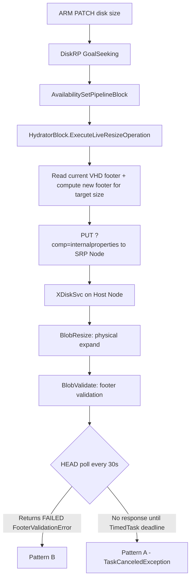

# Playbook F — Disk Lifecycle (Deep)

> **Companion to** [`playbook-F-disk-core.md`](./playbook-F-disk-core.md). Core file is the routing entry point; this file holds full KQL bodies, customer-RCA blocks, and per-error workarounds. **All anchors are `MD-*` (Managed Disk)** — pasteable directly from the core router.

## Cluster shortcuts (paste at top of every Kusto session)

```kusto
let disks       = cluster('disks.kusto.windows.net').database('Disks');
let crp         = cluster('azcrp.kusto.windows.net').database('crp_allprod');
let crp_follow  = cluster('Azcsupfollower2.centralus.kusto.windows.net').database('crp_allprod');
let armprodgbl  = cluster('armprodgbl.eastus.kusto.windows.net').database('ARMProd');
let azcm        = cluster('AzureCM.kusto.windows.net').database('AzureCM');
let azcore      = cluster('azcore.centralus.kusto.windows.net').database('Fa');
let storclient  = cluster('storageclient.eastus.kusto.windows.net').database('Fa');
let pav2        = cluster('pav2data.eastus').database('aipusagedb');
let xdata       = cluster('xdataanalytics.westcentralus').database('XDataAnalytics');
let xstore_meta = cluster('Xstore').database('xstore');
```

> **Foundation reference**: `references/disks-queries.md` documents `DiskRPResourceLifecycleEvent`, `DiskManagerApiQoSEvent`, `DiskManagerContextActivityEvent`, `DiskManagerBackgroundTaskContextActivityEvent`, `Disk` snapshot table, `AssociatedXStoreEntityResourceLifecycleEvent`, `DiskRPDiskEncryptionSetLifecycleEvent`. The sections below assume the disk has been identified per that reference and now needs scenario-specific investigation.

---

## Anchor Index

### Delete operations
- [`MD-Delete-1`](#md-delete-1--unable-to-delete-managed-disk-4-cause-router) — Unable to Delete Managed Disk (4-cause router, no KQL)
- [`MD-Delete-2`](#md-delete-2--managed-disk-recovery-soft-delete) — Managed Disk Recovery (Soft Delete, 2 KQL)
- [`MD-Delete-3`](#md-delete-3--unable-to-delete-disk-leased) — Unable to Delete Disk Leased (2 KQL, Databricks pattern)
- [`MD-Delete-4`](#md-delete-4--deleting-unmanaged-vm-tlsversionnotpermitted) — Deleting Unmanaged VM `TlsVersionNotPermitted` (1 KQL)

### Snapshot operations
- [`MD-Snapshot-1`](#md-snapshot-1--pv2-cumulative-snapshot-timing) — PV2 Cumulative Snapshot timing (2 KQL)
- [`MD-Snapshot-2`](#md-snapshot-2--instant-access-snapshot) — Instant Access Snapshot (3 KQL)
- [`MD-Snapshot-3`](#md-snapshot-3--unable-to-create-new-snapshot-snapshotlimitreached) — Unable to Create New Snapshot / `SnapshotLimitReached` (1 KQL — Azure Resource Graph)
- [`MD-Snapshot-4`](#md-snapshot-4--cross-region-snapshot-copy-hung) — Cross-Region Snapshot Copy hung (1 KQL — BackgroundTask)

### Resize operations
- [`MD-Resize-1`](#md-resize-1--changedisksizewhileattachednotallowed) — `ChangeDiskSizeWhileAttachedNotAllowed` (no KQL — deallocate)
- [`MD-Resize-2`](#md-resize-2--liveresizestorageclientfailure-pattern-a-srp-timeout-vs-pattern-b-footervalidationerror) — `LiveResizeStorageClientFailure` Pattern A/B (2 KQL — high-value RCA)
- [`MD-Resize-3`](#md-resize-3--livediskpropertychangeofvmofsizenotsupported) — `LiveDiskPropertyChangeOfVMOfSizeNotSupported` / `OperationNotAllowedDataDisk` (1 KQL)
- [`MD-Resize-4`](#md-resize-4--invalidresizewithname-shrinking-managed-disks) — `InvalidResizeWithName` (Shrinking Managed Disks, no KQL)
- [`MD-Resize-5`](#md-resize-5--unable-to-resize-diskless-vms-temp-disk-sku-mismatch) — Unable to Resize Diskless VMs (temp-disk vs no-temp-disk SKU mismatch, no KQL)

### Convert operations
- [`MD-Convert-1`](#md-convert-1--512n-vs-512e-stripe-vs-abc-node-placement) — 512N vs 512E (Stripe vs ABC node placement, no KQL — FcShell only)
- [`MD-Convert-2`](#md-convert-2--premium-ssd-v2--standard-hdd-snapshot-workaround) — Premium SSD v2 → Standard HDD (snapshot workaround, no KQL)
- [`MD-Convert-3`](#md-convert-3--osdata-disk-content-swap-conversion) — OS↔Data disk content swap (PS recipes, no KQL)
- [`MD-Convert-4`](#md-convert-4--revert-managed-disk-vm-to-unmanaged-legacy) — Revert Managed Disk VM to Unmanaged (legacy / discouraged, no KQL)

### Encryption operations
- [`MD-Encryption-1`](#md-encryption-1--parameter-encryptionsettings-is-not-allowed-pv2--ude-conflict) — Parameter `encryptionSettings` is not allowed (PV2 + UDE conflict, 2 KQL)
- [`MD-Encryption-2`](#md-encryption-2--find-des-for-cmk-disk-recovery) — Find DES for CMK Disk Recovery (1 KQL — DES Lifecycle)
- [`MD-Encryption-3`](#md-encryption-3--sas-token-expiration-60-day-max) — SAS Token Expiration (60-day max, no KQL — notice)

### Visibility issues (in-guest / portal)
- [`MD-Visibility-1`](#md-visibility-1--disk-not-visible-in-portal-zonal-mismatch) — Disk Not Visible in Portal (zonal mismatch, no KQL)
- [`MD-Visibility-2`](#md-visibility-2--disk-not-visible-in-windows-guest) — Disk Not Visible in Windows guest (no KQL — in-guest)
- [`MD-Visibility-3`](#md-visibility-3--disk-not-found-linux-lun-0-problem) — Disk Not Found Linux LUN 0 (kernel SCSI probe behavior, no KQL)
- [`MD-Visibility-4`](#md-visibility-4--disk-size-not-updated-in-windows-after-resize) — Disk Size Not Updated in Windows after Resize (DiskPart `extend filesystem`, no KQL)
- [`MD-Visibility-5`](#md-visibility-5--spanned-disk-missing) — Spanned Disk Missing (foreign disks after partial copy, no KQL)

### Reset events
- [`MD-Event-1`](#md-event-1--event-129-reset-to-device-generic-stornvme-storahci-vhdmp) — Event 129 Reset to Device (generic — stornvme/storahci/vhdmp, no KQL)
- [`MD-Event-2`](#md-event-2--stornvme-event-129-asap--io-timeout-known-issue) — stornvme Event 129 (ASAP IO Timeout known issue, 3 KQL — cross-links to `asap-storage-queries.md`)
- [`MD-Event-3`](#md-event-3--event-157-disk-surprise-remove) — Event 157 Disk Surprise Remove (cluster + non-cluster mitigations, no KQL)

### Allocation / colocation (advanced)
- [`MD-Colocation-1`](#md-colocation-1--software-latency-zone-slz-silent-feature-) — Software Latency Zone (SLZ, 6 KQL) **⚠ SILENT — DO NOT DISCUSS WITH CUSTOMERS**
- [`MD-UltraSSD-1`](#md-ultrassd-1--overconstrainedzonalallocationrequest-ultrassd) — `OverconstrainedZonalAllocationRequest` (UltraSSD, 1 KQL)

### Billing
- [`MD-Billing-1`](#md-billing-1--standard-hddssd-billing-anomalies) — Standard HDD/SSD Billing Anomalies (3 KQL — PAv2 + XStore hourly)

### Platform-side
- [`MD-Platform-1`](#md-platform-1--502-gateway-error-on-virtualmachines-collection) — 502 Gateway Error on virtualMachines collection (3 KQL — ARM+CRP+DiskRP fan-out)
- [`MD-Shared-1`](#md-shared-1--shared-disk-not-propagating-cluster-fs-required) — Shared Disk Not Propagating (cluster FS required, no KQL)

### Workflows + ownership
- [`MD-Workflow-Router`](#md-workflow-router--attachdetach--create--delete--resize) — Attach/Detach/Create/Delete/Resize routing decision tree
- [`MD-Other-Ephemeral`](#md-other-ephemeral--ephemeral-os-disk) — Ephemeral OS Disk (no KQL — concept)
- [`MD-Other-Unattached`](#md-other-unattached--remove-unattached-data-disks) — Remove Unattached Data Disks (no KQL — PS script with disclaimer)
- [`MD-Other-Upload`](#md-other-upload--managed-disk-direct-upload) — Managed Disk Direct Upload (no KQL — process)
- [`MD-Other-Unmanaged-Retirement`](#md-other-unmanaged-retirement--unmanaged-disk-retirement-2026-03-31) — Unmanaged Disk Retirement (2026-03-31, no KQL)
- [`MD-Other-Unmanaged-OSSwap`](#md-other-unmanaged-osswap--unmanaged-os-disk-swap-storage-explorer--cli) — Unmanaged OS Disk Swap (Storage Explorer + CLI/PS, no KQL)

---

## MD-Delete-1 — Unable to Delete Managed Disk (4-cause router)

**Scope**: ARM/CRP returns `OperationNotAllowed` or "DiskIsAttached" for a delete on a disk that the customer can't otherwise reach. No KQL — purely a routing decision based on what the error string says and what Jarvis/ASC shows.

| Cause | Symptom | Action |
|---|---|---|
| 1 — VM still exists | Disk shows `managedBy = <vmId>` and VM exists | Detach (data disk) or delete VM (OS disk) first |
| 2 — VM in CRP but not ARM cache | Error: "Could not find resource <vmId> in ARM cache" | Collab to ARM team: `Azure/Azure Resource Manager (ARM)/Resource Management/Resource not showing up` |
| 3 — VM gone, `managedBy` stale | VM no longer exists but `managedBy` still references it | ICM to **EEEAzureRT** for KVS update (delete stale `managedBy`) |
| 4 — AvSet member error | Error surfaces from a *different* VM in the same AvSet | Deallocate the specific VM (or all VMs in AvSet), retry |

**Symptom 2 — reserved name** (e.g., `App_Data`, anything containing reserved keyword): cannot be deleted via API. ICM to **EEEAzureRT** to delete from backend.

**Foundation queries**: existence check via `DiskManagerApiQoSEvent` and current state via `DiskRPResourceLifecycleEvent` (see `references/disks-queries.md`).

**TSG**: https://supportability.visualstudio.com/AzureIaaSVM/_wiki/wikis/AzureIaaSVM/22085

---

## MD-Delete-2 — Managed Disk Recovery (Soft Delete)

**Scope**: Customer deleted a disk and wants it back. Soft-delete is the platform-side recovery path. Premium SSD v2 and Ultra SSD are **NOT** recoverable in any state — confirm `storageAccountType` first.

### Q1 — Per-disk soft-delete verification

```kusto
cluster("disks.kusto.windows.net").database("Disks").DiskRPResourceLifecycleEvent
| where MonitoringApplication == "DiskRP-{Region}_Monitoring"  // e.g., DiskRP-centralus_Monitoring
| where subscriptionId == "{SubscriptionId}"
| where resourceName contains "{DeletedDiskName}"
| where PreciseTimeStamp >= datetime({StartTime}) and PreciseTimeStamp <= datetime({EndTime})
| project PreciseTimeStamp, resourceGroupName, resourceName, blobUrl, storageAccountType, diskEvent, RPTenant
```

**Interpretation**: latest `diskEvent` must be `SoftDelete` (not `HardDelete`) **AND** `storageAccountType` must NOT be `UltraSSD_LRS` or `Premium_SSDv2`. If latest is `HardDelete` → follow [Hard Deleted Disk TSG](https://supportability.visualstudio.com/AzureIaaSVM/_wiki/wikis/AzureIaaSVM/748073) instead.

### Q2 — Bulk soft-deleted disks in a Resource Group (for batch CSV recovery)

The recovery team needs a row per disk with `wellknownsubscriptionid` / `smeregionarmnameparameter` / `smesourceresourcegroupnameparameter` / `smesourcedisknameparameter` / `smetargetresourcegroupnameparameter` / `smetargetdisknameparameter` / `smeapiversionparameter`. The query uses a massive `extend region = replace(...)` chain to convert `RPTenant` (e.g., `DiskRP-centralus`) into the ARM region name (e.g., `CentralUS`) the recovery script expects.

```kusto
let subID="{SubscriptionId}";
let SourceRGname="{SourceRGName}";              // case sensitive
let targetRGname="{TargetRGName}";              // empty = same as source
let timewindow = 7d;                            // e.g. 1h, 7d, 30d
cluster('Disks').database('Disks').DiskRPResourceLifecycleEvent
| where PreciseTimeStamp > ago(timewindow)
| where subscriptionId == subID
| where resourceGroupName has SourceRGname
| where diskEvent has "SoftDelete"
| extend region=replace(@'DiskRP-australiacentral',@'AustraliaCentral',RPTenant)
| extend region=replace(@'DiskRP-australiacentral2',@'AustraliaCentral2',region)
| extend region=replace(@'DiskRP-australiaeast',@'AustraliaEast',region)
| extend region=replace(@'DiskRP-australiasoutheast',@'AustraliaSouthEast',region)
| extend region=replace(@'DiskRP-brazilsouth',@'BrazilSouth',region)
| extend region=replace(@'DiskRP-brazilsoutheast',@'BrazilSoutheast',region)
| extend region=replace(@'DiskRP-canadacentral',@'CanadaCentral',region)
| extend region=replace(@'DiskRP-canadaeast',@'CanadaEast',region)
| extend region=replace(@'DiskRP-centralindia',@'CentralIndia',region)
| extend region=replace(@'DiskRP-centralus',@'CentralUS',region)
| extend region=replace(@'DiskRP-centraluseuapP',@'CentralUSEUAP',region)
| extend region=replace(@'DiskRP-eastasia',@'EastAsia',region)
| extend region=replace(@'DiskRP-eastus',@'EastUS',region)
| extend region=replace(@'DiskRP-eastus2',@'EastUS2',region)
| extend region=replace(@'DiskRP-eastus2euap',@'EastUS2EUAP',region)
| extend region=replace(@'DiskRP-francecentral',@'FranceCentral',region)
| extend region=replace(@'DiskRP-francesouth',@'FranceSouth',region)
| extend region=replace(@'DiskRP-germanynorth',@'GermanyNorth',region)
| extend region=replace(@'DiskRP-germanywestcentral',@'GermanyWestCentral',region)
| extend region=replace(@'DiskRP-israelcentral',@'IsraelCentral',region)
| extend region=replace(@'DiskRP-italynorth',@'ItalyNorth',region)
| extend region=replace(@'DiskRP-japaneast',@'JapanEast',region)
| extend region=replace(@'DiskRP-japanwest',@'JapanWest',region)
| extend region=replace(@'DiskRP-jioindiacentral',@'JioIndiaCentral',region)
| extend region=replace(@'DiskRP-jioindiawest',@'JioIndiaWest',region)
| extend region=replace(@'DiskRP-koreacentral',@'KoreaCentral',region)
| extend region=replace(@'DiskRP-koreasouth',@'KoreaSouth',region)
| extend region=replace(@'DiskRP-malaysiasouth',@'MalaysiaSouth',region)
| extend region=replace(@'DiskRP-mexicocentral',@'MexicoCentral',region)
| extend region=replace(@'DiskRP-newzealandnorth',@'NewZealandNorth',region)
| extend region=replace(@'DiskRP-northcentralus',@'NorthCentralUS',region)
| extend region=replace(@'DiskRP-northeurope',@'NorthEurope',region)
| extend region=replace(@'DiskRP-norwayeast',@'NorwayEast',region)
| extend region=replace(@'DiskRP-norwaywest',@'NorwayWest',region)
| extend region=replace(@'DiskRP-polandcentral',@'PolandCentral',region)
| extend region=replace(@'DiskRP-qatarcentral',@'QatarCentral',region)
| extend region=replace(@'DiskRP-southafricanorth',@'SouthAfricaNorth',region)
| extend region=replace(@'DiskRP-southafricawest',@'SouthAfricaWest',region)
| extend region=replace(@'DiskRP-southcentralus',@'SouthCentralUS',region)
| extend region=replace(@'DiskRP-southeastasia',@'SoutheastAsia',region)
| extend region=replace(@'DiskRP-southindia',@'SouthIndia',region)
| extend region=replace(@'DiskRP-spaincentral',@'SpainCentral',region)
| extend region=replace(@'DiskRP-swedencentral',@'SwedenCentral',region)
| extend region=replace(@'DiskRP-swedensouth',@'SwedenSouth',region)
| extend region=replace(@'DiskRP-switzerlandnorth',@'SwitzerlandNorth',region)
| extend region=replace(@'DiskRP-switzerlandwest',@'SwitzerlandWest',region)
| extend region=replace(@'DiskRP-taiwannorth',@'TaiwanNorth',region)
| extend region=replace(@'DiskRP-taiwannorthwest',@'TaiwanNorthWest',region)
| extend region=replace(@'DiskRP-uaecentral',@'UAECentral',region)
| extend region=replace(@'DiskRP-uaenorth',@'UAENorth',region)
| extend region=replace(@'DiskRP-uksouth',@'UKSouth',region)
| extend region=replace(@'DiskRP-uksouth2',@'UKSouth2',region)
| extend region=replace(@'DiskRP-ukwest',@'UKWest',region)
| extend region=replace(@'DiskRP-westcentralus',@'WestCentralUS',region)
| extend region=replace(@'DiskRP-westeurope',@'WestEurope',region)
| extend region=replace(@'DiskRP-westindia',@'WestIndia',region)
| extend region=replace(@'DiskRP-westus',@'WestUS',region)
| extend region=replace(@'DiskRP-westus2',@'WestUS2',region)
| extend region=replace(@'DiskRP-westus3',@'WestUS3',region)
| project wellknownsubscriptionid=subscriptionId, smeregionarmnameparameter=region, smesourceresourcegroupnameparameter=resourceGroupName,
          smesourcedisknameparameter=resourceName, smetargetresourcegroupnameparameter=targetRGname, smetargetdisknameparameter='', smeapiversionparameter=''
| summarize arg_max(wellknownsubscriptionid, smeregionarmnameparameter, smesourceresourcegroupnameparameter, smesourcedisknameparameter,
            smetargetresourcegroupnameparameter, smetargetdisknameparameter, smeapiversionparameter) by smesourcedisknameparameter
| project wellknownsubscriptionid, smeregionarmnameparameter, smesourceresourcegroupnameparameter, smesourcedisknameparameter, smetargetresourcegroupnameparameter,
          smetargetdisknameparameter='', smeapiversionparameter=''
| sort by smesourcedisknameparameter asc
```

Export results to CSV → attach to the recovery IcM.

### Recovery process

1. Verify SoftDelete (Q1 or Q2 above)
2. Create IcM via [Managed Disk Recovery Template](https://aka.ms/ManagedDiskRecoveryTemplate) — **must be Sev 4**
3. Email `cssdiskrec@microsoft.com`
4. If CMK-encrypted: first run § [MD-Encryption-2](#md-encryption-2--find-des-for-cmk-disk-recovery) to identify the DES + KV + key, then create a new DiskEncryptionSet with the same KV + key, recover the KV if also deleted, add access policy on KV for the DES (wrap/unwrap/get); then ICM AzureRT/Disk Service for `Invoke-ApplyDiskEncryptionSetToPendingBlobAccount`

**JIT**: recovery team needs JIT to `DiskRPSupport` / `PlatformServiceOperator`. TA approval required. For Fairfax: USME + AME access, or escort access.

**TSG**: https://supportability.visualstudio.com/AzureIaaSVM/_wiki/wikis/AzureIaaSVM/22148

---

## MD-Delete-3 — Unable to Delete Disk Leased

**Scope**: Disk delete fails with `LeaseIdMissing` / `DiskServiceInternalError` because of an active blob lease. Most commonly seen on Databricks cluster disks stuck in `ToBeDeleted` state.

### Q1 — Confirm the disk is stuck in deleting

```kusto
cluster('disks.kusto.windows.net').database('Disks').DiskRPResourceLifecycleEvent
| where PreciseTimeStamp between (datetime({StartTime}) .. datetime({EndTime}))
| where subscriptionId contains "{SubscriptionId}"
| where resourceGroupName contains "{ResourceGroupName}"
| where resourceName == "{DiskName}"
| project PreciseTimeStamp, activityId, callerName, diskEvent, stage, ['state'], crpDiskId, diskOwner, storageAccountName, resourceGroupName, resourceName
```

Pick the `activityId` of the latest failed delete attempt.

### Q2 — Verbose deletion trace (look for lease signature)

```kusto
cluster('disks.kusto.windows.net').database('Disks').DiskManagerContextActivityEvent
| where PreciseTimeStamp between (datetime({StartTime}) .. datetime({EndTime}))
| where activityId == "{ActivityId}"
| project PreciseTimeStamp, callerName, subscriptionId, message, sourceFile, lineNumber
```

**Error signatures** (any of these confirms the lease scenario):

1. `Microsoft.WindowsAzure.DiskRP.StorageCorClient.StorageCorException: Storage HTTP DELETE ... failed PreconditionFailed` + `Error message: There is currently a lease on the blob and no lease ID was specified in the request.`
2. `BreakLeaseFeatureState: Enabled, leaseBreakable: False` + `Blob with Lease: ... can not be added to PendingBlobs` + `DiskServiceInternalError: The operation is not permitted because there is a lease on the blob.`

### Mitigation

Known issue WorkItem 78300. **Open ICM through ASC** → engineering team breaks the disk lease from backend (cannot be done via portal/API).

**Reference ICMs**: 426625265, 425112821, 646948668 (the last is the `FailToDeleteVMSS` variant of the same root cause).

**TSG**: https://supportability.visualstudio.com/AzureIaaSVM/_wiki/wikis/AzureIaaSVM/748245

---

## MD-Delete-4 — Deleting Unmanaged VM `TlsVersionNotPermitted`

**Scope**: VM with unmanaged disk fails to delete because the underlying storage account requires TLS 1.3 but the delete operation uses an older TLS version.

**Symptom**: `StatusMessage: The TLS version of the connection is not permitted on this storage account. ErrorCode: TlsVersionNotPermitted`

### Q1 — Find the failed CRP delete op

```kusto
let uri="{VMResourceUri}";
cluster("azcrp").database("crp_allprod").ApiQosEvent_nonGet
| where PreciseTimeStamp > ago(30d)
| where subscriptionId =~ split(uri,"/")[2] and resourceGroupName contains split(uri,"/")[4] and resourceName contains split(uri,"/")[8]
| where operationName !in ("AsyncOperationCompletionOperation","VirtualMahines.RetrieveBootDiagnosticsData.POST","VirtualMachines.RetrieveVMConsoleSerialLogs.POST", "VirtualMachines.RetrieveVMConsoleScreenshot.POST") and operationName !startswith "Restore"
| project PreciseTimeStamp, operationId, correlationId, operationName, resourceName, httpStatusCode, resultCode, exceptionType, errorDetails, region, requestEntity
| sort by PreciseTimeStamp asc
```

### Mitigation

Portal → Storage Account holding the VHDs → **Configuration → Minimum TLS Version → set lower than 1.3** → retry VM delete. (Customer may then revert TLS setting after delete completes.)

---

## MD-Snapshot-1 — PV2 Cumulative Snapshot timing

**Scope**: Customer asks why a PV2 cumulative snapshot is "still pending" or why creating a disk from snapshot is slow. Both are timing investigations using `DDSnapshotCreate` → `DDSnapshotCopyCompleted` and `Create` → `DDDiskImportCompleted` event pairs.

### Q1 — Snapshot copy time (DDSnapshotCreate → DDSnapshotCopyCompleted)

```kusto
cluster("disks.kusto.windows.net").database("Disks").DiskRPResourceLifecycleEvent
| where PreciseTimeStamp >= datetime({StartTime}) and PreciseTimeStamp <= datetime({EndTime})
| where subscriptionId == "{SubscriptionId}"
| where resourceGroupName contains "{ResourceGroupName}"
| where resourceName == "{SourceDiskName}"
| extend IsCanary = RPTenant contains "euap"
| where IsCanary == "false"
| where diskEvent == "DDSnapshotCreate"
| where stage == "After"
| extend sascreate = PreciseTimeStamp
| join kind = inner (
    cluster("disks.kusto.windows.net").database("Disks").DiskRPResourceLifecycleEvent
    | where PreciseTimeStamp >= datetime({StartTime}) and PreciseTimeStamp <= datetime({EndTime})
    | where subscriptionId == "{SubscriptionId}"
    | where resourceGroupName contains "{ResourceGroupName}"
    | where diskEvent == "DDSnapshotCopyCompleted"
    | where stage == "After"
    | extend DiskSizeTB = toint(diskSizeBytes / (1024 * 1024 * 1024 * 1024))
    | extend completed = PreciseTimeStamp
) on $left.id == $right.id
| extend TimeTakenInHour = (completed - sascreate) / timespan(1m) / 60
| project id, TimeTakenInHour, DiskSizeTB, resourceGroupName, resourceName, subscriptionId
| take 10
```

### Q2 — Disk-creation-from-snapshot time (Create → DDDiskImportCompleted)

```kusto
cluster("disks.kusto.windows.net").database("Disks").DiskRPResourceLifecycleEvent
| where PreciseTimeStamp >= datetime({StartTime}) and PreciseTimeStamp <= datetime({EndTime})
| where subscriptionId == "{SubscriptionId}"
| where resourceGroupName contains "{ResourceGroupName}"
| where resourceName == "{CreatedDiskName}"
| where diskEvent == "DDDiskImportCompleted"
| extend DiskImportComplete = PreciseTimeStamp
| join kind = inner (
    cluster("disks.kusto.windows.net").database("Disks").DiskRPResourceLifecycleEvent
    | where PreciseTimeStamp >= datetime({StartTime}) and PreciseTimeStamp <= datetime({EndTime})
    | where subscriptionId == "{SubscriptionId}"
    | where resourceGroupName contains "{ResourceGroupName}"
    | where diskEvent == "Create"
    | extend DiskCreate = PreciseTimeStamp
) on id
| extend TimeTakenInHour = (DiskImportComplete - DiskCreate) / timespan(1m) / 60
| project id, DiskSizeTB = diskSizeBytes / (1024 * 1024 * 1024 * 1024), TimeTakenInHour
```

**Interpretation**: PV2 cumulative snapshots take longer than incrementals because they include the previous snapshot deltas materialized. Customer-visible "still pending" is normal until `DDSnapshotCopyCompleted` fires.

---

## MD-Snapshot-2 — Instant Access Snapshot

**Scope**: PV2 + Ultra Instant Access Snapshot lifecycle, error codes, and verification queries.

### Background — Instant Access Snapshot states

| State | Disk type | Capabilities |
|---|---|---|
| `Available` | Pv1/SSD/HDD; Pv2/Ultra Incremental | Background copy DONE; shallow copy permitted |
| `InstantAccess` | Pv2/Ultra | Can **restore** disks fast but **cannot** copy/download; before `InstantAccessDurationMinute` hits and background copy in progress |
| `AvailableWithInstantAccess` | Pv2/Ultra | Can restore + copy + download; copy completed |

### Error codes

| Error code | Meaning |
|---|---|
| `InvalidInstantAccessRequest` | Source disk is undergoing a background data copy (e.g., disk in import). Wait or retry on a different source. |
| `AzdError_InstantAccessNotEnabled` | DD backend does not support the feature in this region/account. |
| `AzdError_MigrationAndInstantAccessSnapshotsNotSupportedTogether` | Disk is in move/migration (AvSet collocation, VMSS, zonal alignment). Wait for migration to finish. |

### Q1 — Was Instant Access Snapshot created?

```kusto
cluster('Disks').database('Disks').DiskManagerApiQoSEvent
| where PreciseTimeStamp > ago(7d)
| where operationName == "Snapshots.ResourceOperation.PUT"
| where resultType != "1"
| extend InstantAccessDuration = tostring(parse_json(requestEntity).properties.creationData.instantAccessDurationMinutes)
| where InstantAccessDuration != ""
| distinct RPTenant, operationId, succeeded, resultType, SubscriptionId, region, Day = bin(PreciseTimeStamp,1d)
```

### Q2 — Failed Instant Access PUTs with error details

```kusto
cluster('Disks').database('Disks').DiskManagerApiQoSEvent
| where PreciseTimeStamp > ago(30d)
| where operationName == "Snapshots.ResourceOperation.PUT"
| where resultType == 2
| extend InstantAccessDuration = tostring(parse_json(requestEntity).properties.creationData.instantAccessDurationMinutes)
| where InstantAccessDuration != ""
| project SubscriptionId, resourceGroupName, resourceName, operationId, resultType, resultCode, errorDetails, Day = bin(PreciseTimeStamp,1d)
```

### Q3 — Disks restored from Instant Access (DDRestoreFromInstantAccessSnapshot)

```kusto
cluster('disks').database('Disks').DiskRPResourceLifecycleEvent
| where PreciseTimeStamp > ago(7d)
| where diskEvent == "DDRestoreFromInstantAccessSnapshot"
| extend SubscriptionId = subscriptionId
| join kind = leftouter (
    cluster('Xstore').database('xstore').LatestProduct360CustomerSubscriptionsDaily
    | project SubscriptionId, CustomerName, BillingType)
on SubscriptionId
| summarize dcount(id) by CustomerName
```

---

## MD-Snapshot-3 — Unable to Create New Snapshot / `SnapshotLimitReached`

**Scope**: Snapshot create returns `SnapshotLimitReached` — "The snapshot count was exceeded for a disk. Please delete a snapshot before creating another one." Limit is **500 snapshots per disk**.

### Q1 — Verify snapshot count for the disk (Azure Resource Graph)

```kusto
resources
| where type =~ "microsoft.compute/snapshots"
| summarize snapshotCount = count() by diskId = tostring(properties.creationData.sourceResourceId)
| where diskId == "{DiskResourceId}"
```

Confirm in portal too: Snapshots blade → filter by disk resource.

### Mitigation

| Result | Action |
|---|---|
| `snapshotCount < 500` | Customer's portal view is stale or there are **leaked snapshots**. Open IcM to **AzureRT** — needs EEE/PG to clean up. |
| `snapshotCount >= 500` | Customer must delete some snapshots before creating new ones. |

---

## MD-Snapshot-4 — Cross-Region Snapshot Copy hung

**Scope**: Cross-region incremental snapshot copy stalled at `<100%` `completionPercent`. Background task lives in `DiskManagerBackgroundTaskContextActivityEvent`.

### Q1 — TrackingAsyncCopyTask progress

```kusto
let _region = "{RegionName}";
let _snapshotARMId = "/subscriptions/{SubscriptionId}/resourcegroups/{ResourceGroupName}/providers/microsoft.compute/snapshots/{SnapshotName}";
let _subid = tostring(split(_snapshotARMId, "/")[2]);
let _rgname = tostring(split(_snapshotARMId, "/")[4]);
let _rname = tostring(split(_snapshotARMId, "/")[8]);
cluster("disks").database("disks").DiskManagerBackgroundTaskContextActivityEvent
| where PreciseTimeStamp > ago(6h)
| where RPTenant =~ strcat("DiskRP-", _region) and taskName == "TrackingAsyncCopyTask" and traceCode == 710103 and lineNumber != 314
| where message contains strcat("/Subscriptions/", _subid, "/ResourceGroups/", _rgname, "/disks/", _rname)
| project PreciseTimeStamp, message, callerName
| order by PreciseTimeStamp asc
```

**Interpretation**:
- Rows present + recent + `completionPercent` advancing → copy is still active, wait
- No rows OR stale most-recent row + no `completionPercent` change → **copy hung** → ICM `xstore/Triage` (table-server issue)

**Alternative**: DGrep [https://portal.microsoftgeneva.com/s/62803206](https://portal.microsoftgeneva.com/s/62803206) — select target region + provide snapshot ARM ID (or just snapshot name).

### Background — Incremental snapshots

- Default at create-time: `Incremental=true`
- `Standard_LRS` by default; `Standard_ZRS` if region supports ZRS
- `CopyStart` option enables cross-region copy, cross-sub copy, in-region copy for ZRS hardening
- Each incremental snapshot only copies delta → reduces RPO

---

## MD-Resize-1 — `ChangeDiskSizeWhileAttachedNotAllowed`

**Error**: `ChangeDiskSizeWhileAttachedNotAllowed` / `OperationNotAllowed` — "Cannot resize disk DISKNAME while it is attached to running VM ... Resizing a disk of an Azure Virtual Machine requires the virtual machine to be deallocated."

**Fix**: Deallocate VM **OR** detach disk before resize. (If customer needs live resize, see [MD-Resize-3](#md-resize-3--livediskpropertychangeofvmofsizenotsupported) for SKU eligibility.)

---

## MD-Resize-2 — `LiveResizeStorageClientFailure` (Pattern A SRP Timeout vs Pattern B FooterValidationError)

**Scope**: Live resize of a managed disk attached to a running VM fails with `LiveResizeStorageClientFailure`. There are two distinct root causes — distinguishing Pattern A vs B determines the workaround.

| | Pattern A — SRP Timeout | Pattern B — FooterValidationError |
|---|---|---|
| Root cause | SRP node didn't respond in time (usually bulk/automated ops causing concurrent load) | DiskRP sent a bad VHD footer; XDiskSvc rejected it during BlobValidate |
| Key signal | `TaskCanceledException` in activity logs | `FooterValidationError` in `x-ms-internal-disk-operation-result` |
| Workaround | Option 3 (retry via Portal/SDK with throttling) | Option 1 (detach→resize→reattach) or Option 2 (offline) |

### How live resize works (RCA pipeline)



**Preemption note**: If a sibling disk in the same AvSet is patched at the same time, a new pipeline activity will inherit the in-flight SRP op. The `FooterValidationError` may then appear under a **new preempting activity ID**. If Step 2 below returns nothing, check the original activity for `Switching activity-id to <X>` and re-run Step 2 with that new ID.

### Step 1 — Pull full op details from DiskRP

```kusto
cluster('disks.kusto.windows.net').database('Disks').DiskManagerApiQoSEvent
| where PreciseTimeStamp between (datetime({StartTime}) .. datetime({EndTime}))
| where subscriptionId contains "{SubscriptionId}"
| where resourceGroupName contains "{ResourceGroupName}"
| where resourceName contains "{DiskName}"
| where operationName !contains "Disks.ResourceOperation.GET"
| where operationName !contains "DiskOperations.Get.GET"
| project PreciseTimeStamp, correlationId, operationId, operationName, resultCode,
          resourceName, errorDetails, userAgent, requestEntity,
          subscriptionId, resourceGroupName, region, e2EDurationInMilliseconds, httpStatusCode
| order by PreciseTimeStamp asc
```

Pick the `operationId` of the failed PATCH/PUT. That's your `activityId` for Step 2.

### Step 2 — Check for FooterValidationError (confirms Pattern B)

```kusto
cluster('disks.kusto.windows.net').database('Disks').DiskManagerContextActivityEvent
| where PreciseTimeStamp between (datetime({StartTime}) .. datetime({EndTime}))
| where subscriptionId contains "{SubscriptionId}"
| where activityId == "{ActivityId}"
| where message contains "FooterValidationError"
| project PreciseTimeStamp, callerName, subscriptionId, message, sourceFile, lineNumber, activityId
```

| Result | Classification |
|---|---|
| Rows returned, message contains `x-ms-internal-disk-operation-result={..."ErrorCode": "FooterValidationError"...}` | **Pattern B** → Option 1 or 2 |
| No rows, re-run unfiltered → `TaskCanceledException` at `PollForLivePropertyChangeOperationCompletion` | **Pattern A** → Option 3 |
| No rows, original activity shows `Switching activity-id to <X>` | Preemption — re-run Step 2 with the new activity ID |
| Neither pattern clear | Escalate with both query outputs attached |

### Option 1 — Detach → Resize → Reattach (both patterns, VM stays running)

```powershell
$vm = Get-AzVM -ResourceGroupName "{RG}" -Name "{VMName}"
Remove-AzVMDataDisk -VM $vm -Name "{DiskName}"
Update-AzVM -ResourceGroupName "{RG}" -VM $vm

$disk = Get-AzDisk -ResourceGroupName "{RG}" -DiskName "{DiskName}"
$disk.DiskSizeGB = {NewSizeGB}
Update-AzDisk -ResourceGroupName "{RG}" -Disk $disk -DiskName $disk.Name

$disk = Get-AzDisk -ResourceGroupName "{RG}" -DiskName "{DiskName}"
Add-AzVMDataDisk -VM $vm -Name "{DiskName}" -ManagedDiskId $disk.Id -Lun {LUN} -CreateOption Attach
Update-AzVM -ResourceGroupName "{RG}" -VM $vm
```

### Option 2 — Offline resize (VM deallocated)

```powershell
Stop-AzVM -ResourceGroupName "{RG}" -Name "{VMName}" -Force
$disk = Get-AzDisk -ResourceGroupName "{RG}" -DiskName "{DiskName}"
$disk.DiskSizeGB = {NewSizeGB}
Update-AzDisk -ResourceGroupName "{RG}" -Disk $disk -DiskName $disk.Name
Start-AzVM -ResourceGroupName "{RG}" -Name "{VMName}"
```

### Option 3 — Retry from portal or official SDK (Pattern A only)

Wait, then retry from **Portal → Disk blade → Size + Performance**, OR via **Az PowerShell / CLI** (these have built-in throttling/retry). Do **NOT** retry with the bulk automation tool that caused the original failure — same load will reproduce the SRP timeout.

---

## MD-Resize-3 — `LiveDiskPropertyChangeOfVMOfSizeNotSupported`

**Errors** (both share this root cause):
- `LiveDiskPropertyChangeOfVMOfSizeNotSupported` / `OperationNotAllowed` — "Change in disk property of VM of size [VM Size] is not supported."
- `OperationNotAllowedDataDisk` from the **Resize OperationNotAllowedDataDisk** TSG — same VM-SKU-doesn't-support-live-disk-resize cause; use the same Q1 + mitigation below.

**Cause**: Live data-disk resize is supported only on **some** VM SKUs. Depends on disk type, disk size, and VM size.

### Q1 — Find the failed live-resize op (to confirm error code)

```kusto
let s = datetime({StartTime});
let e = datetime({EndTime});
cluster('Azcsupfollower2.centralus.kusto.windows.net').database('crp_allprod').ApiQosEvent_nonGet
| where PreciseTimeStamp between (s..e)
| where subscriptionId == "{SubscriptionId}"
| extend target = extractjson('$.target', errorDetails, typeof(string))
| extend diskSizeGB = extractjson('$.disks[0].diskSizeGB', requestEntity, typeof(string))
| extend crpDiskId = extractjson('$.disks[0].crpDiskId', requestEntity, typeof(string))
| where resultCode contains "LiveDiskPropertyChangeOfVMOfSizeNotSupported"
| project region, operationName, operationId, target, diskSizeGB, crpDiskId, resultCode, subscriptionId, resourceName, errorDetails
| take 5
```

### PowerShell to list SKUs that support live disk resize

```powershell
Connect-AzAccount
$subscriptionId="yourSubID"
$location="desiredRegion"
Set-AzContext -Subscription $subscriptionId
$vmSizes=Get-AzComputeResourceSku -Location $location | where {$_.ResourceType -eq 'virtualMachines'}

foreach($vmSize in $vmSizes){
    foreach($capability in $vmSize.Capabilities)
    {
       if(($capability.Name -eq "EphemeralOSDiskSupported" -and $capability.Value -eq "True") -or ($capability.Name -eq "PremiumIO" -and $capability.Value -eq "True") -or ($capability.Name -eq "HyperVGenerations" -and $capability.Value -match "V2"))
        {
            $vmSize.Name
       }
   }
}
```

### Mitigation

Deallocate VM **OR** detach disk before resize. If customer must resize live, recommend resizing the VM to a SKU that supports it first.

---

## MD-Resize-4 — `InvalidResizeWithName` (Shrinking Managed Disks)

**Error**: `InvalidResizeWithName` / `BadRequest` — "cannot be resized down. Reducing disk/snapshot size is not supported in Azure to prevent data loss."

**No KQL** — this is a platform restriction, not a bug to investigate.

**Workaround**:
- **OS disk** — provision a new VM with smaller disk + migrate
- **Data disk** — create a smaller disk + copy data + detach old

---

## MD-Resize-5 — Unable to Resize Diskless VMs (temp-disk SKU mismatch)

**Error**: `OperationNotAllowed` — "Unable to resize the VM 'VMName' since changing from resource disk to non-resource disk VM size and vice-versa is not allowed."

**Symptom**: The desired target SKU doesn't appear in the **Portal → Resize** blade. Even when forced via CLI/PS the resize fails with the error above.

**Root cause**: An Azure VM cannot mix temp-disk and no-temp-disk SKUs during resize. Only allowed transitions: temp→temp, no-temp→no-temp. "Diskless" (no temp disk) families like `Dasv5`/`Easv5`/`Dadsv5`/`Eadsv5` cannot be live-resized to their temp-disk counterparts (or vice-versa).

**Workaround**:
1. Snapshot the OS disk
2. Create new disk from the snapshot
3. Create new VM with the target SKU using that disk

**Reference**: https://aka.ms/AAah4sj (full SKU-family compatibility matrix)

---

## MD-Convert-1 — 512N vs 512E (Stripe vs ABC node placement)

**Scope**: Mixed 512N (logical 512 / physical 512) + 512E (logical 512 / physical 4096) sectors in a SQL Always-On Availability Group → slow synchronization (see KB3009974). Standard HDD on stripe-cluster nodes is 512N; Standard HDD on ABC nodes is 512E; S-series (premium-capable) always lands on ABC → always 512E.

### Validate (FcShell, internal only)

```powershell
$f = Get-Fabric <Cluster>
$n = $f | Get-Node <NodeId>
$n.Internals.MachineProperties     # PreparedMode = ABC or Stripe
```

### Workaround

Resize VM to `Ds_v3` (premium-capable) → forces ABC node → 512E consistent. No procedure to move from ABC back to stripe. Most apps support 4k sectors natively.

**Cross-link**: Switching from Stripe to ABC: start/resize can take a long time → see [Host Node Switched to Disk configuration TSG](https://supportability.visualstudio.com/AzureIaaSVM/_wiki/wikis/AzureIaaSVM/495447).

**Reference ICMs**: 147427610, 218505405.

---

## MD-Convert-2 — Premium SSD v2 → Standard HDD (snapshot workaround)

**Scope**: Conversion `Premium_SSDv2_LRS` → `Standard_LRS` is **NOT** supported via `az disk update --sku Standard_LRS` (returns error). Workaround uses snapshot.

**Steps**:

1. Stop + Deallocate VM
2. Create snapshot of the PV2 disk
3. Monitor via `Get-AzSnapshot` / `az snapshot show` until provisioning is `Succeeded`
4. Create new Standard HDD LRS disk from snapshot
5. Attach to VM (replace original PV2 reference)
6. Start VM

---

## MD-Convert-3 — OS↔Data disk content swap (conversion)

**Scope**: Contents of OS/Data disk got swapped at the **OS level** (not platform level) — e.g., customer mounted an OS-disk's VHD as a data disk, then tried to boot from it. VM goes into no-boot. PowerShell recipes below avoid the slow VHD download/upload alternative.

### Convert Data Disk snapshot → OS Disk

```powershell
$snapshot = Get-AzSnapshot -ResourceGroupName "{RG}" -SnapshotName "{SnapshotName}"
$diskConfig = New-AzDiskConfig -OsType Windows -HyperVGeneration 2 `
                               -CreateOption Copy -SourceResourceId $snapshot.Id `
                               -Location $snapshot.Location -SkuName Premium_LRS
New-AzDisk -ResourceGroupName "{RG}" -DiskName "{NewOsDiskName}" -Disk $diskConfig
```

### Create OS Disk snapshot from Data Disk

```powershell
$dataDisk = Get-AzDisk -ResourceGroupName "{RG}" -DiskName "{DataDiskName}"
$snapshotConfig = New-AzSnapshotConfig -OsType Windows -HyperVGeneration 2 `
                                       -CreateOption copy -SourceUri $dataDisk.Id `
                                       -Location $dataDisk.Location
New-AzSnapshot -ResourceGroupName "{RG}" -SnapshotName "{NewSnapshotName}" -Snapshot $snapshotConfig
```

Then attach the new OS disk to the original VM (after detaching the corrupted one) and boot.

---

## MD-Convert-4 — Revert Managed Disk VM to Unmanaged (legacy)

**Scope**: Customer asks to revert a managed-disk VM back to unmanaged disks. Modern path **discouraged** — unmanaged disks are deprecated (see [MD-Other-Unmanaged-Retirement](#md-other-unmanaged-retirement--unmanaged-disk-retirement-2026-03-31) for the 2026-03-31 retirement). Provided only as a historical workflow.

### Steps (legacy)

1. Stop + Deallocate VM
2. `ConvertTo-AzVMUnmanagedDisk` PowerShell cmdlet (deprecated path)
3. Detach managed disks
4. Create unmanaged VHDs from snapshots
5. Recreate VM with unmanaged disks

**Recommendation**: Push the customer to stay on managed disks. The retirement timeline makes this path unsustainable.

---

## MD-Encryption-1 — Parameter `encryptionSettings` is not allowed (PV2 + UDE conflict)

**Scope**: VM stuck in failed state after attaching a PV2/Ultra data disk. Error: `Parameter 'encryptionSettings' is not allowed.`

**Pattern**: VM has PV2 or direct-drive data disk; VM had Azure Disk Encryption (ADE) enabled in the past; VM is now stuck in failed state.

### Q1 — Find the ApiQosEvent_nonGet op

```kusto
cluster("azcrp").database("crp_allprod").ApiQosEvent_nonGet
| where PreciseTimeStamp between (datetime({StartTime}) .. datetime({EndTime}))
| where subscriptionId == "{SubscriptionId}"
| where resourceName contains "{VMName}"
| where operationName != 'AsyncOperationCompletionOperation'
| extend StartTime = datetime_add('millisecond', -e2EDurationInMilliseconds, PreciseTimeStamp)
| project PreciseTimeStamp, StartTime, operationId, operationName, resourceName, requestEntity, resultCode, resultType, errorDetails, region, userAgent
```

### Q2 — Confirm UDE flag via ContextActivity

```kusto
cluster("azcrp").database("crp_allprod").ContextActivity
| where PreciseTimeStamp between (datetime({StartTime}) .. datetime({EndTime}))
| where activityId == "{ActivityId}"
| project PreciseTimeStamp, activityId, traceLevel, message, callerName, lineNumber, sourceFile
```

**Look for**: `VM has legacy disk encryption - False, unified disk encryption - True`

### Root cause

Code bug in CRP/DiskRP blocks attach of PV2/Ultra disks to a VM tagged for Unified Disk Encryption (UDE). The VM was tagged because the ADE extension was installed in the past — the UDE flag **persists for VM lifetime in CRP**. UDE settings are not persisted in CRP but retrieved from DiskRP via `RefreshFromBlob`. Allocation fails because PV2 storageType disk + ADE (BitLocker / DM-Crypt) is not supported for PV2.

### Mitigation

1. Detach all PV2 data disks from VM → state becomes Healthy
2. **VM blade → Redeploy + Reapply → Reapply**
3. Validate `(Get-AzVM ...).ProvisioningState == "Succeeded"`
4. Re-attach disks individually

**Internal tracking**:
- Bug: https://msazure.visualstudio.com/One/_workitems/edit/14590470
- ICMs: 517388482, 466882705

---

## MD-Encryption-2 — Find DES for CMK Disk Recovery

**Scope**: When recovering CMK-encrypted disks where the Key Vault was also deleted, the recovery team needs the DES + KV + key URL that was originally associated with the disks. This query joins deleted-disk lifecycle to DES lifecycle.

### Q1 — Find DES / KV / key for deleted CMK disks

```kusto
let deleted_disk =
DiskRPResourceLifecycleEvent
| where subscriptionId == "{SubscriptionId}"
| where diskEvent contains "deleted"
| where diskType != "Snapshot"
| where PreciseTimeStamp >= (datetime({StartTime}))
| extend diskeSet = tostring(split(diskEncryptionSetId, '/')[-1])
| extend diskeSetRg = tostring(split(diskEncryptionSetId, '/')[-5])
| distinct timeCreated, resourceName, PreciseTimeStamp, diskEvent, resourceGroupName, blobUrl, diskEncryptionSetId, diskeSet, diskeSetRg
| project timeCreated, diskeSet, diskeSetRg, resourceName, resourceGroupName, PreciseTimeStamp, diskEvent, blobUrl, diskEncryptionSetId;
let encrypt_disk =
DiskRPDiskEncryptionSetLifecycleEvent
// Use a longer time range for the lifecycle event
| where PreciseTimeStamp >= datetime({StartTime})
| where subscriptionId == "{SubscriptionId}"
| project resourceName, resourceGroupName, keyVaultId, keyUrl;
deleted_disk
| join kind = leftouter encrypt_disk on $left.diskeSet == $right.resourceName and $left.resourceGroupName == $right.resourceGroupName
| distinct diskeSet, diskeSetRg, resourceName, resourceGroupName, blobUrl, keyVaultId, keyUrl
```

### Mitigation

1. Recover the Key Vault if also deleted
2. Create new DiskEncryptionSet with the same KV + key
3. Add access policy on KV for the new DES: `wrap` / `unwrap` / `get`
4. Recovery flow then proceeds via § [MD-Delete-2](#md-delete-2--managed-disk-recovery-soft-delete)

---

## MD-Encryption-3 — SAS Token Expiration (60-day max)

**Notice** (effective 2/15/2025): SAS token max validity for disks + snapshots is now **60 days**. No KQL.

**Action on existing SAS > 60d**: revoke + recreate via REST / PowerShell / CLI.

---

## MD-Visibility-1 — Disk Not Visible in Portal (zonal mismatch)

**Symptom**: Disk does not appear in the "Attach existing disks" dropdown on a VM blade even though the disk exists in the same RG.

**Cause**: VM is **zonal** and disk is in a **different zone** (or VM is non-zonal and disk is zonal, or vice versa). The portal only shows disks in matching zones.

**Validate**: Disk Overview → check Availability Zone, compare to VM.

**Mitigation**: Create the disk in the same zone as the VM, or recreate the VM in the disk's zone (via snapshot + new VM).

---

## MD-Visibility-2 — Disk Not Visible in Windows guest

**Scope**: In-guest Windows visibility issue — disk attached at platform level but not showing in Windows. **No platform KQL** (issue is inside the guest).

**Workflow**:
1. **Disk Management** → check if disk is **offline** (most common — bring online)
2. **Device Manager** → count "Microsoft Virtual Disks" vs Azure-attached count
3. PowerShell `Get-PhysicalDisk` to correlate
4. If not in Device Manager → escalate via AVA in WoA Teams channel
5. Check Storage Spaces (`Get-StoragePool`, `Get-VirtualDisk`) — may have auto-configured
6. Reboot VM as last resort (kills RCA — exhaust other options first)

**RCA sources** (very limited): System log + `Microsoft-Windows-StorageSpaces-Driver/Operational`.

---

## MD-Visibility-3 — Disk Not Found Linux LUN 0 Problem

**Scope**: Linux VM with multiple data disks — some data disks fail to appear in `/dev/sd*` or `lsblk` output.

**Cause**: Linux SCSI subsystem looks for `LUN(0)` first to determine the SCSI level. If `LUN(0)` is unused/unattached, the kernel may skip probing the rest of the LUN range and **additional data disks may not be recognized**.

**Mitigation**:
- Always have `LUN(0)` attached on Linux VMs (use it as the first data disk)
- Alternative: attach a small dummy disk at VM creation time to occupy LUN 0

**Validate after fix**: `lsblk`, `lsscsi`, `ls -l /dev/disk/azure/scsi1/lun*`

---

## MD-Visibility-4 — Disk Size Not Updated in Windows after Resize

**Scope**: Customer resized the disk in portal (or via PS/CLI), the disk shows the new size in Azure, but Windows still shows the old size in Disk Management / `Get-Disk`.

**Cause**: The disk-resize operation at the platform layer only grows the underlying VHD. The OS-level partition + filesystem must still be extended inside the guest.

### Resolution (Windows DiskPart)

```cmd
diskpart
list volume
select volume <#>
extend filesystem
```

Then **restart** the VM (not shutdown — a clean shutdown is fine, but a full power-off + start may skip the extension). PowerShell equivalent:

```powershell
$disk = Get-Disk -Number <N>
$part = Get-Partition -DiskNumber <N> | Where-Object Type -eq 'Basic'
$size = (Get-PartitionSupportedSize -DiskNumber <N> -PartitionNumber $part.PartitionNumber).SizeMax
Resize-Partition -DiskNumber <N> -PartitionNumber $part.PartitionNumber -Size $size
```

For Linux equivalent: `growpart /dev/sdX 1` + `resize2fs /dev/sdX1` (or `xfs_growfs /mountpoint` for XFS).

---

## MD-Visibility-5 — Spanned Disk Missing

**Symptom**: Spanned volume shows as **Failed** in Windows Disk Management; data disks appear as **foreign** or **missing** when the disk set was copied from another VM without all the constituent disks.

**Cause**: Spanned/striped volumes require **all** member disks present. Copying a subset of the disk set breaks the metadata chain.

**Resolution**:
1. Identify the original spanned set on the source VM (use LUN IDs to match)
2. Re-create the matching set: ensure all member disks are snapshotted and attached together to the target VM
3. Clean the broken target VM, attach the correct spanned set, reboot, import foreign disks via Disk Management → right-click → Import Foreign Disks

---

## MD-Event-1 — Event 129 Reset to Device (generic — stornvme/storahci/vhdmp)

**Scope**: Generic Event 129 in System log: `Reset to device, \Device\RaidPortN, was issued.` Source is the HBA miniport driver name (`vhdmp`, `storahci`, `stornvme`). This is the generic TSG — for the ASAP-specific known issue see [MD-Event-2](#md-event-2--stornvme-event-129-asap--io-timeout-known-issue).

### Background

`STORPORT.SYS` (the port driver) logs Event 129 when an SRB request in the pending queue times out. Each request has a timer initialized from `HKLM\System\CurrentControlSet\Services\Disk\TimeOutValue`. When the timer hits 0, STORPORT issues a port reset.

### Timeout precedence (Windows 8 / Server 2012 and later)

1. **Miniport-specific**: `HKLM\System\CurrentControlSet\Services\<miniport>\Parameters\IoTimeoutValue` (e.g., `stornvme`, `storahci`) — **highest priority**
2. **Global**: `HKLM\System\CurrentControlSet\Services\Disk\TimeOutValue`
3. **Default**: 10 seconds

### Investigation

- Run **PerfInsights** at time of event
- Check both global `Disk\TimeOutValue` and miniport-specific `IoTimeoutValue`
- Collect **Hostanalyzer** report
- Look for `VhdDiskPrt` events 2/3 → cross-link to performance TSG

### Possible causes

- Known WS2012R2 bug (apply hotfix)
- High throttling + IO delays > OS disk timeout
- OS disk timeout smaller than Azure Storage timeout (Storage E17 = 180s)
- Misconfigured disks
- Azure platform IO delays (storage partition load-balancing)
- **On host node**: local disk hardware failure + Event 500 → cross-link to DiskHardwareFailure restart TSG (Playbook A § STG)

---

## MD-Event-2 — stornvme Event 129 (ASAP IO Timeout known issue)

> **Reference**: This TSG overlaps with `asap-storage-queries.md`. Use this section for routing + the 3 queries below; for deep ASAP NVMe RCA (controller resets, BQE/NQE etc.) go to `asap-storage-queries.md`.

**Scope**: Windows Server 2019/2022/2025 on NVMe-based Azure VM SKUs (Eb-series, v6+) — known issue with `stornvme` Event 129 caused by the overly aggressive default NVMe IO timeout (10s) under dynamic Azure network conditions.

### Symptoms

- System Event 129 `stornvme` "Reset to device, \Device\RaidPort0, was issued."
- VM failovers, DB disconnects, temp disk access loss
- BSOD bugcheck `0x7A` (`KERNEL_DATA_INPAGE_ERROR`) — `Hyper-V-Chipset` event 1570 with P0=0x7a

### Q1 — Collect NodeId

```kusto
let sid= "{SubscriptionId}";
let vmname="{VMName}";
cluster("AzureCM").database("AzureCM").LogContainerSnapshot
| where subscriptionId == sid and roleInstanceName has vmname
| where CloudName == 'Public' and Tenant !has 'TMBox'
| summarize min(PreciseTimeStamp), max(PreciseTimeStamp) by roleInstanceName, creationTime, virtualMachineUniqueId, Tenant, containerId, nodeId, tenantName, Region
```

### Q2 — Collect ControllerReset events using NodeId

```kusto
cluster("azcore.centralus.kusto.windows.net").database("Fa").AsapNvmeEtwTraceLogEventTable
| where PreciseTimeStamp between (datetime({StartTime}) .. datetime({EndTime}))
| where NodeId == "{NodeId}"
| parse TaskName with StrEVID ' - ' *
| extend EventId = toint(StrEVID)
| where EventId !in (2010)
| where TaskName contains 'ControllerReset'
| project PreciseTimeStamp, Level, EventId, TaskName, Message
```

### Q3 — Verify Host OS patch applied (asapkms.sys >= 6.91.2.15)

```kusto
cluster('storageclient.eastus.kusto.windows.net').database('Fa').AsapNvmeEtwTraceLogEventView
| where PreciseTimeStamp > datetime({StartTime}) and PreciseTimeStamp < datetime({EndTime})
| where NodeId == "{NodeId}"
| where EventId in (1,4,26,3088)
| extend json=parse_json(Message)
| project PreciseTimeStamp, NodeId, Cluster, EventId, VfId=toint(json.VfId), ContainerId=tostring(json.ContainerId), EventName, Level, ADMTO=toint(json.AdminCmdTimeout), IOCMDTO=toint(json.IoCmdTimeout), Message
| where ContainerId == "{ContainerId}"
```

### Workaround (Windows)

Increase NVMe IO timeout to 240s in registry:

```
HKLM\SYSTEM\CurrentControlSet\Services\stornvme\Parameters\IoTimeoutValue = 240
```

**Reboot inside OS** (NOT deallocate/redeploy, or the value reverts).

### Permanent fix

| Build | Patch | Notes |
|---|---|---|
| Windows Server 2025 | KB5072033 (December 2025) | Guest NVMe driver polls IO timeout from host on boot |
| Windows Server 2022 | KB5071547 (December 2025) | Same as above |
| Windows Server 2019 | **No fix** | Recommend in-place upgrade to 2022/2025 |
| Host OS | `asapkms.sys >= 6.91.2.15` | Provides 240s IoTimeout via Azure host to guest |

### Linux mitigation

Set `nvme_core.io_timeout = 240`:

- **Runtime**: `echo 240 > /sys/module/nvme_core/parameters/io_timeout`
- **Persistent**: edit `/etc/default/grub`, add `nvme_core.io_timeout=240` to `GRUB_CMDLINE_LINUX`, regenerate grub config

### Customer-facing RCA (verbatim — paste into RCA email)

> **Issue Summary**: Windows virtual machines using the NVMe storage controller (Azure Boost on Eb-series or v6+ VM sizes) may experience unexpected cluster failovers or bugchecks. This behavior is triggered by reset events in the guest stornvme driver when I/O operations exceed the default timeout value of 10 seconds, which is insufficient under certain conditions.
>
> **Root cause**: The problem originates when I/O operations experience delays exceeding 10 seconds. While such delays are uncommon, they can occur in dynamic, network-connected Azure environments. The default configuration of the Windows stornvme.sys driver treats these extended delays as failures, triggering a reset event that can lead to a guest OS bugcheck or cluster failover.
>
> **Resolution**: Azure Core Platform and Windows Engineering teams have jointly developed a fix to address this issue by increasing the I/O timeout value to 240 seconds. Starting with the December 2025 Windows Update for Windows Server 2022 and Windows Server 2025, the guest NVMe driver has been enhanced to poll IO timeout from Azure host node during boot time. In alignment with this update, the Azure host OS has been updated to provide a 240-second I/O timeout to guest virtual machines. While the majority of the Azure platform has already received this update, deployment across the remaining Azure fleet is still in progress and is expected to complete by the end of March.

**Known Issue**: https://supportability.visualstudio.com/AzureIaaSVM/_workitems/edit/161722

---

## MD-Event-3 — Event 157 Disk Surprise Remove

**Symptoms**: Windows System log Event 157 "Disk N has been surprise removed." Disks appear attached in portal but reported as removed inside the guest.

### Possible causes

- SAN fabric / SCSI bus disruption
- High IO workload → throttling → IO delays → IO timeout
- Misconfigured registry timeout (`HKLM\System\CurrentControlSet\Services\Disk\TimeOutValue` too small — should be **179**)
- Cluster validation operation inside guest
- Low memory inside guest

### Mitigation 1 — Cluster environment

1. Verify Windows Failover Clustering role is configured correctly
2. Run PerfInsights
3. Collect cluster logs: `Get-ClusterLog`
4. Verify `Disk\TimeOutValue == 179` (Azure-recommended for cluster scenarios)
5. Run Hostanalyzer to check throttling / latency / delays
6. Engage Windows On Azure SME if cluster role is used
7. **Note**: Standard HDD with WSFC cluster role is **NOT recommended**

### Mitigation 2 — Non-cluster

1. Check disk health in portal
2. Detach + reattach the disk
3. Inspect VM perf metrics in Azure Monitor / ASC / ASI (cross-link to Playbook C § STG-Perf-*)
4. Validate disk SKU matches workload (IOPS / throughput cap)
5. Enable Azure Diagnostics extension or Continuous Diagnostic on Perf Diag Extension (private preview)
6. Run `chkdsk` and `sfc /scannow` for file system integrity

**Cross-link**: For the host-side IO-blip detection (when guest reports surprise remove but VM still shows attached) → Disambiguation Rule #9 in SKILL.md (run `AirDiskIOBlipEvents` to classify CloudNet vs XStore).

---

## MD-Colocation-1 — Software Latency Zone (SLZ) silent feature ⚠

> ## ⚠ SILENT FEATURE — DO NOT DISCUSS WITH CUSTOMERS
> SLZ is an internal-only colocation feature. Do not mention "SLZ" or "Software Latency Zone" in any customer-facing communication. RCA wording must reference generic "platform optimization" or "allocation policy" language.

**Scope**: SLZ is an upgraded version of zonal colocation. It attempts to colocate the VM + disk on a **set of T2 spines** (SLZ) honouring latency requirements, rather than a specific T2 spine. Config-driven per storage account type.

**Targeted SKUs**: `Premium_LRS V1`, `Premium_LRS V2`, `UltraSSD_LRS`

**Regional availability**: Enabled in **East US2 EUAP** (canary). Next: **East Asia**.

**Performance behaviour**:
- Writes — immediate improvement
- Reads — may take up to **24h** (background data copy)

### Q1 — Verify VM/Disk got collocated

```kusto
let SubId = "{SubscriptionId}";
let RgName = "{ResourceGroupName}";
let VmName = "{VmName}";
let vmDeploymentDate = datetime({StartTime});
let timerange = 12d;
cluster("azcrp").database("crp_allprod").VMApiQosEvent
| where PreciseTimeStamp between (vmDeploymentDate .. timerange)
        and subscriptionId == SubId
        and resourceGroupName =~ RgName
        and resourceName =~ VmName
        and isManaged == "True"
| extend colocationSkipDetails = extractjson("$.ColocationSkipDetails", extraVMProperties)
| extend colocationType = extractjson("$.ColocationType", extraVMProperties)
| where colocationType == "PolicyBased"
| extend colocationSkipDetailsReason = extractjson("$.Reason", colocationSkipDetails)
//| where colocationSkipDetailsReason != "" // Uncomment to show only failed attempts
| extend colocationStatus = iff((networkSpineIds != ""), "Colocation succeeded",
                                iff((networkSpineIds == "" and colocationSkipDetailsReason != ""), "Colocation skipped and normal allocation succeeded", "N/A"))
| project TIMESTAMP, operationName, resultType, colocationStatus, colocationSkipDetails, networkSpineIds, operationId
```

### Q2 — Allocation failures with colocation context

```kusto
let subscriptionId = "{SubscriptionId}";
let resourceGroupName = "{ResourceGroupName}";
let vmName = "{VmName}";
let vmDeploymentDate = datetime({StartTime});
cluster("azcrp").database("crp_allprod").VMApiQosEvent
| where PreciseTimeStamp between (vmDeploymentDate .. 1d)
| where subscriptionId == subscriptionId and resourceGroupName == resourceGroupName and resourceName contains vmName
| where isManaged == "True"
| where resultType == 2
| where errorDetails has "VMDiskColocationAllocator"
| join kind=leftouter (
    cluster("azcrp").database("crp_allprod").AlertingEvent
    | where PreciseTimeStamp between (vmDeploymentDate .. 1d)
    | where debugInfo has "VMDiskColocationAllocator"
    | extend operationId = activityId
) on MonitoringApplication, subscriptionId, operationId
| extend colocationStatus = iff((alertCode != ""), "Colocation was skipped but operation still failed", "Colocation was NOT skipped and operation failed")
| project operationId, operationName, resourceGroupName, resourceName, colocationStatus, colocationSkipReasonCode = alertCode, colocationSkipReason = message
```

If allocation-failure errors are **unrelated** to capacity → escalate. **Capacity-related** → WACAP team first.

### Q3 — AlertingEvent for SLZ issues

```kusto
let _startTime = datetime({StartTime});
let _endTime = datetime({EndTime});
let _monitoringApplication = "{MonitoringApplication}";
cluster('azcrp.kusto.windows.net').database('crp_allprod').AlertingEvent
| where PreciseTimeStamp between (_startTime .. _endTime)
| where MonitoringApplication in (_monitoringApplication)
| where debugInfo has "VMDiskColocationAllocator"
| order by PreciseTimeStamp desc
| project activityId, alertCode, subscriptionId, suspectComponent, message
```

### Q4 — ProcessFailure for SLZ

```kusto
let _startTime = datetime({StartTime});
let _endTime = datetime({EndTime});
let _monitoringApplication = "{MonitoringApplication}";
cluster('azcrp.kusto.windows.net').database('crp_allprod').ProcessFailure
| where PreciseTimeStamp between (_startTime .. _endTime)
| where MonitoringApplication in (_monitoringApplication)
| where details has "Microsoft.WindowsAzure.ComputeResourceProvider.Core.GSEPipelines.VMDiskColocationAllocator"
| order by PreciseTimeStamp desc
| project activityId, exceptionType, failureLocation, details, cause
```

### Q5 — Summarized QoS failures for SLZ

```kusto
let _startTime = datetime({StartTime});
let _endTime = datetime({EndTime});
let _monitoringApplication = "{MonitoringApplication}";
cluster('azcrp.kusto.windows.net').database('crp_allprod').ApiQosEvent_nonGet
| where PreciseTimeStamp between (_startTime .. _endTime)
| where MonitoringApplication in (_monitoringApplication)
| where resultType == 2 or resultType == 1
| where errorDetails has "VMDiskColocationAllocator"
| summarize count() by resultCode, exceptionType
| order by count_
```

### Q6 — Detailed QoS analysis by error code

```kusto
let _startTime = datetime({StartTime});
let _endTime = datetime({EndTime});
let _exceptionType = 'Microsoft.Windows.Azure.GCM.Allocator.AllFabricsFailedToAllocateException';
let _monitoringApplication = "{MonitoringApplication}";
let _resultCode = 'InternalExecutionError';
cluster('azcrp.kusto.windows.net').database('crp_allprod').ApiQosEvent_nonGet
| where PreciseTimeStamp between (_startTime .. _endTime)
| where MonitoringApplication in (_monitoringApplication)
| where resultCode == _resultCode
| where exceptionType == _exceptionType
| where errorDetails has "VMDiskColocationAllocator"
| invoke AddSubscriptionOwnerInfo()
| order by PreciseTimeStamp desc
| project operationId, operationName, exceptionType, resultCode, resultType, errorDetails
| take 100
```

### Common error codes for SLZ

| ResultCode | ExceptionType |
|---|---|
| InternalOperationError | `Microsoft.Windows.Azure.GCM.ContractException` |
| InternalExecutionError | `Microsoft.Windows.Azure.GCM.Allocator.AllocationOutOfTimeException` |
| InternalExecutionError | `Microsoft.Windows.Azure.GCM.Allocator.OverConstrainedAllocationRequestException` |
| InternalExecutionError | `Microsoft.Windows.Azure.GCM.Allocator.AllFabricsFailedToAllocateException` |

### When colocation didn't happen — pre-checks

Stop → deallocate → start VM. Pre-checks before escalating:

1. VM uses a size supporting premium storage (not DSv1)
2. VM is in a supported region
3. VM is using Managed Disks (not unmanaged)
4. Disk SKU is `Premium_LRS V1/V2` or `Ultra SSD LRS`

---

## MD-UltraSSD-1 — `OverconstrainedZonalAllocationRequest` (UltraSSD)

**Scope**: VM with UltraSSD enabled fails to start with `OverconstrainedZonalAllocationRequest`. The portal blocks VM-with-UltraSSD creation on an unsupported AZ, but **PowerShell/CLI can flip `additionalCapabilities.ultraSsdEnabled=true` WITHOUT validation against AZ supportability** → allocation fails later when VM tries to start.

**Background**: UltraSSD supportability is per-region + per-AZ + per-VM-size matrix. The logical AZ is subscription-specific (Azure maps logical → physical per subscription).

### CLI / PS fallback to find supported regions/zones

```powershell
Get-AzComputeResourceSku | ? {($_.ResourceType -eq 'disks') -and ($_.Name -like 'Ultra*')}

# Per-VM-size supported zones:
$vmSize = "Standard_F2s_v2"
$region = "westeurope"
(Get-AzComputeResourceSku | where {$_.Locations.Contains($region) -and ($_.Name -eq $vmSize) -and $_.LocationInfo[0].ZoneDetails.Count -gt 0})[0].LocationInfo[0].ZoneDetails
```

```bash
az vm list-skus --resource-type disks --query "[?name=='UltraSSD_LRS'].[resourceType, name, locationInfo[].location, locationInfo[].zones]" --output table

az vm list-skus --resource-type virtualMachines --location $region --query "[?name=='$vmSize'].locationInfo[0].zoneDetails[0].Name" --output table
```

### Q1 — Kusto: analyze the failed allocation operation

```kusto
cluster("Azcsupfollower2.centralus.kusto.windows.net").database("crp_allprod").ContextActivity
| where PreciseTimeStamp between (datetime({StartTime}) .. datetime({EndTime}))
| where subscriptionId =~ "{SubscriptionId}"
| where activityId == "{CRPOperationId}"
| project PreciseTimeStamp, message
| sort by PreciseTimeStamp asc
```

**Look for**: message `UltraSSD Enabled cluster is required for allocation.` plus constraint message like:

```
No compute stamps available for allocation of <id>.
Constraints applied: AvailabilityZone, VMSize, UltraSSD.
Constraint values: AvailabilityZone: europewest-AZ02
```

### Validate

Get VM's `zones` array via ASC/Jarvis (CRP / VM Operations / GET VM). Compare with Q1's supported-zone list.

---

## MD-Billing-1 — Standard HDD/SSD Billing Anomalies

**Scope**: Customer disputes a Standard HDD/SSD billable-transaction count. Three queries cross-reference Commerce (PAv2) data with the engineering telemetry that drives it.

### Background

- **Standard SSD billing**: performance tier + transactions + redundancy
- **Standard HDD billing**: provisioned tier (flat monthly rate, prorated hourly) + bundled IOPS/throughput
- Tiers `S4/S6/S70/S80` are billed via **16 KiB IO Unit Size** — transactions are split by ceiling against 16 KiB; hourly billable-transaction caps apply per tier
- `S70/S80` — every IO has a max of **16 billable transactions** (cap for large block sizes)

### Q1 — Commerce Usage (PAv2 — billed transaction units the customer sees)

```kusto
cluster("pav2data.eastus").database("aipusagedb").getUAEUsageData()
| where usage_date_time > ago(10d)
| where resourceUri == "/subscriptions/{SubscriptionId}/resourceGroups/{ResourceGroupName}/providers/Microsoft.Compute/disks/{DiskName}"
// Input in Transactions meter, may be different per region
| where metered_resource_id == "82cd70ab-1aee-4b30-bc04-8b71e1204dbc"
| project usage_date_time, location, quantity, resourceUri, AzureCloud
```

### Q2 — Engineering telemetry: capacity + transaction breakdown (Standard HDD example)

```kusto
let diskOfChoice = cluster('xdataanalytics.westcentralus').database('XDataAnalytics').XStoreAccountCapacityHourly
| where TimePeriod > ago(10d)
| where ResourceUri == "/subscriptions/{SubscriptionId}/resourceGroups/{ResourceGroupName}/providers/Microsoft.Compute/disks/{DiskName}"
| where ProductName == "Standard HDD Managed Disks"
| where DataType == "S4" or DataType == "S6" or DataType == "S70" or DataType == "S80"
| where DataType != "SSnapshot" and DataType != "UnbilledBlob" and DataType != "CvmEncryption" and DataType != "CapacityDataType_Invalid"
| where Account startswith_cs "md-"
| where SubscriptionId != "unknown"
| extend ProvisionedSizeTB = ProvisionedSize/1024/1024/1024/1024, ProvisionedSizeGB = ProvisionedSize/1024/1024/1024
| project TimePeriod, SubscriptionId, Tenant=tolower(Tenant), Account, Container, ProvisionedSizeTB, ProvisionedSizeGB, ResourceUri
| summarize arg_max(ProvisionedSizeGB, *) by TimePeriod, Account, Container, ResourceUri;
let diskAccount = diskOfChoice | distinct Account;
let diskContainer = diskOfChoice | distinct Container;
cluster('XDataAnalytics.WestCentralUS').database('XDataAnalytics').XStoreAccountTransactionsHourly
| where TimePeriod > ago(10d)
| where Account in (diskAccount)
| where Container in (diskContainer)
| where ProductName == "Standard HDD Managed Disks"
| summarize hint.strategy = shuffle HourlyEgressBytes = sum(TotalEgress), HourlyIngressBytes = sum(TotalIngress), HourlyTransactions = sum(TransactionCount), HourlyBillableTransactions = sum(BillableTransactionCount), HourlyIoCount = sum(TotalIoCount) by TimePeriod, Account, Container
| project TimePeriod, Account, Container, HourlyIngressBytes, HourlyEgressBytes, HourlyTransactions, HourlyBillableTransactions, HourlyIoCount
```

### Q3 — XStoreAccountBillingHourly (TransactionReader)

```kusto
let diskOfChoice = cluster('xdataanalytics.westcentralus').database('XDataAnalytics').XStoreAccountCapacityHourly
| where TimePeriod > ago(3d)
| where ResourceUri == "/subscriptions/{SubscriptionId}/resourceGroups/{ResourceGroupName}/providers/Microsoft.Compute/disks/{DiskName}"
| where ProductName == "Standard HDD Managed Disks"
| where DataType == "S4" or DataType == "S6" or DataType == "S70" or DataType == "S80"
| where DataType != "SSnapshot" and DataType != "UnbilledBlob" and DataType != "CvmEncryption" and DataType != "CapacityDataType_Invalid"
| where Account startswith_cs "md-"
| where SubscriptionId != "unknown"
| extend ProvisionedSizeTB = ProvisionedSize/1024/1024/1024/1024, ProvisionedSizeGB = ProvisionedSize/1024/1024/1024
| project TimePeriod, SubscriptionId, Tenant=tolower(Tenant), Account, Container, ProvisionedSizeTB, ProvisionedSizeGB, ResourceUri
| summarize arg_max(ProvisionedSizeGB, *) by TimePeriod, Account, Container, ResourceUri;
let diskResourceUri = diskOfChoice | distinct ResourceUri;
cluster('xdataanalytics.westcentralus.kusto.windows.net').database('xdataanalytics').XStoreAccountBillingHourly
| where TimePeriod > ago(10d)
| where ResourceUri in (diskResourceUri)
| where ReaderId == "TransactionReader"
| project TimePeriod, Tenant, Quantity, ProratedQuantity, StgMeterName, MeterId, ResourceUri, Region
```

### Interpretation

- `XStoreAccountTransactionsHourly`: `HourlyIngressBytes + HourlyEgressBytes` give workload block size. `BillableTransactionCount` = pre-16KiB split. `IoCount` = post-16KiB split additional IOs.
- `BillableTransactionCount + IoCount` = `Quantity` in `XStoreAccountBillingHourly`
- `ProratedQuantity` = `Quantity / 10,000` (matches PAv2 Commerce data source from Q1)

If Q1 quantity diverges from Q3 ProratedQuantity by > a few %, escalate to billing/CRI.

---

## MD-Platform-1 — 502 Gateway Error on virtualMachines collection

**Scope**: Compute REST APIs return `502 Bad Gateway`. Two common surface symptoms:

- **Symptom 1**: `Get-AzVM` returns "Resource provider 'Microsoft.Compute' failed to return collection response for type 'virtualMachines'" / 502
- **Symptom 2**: Portal disk-config drop-down doesn't show / "Choose Disk" grayed out → can't Swap OS Disk

### Q1 — ARM HttpIncomingRequests

```kusto
cluster('armprodgbl.eastus.kusto.windows.net').database('ARMProd')
| macro-expand isfuzzy=true ARMProdEG as X (
    X.database('Requests').HttpIncomingRequests
    | where PreciseTimeStamp between (datetime({StartTime}) .. datetime({EndTime}))
    | where correlationId =~ trim(" ", "{CorrelationId}")
    | where httpStatusCode != -1
    | project operationName, httpStatusCode, failureCause
)
```

Expected: `httpStatusCode=502`, `failureCause=service` (RP-level failure).

### Q2 — CRP ApiQosEvent for the incoming GET request

```kusto
cluster('Azcsupfollower2.centralus.kusto.windows.net').database('crp_allprod').ApiQosEvent
| where PreciseTimeStamp between (datetime({StartTime}) .. datetime({EndTime}))
| where correlationId =~ trim(" ", "{CorrelationId}")
| project region, resultCode, errorDetails
```

### Q3 — Disk RP for disk-related calls (different DB)

```kusto
cluster("Disks").database("Disks").DiskManagerApiQoSEvent
| where PreciseTimeStamp between (datetime({StartTime}) .. datetime({EndTime}))
| where subscriptionId == "{SubscriptionId}"
| where correlationId == "{CorrelationId}"
| where region startswith 'jio'
| where resultCode == 'NotFound'
| project PreciseTimeStamp, region, operationName, httpStatusCode, resultCode, errorDetails
```

Expected: `region` like `jioindiawest`, `resultCode == 'SubscriptionNotRegistered'`.

### Root cause

Subscription is **not registered** with a new region recently added to `Microsoft.Compute`. ARM fan-out fails on the unregistered region → 502 bubbles up to the caller.

### Mitigation

Re-register `Microsoft.Compute`:

```powershell
Register-AzResourceProvider -ProviderNamespace Microsoft.Compute
```

```bash
az provider register --namespace Microsoft.Compute
```

**Parent ICM**: https://portal.microsofticm.com/imp/v3/incidents/details/235425669/home — link child ICMs to this parent.

### Customer-facing RCA (verbatim)

> Thank you for reaching out to Microsoft Azure Support. We have completed the analysis of the failure to list all virtual machines in your subscription. Azure is a multi-regional product, where resources can be distributed across multiple regions. Our investigation discovered that your list operations failed due to a new Azure region that was recently released which your subscription was not registered with. Hence, when Azure Resource Manager attempted to read the virtual machines from that region, the operation failed and manifested itself as 502 – Bad Gateway error. The issue was resolved by re-registering the Microsoft.Compute resource provider in the impacted subscription. We are investigating ways to ensure new future regions do not require the same manual work around.

---

## MD-Shared-1 — Shared Disk Not Propagating (cluster FS required)

**Cause**: Customer is using a shared managed disk without a cluster file system. Filesystem metadata changes on one side don't reflect on the other → **data corruption risk**.

**Resolution**:
- **Windows**: WSFC (Windows Server Failover Cluster)
- **Linux**: Pacemaker / Corosync
- **Fully managed alternative**: Azure Files (Premium) or Azure NetApp Files

---

## MD-Workflow-Router — Attach/Detach + Create + Delete + Resize

**Scope**: The four workflow wiki pages are mermaid decision flows that route to per-error sections in this playbook. Reproducing the flows here would duplicate; instead, use the routing summary below.

### Attach/Detach workflow

```mermaid
flowchart TD
  A[Customer cannot attach or detach disk] --> B{Is operation new or pre-existing failure?}
  B -->|New| C{Does the VM exist?}
  B -->|Stuck| D[Engage Disk SME via Ava channel]
  C -->|No| E[Customer must recreate VM]
  C -->|Yes| F{Is VM running?}
  F -->|No| G[Start VM and retry]
  F -->|Yes| H{Which RP returned error?}
  H -->|CRP| I[Pull ApiQosEvent_nonGet by correlationId]
  H -->|DiskRP| J[Pull DiskManagerApiQoSEvent then ContextActivity]
  H -->|ARM| K[ARM HttpIncomingRequests]
```



### Create / Delete / Resize routing

| Error string | Route to |
|---|---|
| `OperationNotAllowed` + "DiskIsAttached" | § [MD-Delete-1](#md-delete-1--unable-to-delete-managed-disk-4-cause-router) |
| `LeaseIdMissing` / "lease on the blob" | § [MD-Delete-3](#md-delete-3--unable-to-delete-disk-leased) |
| `TlsVersionNotPermitted` | § [MD-Delete-4](#md-delete-4--deleting-unmanaged-vm-tlsversionnotpermitted) |
| `ChangeDiskSizeWhileAttachedNotAllowed` | § [MD-Resize-1](#md-resize-1--changedisksizewhileattachednotallowed) |
| `LiveResizeStorageClientFailure` | § [MD-Resize-2](#md-resize-2--liveresizestorageclientfailure-pattern-a-srp-timeout-vs-pattern-b-footervalidationerror) |
| `LiveDiskPropertyChangeOfVMOfSizeNotSupported` / `OperationNotAllowedDataDisk` | § [MD-Resize-3](#md-resize-3--livediskpropertychangeofvmofsizenotsupported) |
| `InvalidResizeWithName` | § [MD-Resize-4](#md-resize-4--invalidresizewithname-shrinking-managed-disks) |
| `OperationNotAllowed` + "resource disk to non-resource disk" (diskless SKU resize) | § [MD-Resize-5](#md-resize-5--unable-to-resize-diskless-vms-temp-disk-sku-mismatch) |
| `SnapshotLimitReached` | § [MD-Snapshot-3](#md-snapshot-3--unable-to-create-new-snapshot-snapshotlimitreached) |
| `InvalidInstantAccessRequest` / `AzdError_InstantAccessNotEnabled` | § [MD-Snapshot-2](#md-snapshot-2--instant-access-snapshot) |
| `OverconstrainedZonalAllocationRequest` (UltraSSD) | § [MD-UltraSSD-1](#md-ultrassd-1--overconstrainedzonalallocationrequest-ultrassd) |
| `Parameter 'encryptionSettings' is not allowed` | § [MD-Encryption-1](#md-encryption-1--parameter-encryptionsettings-is-not-allowed-pv2--ude-conflict) |
| 502 Bad Gateway on virtualMachines | § [MD-Platform-1](#md-platform-1--502-gateway-error-on-virtualmachines-collection) |
| Disk hard-deleted | [Hard Deleted Disk TSG](https://supportability.visualstudio.com/AzureIaaSVM/_wiki/wikis/AzureIaaSVM/748073) |
| Windows Event 157 "surprise removed" | § [MD-Event-3](#md-event-3--event-157-disk-surprise-remove) |
| Disk visible in portal but missing in Linux guest (LUN 0 unused) | § [MD-Visibility-3](#md-visibility-3--disk-not-found-linux-lun-0-problem) |
| Disk resized in Azure but Windows still shows old size | § [MD-Visibility-4](#md-visibility-4--disk-size-not-updated-in-windows-after-resize) |
| Spanned volume shows Failed / foreign disks after partial copy | § [MD-Visibility-5](#md-visibility-5--spanned-disk-missing) |
| Revert managed-disk VM to unmanaged (legacy ask) | § [MD-Convert-4](#md-convert-4--revert-managed-disk-vm-to-unmanaged-legacy) |

---

## MD-Other-Ephemeral — Ephemeral OS Disk

**Concept** (no KQL): Ephemeral OS Disks live on local resource disk OR cache disk of the host. Reimage resets to the initial image.

**Constraints**:
- Cannot extend after VM create
- Cannot stop-deallocate (only reboot/reimage)
- Cannot capture; no snapshot
- Size-limited by host local disk / cache disk

**Common errors**: insufficient size, unsupported SKU, region availability.

**Operations**:
- Increase size → requires VM redeploy (see [Increase Ephemeral OS Disk Size How-To](https://supportability.visualstudio.com/AzureIaaSVM/_wiki/wikis/AzureIaaSVM/?pagePath=/Disks/HowTos/Increase Ephemeral OS Disk Size))
- IID on Ephemeral OS VM → see [Run IID On Ephemeral OS VM How-To](https://supportability.visualstudio.com/AzureIaaSVM/_wiki/wikis/AzureIaaSVM/?pagePath=/Disks/HowTos/Run IID On Ephemeral OS VM)

---

## MD-Other-Unattached — Remove Unattached Data Disks from Subscription

**HIGH-RISK PowerShell** — must verify the customer doesn't need the disks before running. Always include the **Custom Code Procedure disclaimer**.

Public docs:
- Portal: https://learn.microsoft.com/en-us/azure/virtual-machines/disks-find-unattached-portal
- CLI: https://learn.microsoft.com/en-us/azure/virtual-machines/linux/find-unattached-disks
- PowerShell: https://learn.microsoft.com/en-us/azure/virtual-machines/windows/find-unattached-disks

---

## MD-Other-Upload — Managed Disk Direct Upload

**No KQL** — covers the ARM API + PowerShell workflow:

1. `grant-access` returns a writeable SAS URL
2. Use **AzCopy** with the SAS URL
3. `revoke-access` when done

Common issues: SAS expiry (see § [MD-Encryption-3](#md-encryption-3--sas-token-expiration-60-day-max) — 60-day cap), network speed, intermediate disconnections.

---

## MD-Other-Unmanaged-Retirement — Unmanaged Disk Retirement (2026-03-31)

**Deprecation notice**: Unmanaged disks retire on **2026-03-31** (extended from earlier deadline). After 2025-10-01, **Standard unmanaged disks** incur higher charges to push migration; **Premium unmanaged** pricing unchanged.

### Migration path

Use the [Convert Unmanaged VM to Managed TSG](https://supportability.visualstudio.com/AzureIaaSVM/_wiki/wikis/AzureIaaSVM/?pagePath=/Disks/HowTos/ConvertUnmanagedVMtoManaged).

**Pre-flight checks**:
- All VM extensions in `Provisioning Succeeded` state
- Latest Azure Linux Agent (Linux VMs)
- Convert managed AvSet first if part of an AvSet

**Fallback options** if direct migration fails:
- Snapshot the underlying page blob
- Test snapshot → managed disk → test VM (validate before cutover)
- Use Azure VM Backup as safety net

**⚠ Migration is NOT reversible.** VM gets a new IP after migration.

---

## MD-Other-Unmanaged-OSSwap — Unmanaged OS Disk Swap (Storage Explorer + CLI)

**Scope**: VM with unmanaged disks needs OS-disk swap (e.g., broken OS VHD replaced with a fixed copy mounted onto a rescue VM, repaired, then swapped back). For managed-disk equivalent see [MD-Convert-3](#md-convert-3--osdata-disk-content-swap-conversion).

### Process

1. Stop + Deallocate the broken VM
2. Use **Storage Explorer** to copy the broken OS VHD to a second container (preserves original — no data loss risk)
3. Mount the copy on a rescue VM, repair the filesystem
4. Update the VM's OS disk URI to point to the repaired VHD:

**Azure CLI**:
```bash
az vm update -g $rg --subscription $sub -n $vm --set StorageProfile.OsDisk.Vhd.Uri=$vhduri
```

**PowerShell**:
```powershell
$vm = Get-AzVM -ResourceGroupName $rg -Name $vmName
$vm.StorageProfile.OsDisk.Vhd.Uri = $vhduri
Update-AzVM -ResourceGroupName $rg -VM $vm
```

5. Start the VM and validate boot

The affected OS disk is preserved in the second container until you delete it — use this as the rollback path if the swap doesn't work.
